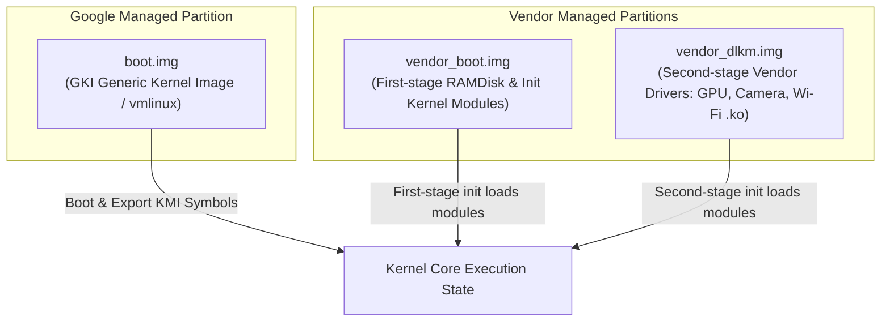

## GKI는 공통 core kernel과 vendor module을 분리한다

상위 문서: [Kernel contracts](kernel.md)

Generic Kernel Image(GKI)는 Android 파편화(Fragmentation) 문제를 해결하고 보안 패치(SPL) 수용률을 향상시키기 위해 core kernel 파티션과 SoC/Vendor 모듈 파티션을 물리적·논리적으로 분리한 아키텍처다.

Google이 ACK 기반의 단일 GKI 바이너리(`boot.img`)를 공급하며, SoC 제조사(Qualcomm, Samsung, MediaTek) 및 OEM은 KMI(Kernel Module Interface) 규격을 준수하는 Loadable Kernel Modules(`.ko`) 형태로 디바이스 특화 드라이버를 `vendor_dlkm` 파티션에 탑재한다.

---

### 메커니즘: GKI 파티션 구조 및 부팅 시 모듈 로드 흐름



1. **GKI 1.0 (Android 11)**: 커널 파티션 분리의 첫 단계로 도입되었으나 일부 디바이스로 제한적 적용.
2. **GKI 2.0 (Android 12+, Linux 5.10+)**: 릴리스되는 모든 ARM64 디바이스에 GKI `boot.img` 장착이 소스로 강제됨. `boot.img`에는 오직 범용 GKI 바이너리만 포함되며 vendor 소스코드는 포함될 수 없음.
3. **KMI Protection**: Kernel Module Interface(KMI) 심볼 리스트(`abi_symbol_list`)에 명시된 C 구조체 및 함수 심볼만 커널 모듈에 내보내어져(Export) ABI 호환성이 유지된다.

---

### Vendor Kernel Module 선언 및 modules.load 설정 예시

```text
# /vendor_dlkm/etc/modules.load 예시 (First/Second stage 모듈 로드 순서 정의)
qcom_scm.ko
pinctrl-msm.ko
msm_drm.ko
wlan.ko
```

```bash
# KMI ABI 심볼 체크 예시 (Kleaf 빌드 시)
tools/bazel run //common:kernel_aarch64_abi_update
```

---

### 실무 규칙

- Android 12 이상 릴리스 디바이스에서는 커널 코어(vmlinux) 소스에 임의의 out-of-tree vendor 드라이버 코드를 직접 패치하거나 수정해서는 안 된다. 반드시 모듈(`.ko`)로 분리해야 한다.
- GKI 환경에서 모듈을 새로 개발하는 경우, `EXPORTS_SYMBOL_GPL`로 내보낸 심볼이 `abi_symbol_list`에 포함되어 있는지 확인해야 부팅 시 `Exec format error` 또는 심볼 미발견 에러를 방지할 수 있다.

---

### 관측 가능한 증거 (Observable Evidence)

1. **현재 디바이스의 Loaded Vendor Modules 목록 조회**:
   ```bash
   adb shell lsmod
   # Module                  Size  Used by
   # msm_drm               356352  1
   # wlan                 4194304  0
   ```
2. **`vendor_dlkm` 파티션 내 modules.load 파일 검증**:
   ```bash
   adb shell cat /vendor_dlkm/etc/modules.load
   ```
3. **procfs를 통한 KMI 심볼 및 버전 정보 확인**:
   ```bash
   adb shell cat /proc/kallsyms | grep -i "android_kmi"
   ```

---

### 관련 문서

- [KMI 안정성은 같은 GKI LTS/Android branch 안에서만 성립한다](kernel-module-interface.md)
- [Vendor kernel module은 first-stage init 경계에서 로드된다](vendor-kernel-modules.md)

공식 문서: [AOSP Generic Kernel Image](https://source.android.com/docs/core/architecture/kernel/generic-kernel-image)

