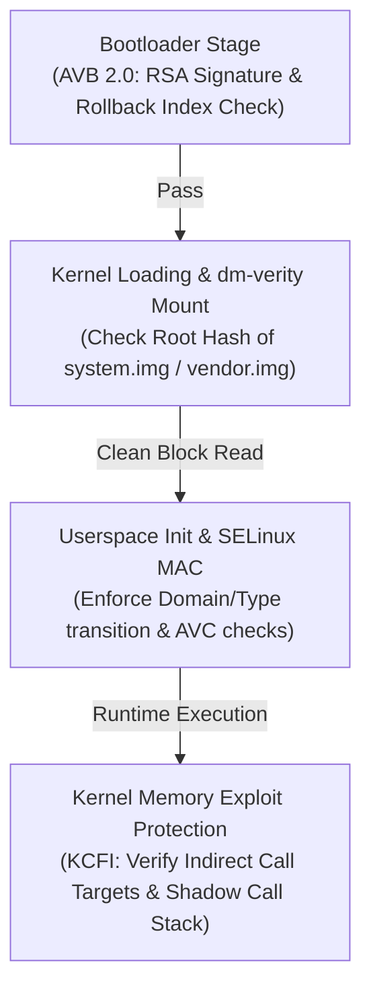

## Kernel security는 AVB, dm-verity, SELinux, CFI가 나눠 맡는다

상위 문서: [Kernel contracts](kernel.md)
배경 지식: [SELinux/MAC](../../../../../linux/security/selinux.md), [Device Mapper/dm-verity](../../../../../../02_references/operating-systems/device-mapper-and-dm-verity.md), [Merkle Tree](../../../../../../02_references/computer-science/merkle-tree.md), [Root of Trust/Chain of Trust](../../../../../security/fundamentals/root-of-trust-and-chain-of-trust.md)

Android 커널 보안은 단일 보안 메커니즘에 의존하지 않으며, 부팅 전 이미지 검증부터 실행 시간 액세스 제어 및 메모리 악용 방지에 이르기까지 계층화된 심층 방어(Defense-in-Depth) 구조로 설계되어 있다.

Android Verified Boot(AVB), `dm-verity`(Hash Tree 기반 블록 레벨 무결성 검증), SELinux(강제 접근 제어 MAC), 그리고 KCFI(Kernel Control Flow Integrity)가 각각 부팅, 블록 I/O, 프로세스 권한, 메모리 익스플로잇 방어 단계를 분담하여 처리한다.

---

### 메커니즘: 계층별 커널 보안 강제 흐름



1. **AVB 2.0 (Android Verified Boot)**: 부트로더 단계에서 `boot.img`, `dtbo`, `vendor_boot` 파티션의 RSA 서명과 롤백 인덱스(Rollback Protection)를 검증하여 변조된 부팅 이미지 실행을 차단한다. 이 서명 검증 자체를 누가 보증하느냐는 문제가 남는데, 그 답은 소프트웨어로는 절대 바꿀 수 없는 하드웨어상의 최초 신뢰 지점인 **root of trust**(신뢰의 뿌리)에서 시작해 각 부팅 단계가 다음 단계의 서명을 검증하며 이어지는 **chain of trust**(신뢰 사슬) 구조다.
2. **`dm-verity`**: 리눅스 커널의 **Device Mapper**(블록 디바이스 위에 가상 계층을 끼워 넣어 I/O 를 가로채는 프레임워크) 위에 구현된 target 중 하나로, 읽기 전용 이미지 파티션(`system.img`, `vendor.img`)의 블록별 해시를 **Merkle Tree**(각 블록 해시를 계속 두 개씩 묶어 올려 최종적으로 하나의 root hash 로 요약하는 트리 구조)로 엮어, 전체 파티션을 매번 다시 해싱하지 않고도 블록 단위로 무결성을 실시간 검증한다. 변조된 4KB 블록 발견 시 즉시 I/O 에러를 유발하거나 디바이스를 재부팅한다.
3. **SELinux (MAC)**: 파일 소유자가 권한을 정하는 일반적인 방식과 달리, 커널이 정의한 정책만으로 접근을 강제하는 **MAC**(Mandatory Access Control, 강제 접근 제어) 모델이다. 프로세스에 붙는 보안 라벨인 `scontext`(source context)와 파일/서비스에 붙는 `tcontext`(target context) 간 접근을 원천 제어하여, root 권한을 탈취당하더라도 타 서브시스템 침투를 격리.
4. **KCFI (Clang Kernel Control Flow Integrity)**: 간접 함수 호출(Indirect Function Call) 시 컴파일 타임 래퍼 훅으로 함수 시그니처 맹글링 수치를 검증하여, **ROP/COP**(Return/Call-Oriented Programming, 이미 커널에 있는 코드 조각들을 이어붙여 임의의 실행 흐름을 조립하는 코드 재사용 공격 기법) 방식의 익스플로잇 시도를 차단하고 커널 패닉 유발.

---

### 커널 보안 릴리스 설정 (`Kconfig` 및 dm-verity 상태) 예시

```ini
# GKI 릴리스 커널 필수 보안 Kconfig 설정
CONFIG_SECURITY_SELINUX=y
CONFIG_DM_VERITY=y
CONFIG_CFI_CLANG=y
CONFIG_SHADOW_CALL_STACK=y
CONFIG_INIT_ON_ALLOC_DEFAULT_ON=y
CONFIG_FORTIFY_SOURCE=y
```

```bash
# dm-verity 마운트 블록 상태 확인
adb shell dmsetup status
# system: 0 4194304 verity V
# (마지막 'V'는 Verity Normal Status를 의미)
```

---

### 실무 규칙

- OEM 엔지니어링 디바이스 빌드 시 User-debug 타깃에서는 SELinux `Permissive` 모드가 허용될 수 있으나, User 타깃 릴리스에서는 반드시 `Enforcing` 모드로 고정되어야 하며 dm-verity 비활성화 옵션(`disable-verity`)이 차단되어야 한다.
- KCFI 활성화 커널 환경에서 새로운 커널 모듈(`.ko`)을 연동할 때, C++ 함수 포인터 캐스팅 오류나 가상 함수 테이블 시그니처 불일치가 발생하면 runtime `CFI failure` 패닉이 발생하므로 타깃 함수 포인터 선언을 정확히 일치시켜야 한다.

---

### 관측 가능한 증거 (Observable Evidence)

1. **SELinux Enforcing 상태 확인**:
   ```bash
   adb shell getenforce
   # Enforcing
   ```
2. **`dm-verity` 파티션 무결성 검증 디바이스 노드 출력**:
   ```bash
   adb shell ls -la /dev/block/mapper/
   # lrwxrwxrwx 1 root root system -> /dev/block/dm-0
   # lrwxrwxrwx 1 root root vendor -> /dev/block/dm-1
   ```
3. **dmesg 내 KCFI 및 SELinux 방어 로깅 확인**:
   ```bash
   adb shell dmesg | grep -E "CFI failure|avc: denied"
   ```

---

### 관련 문서

- [SELinux는 domain/type 정책으로 mandatory access control을 강제한다](selinux-enforces-mac-with-domain-type-policy.md)
- [AVB verifies boot images and rollback protection](../../boot-and-runtime/boot-flow/avb-verifies-boot-images-and-rollback-protection.md)

공식 문서: [Android Verified Boot](https://source.android.com/docs/security/features/verifiedboot/verified-boot), [Kernel Control Flow Integrity](https://source.android.com/docs/security/test/kcfi)

