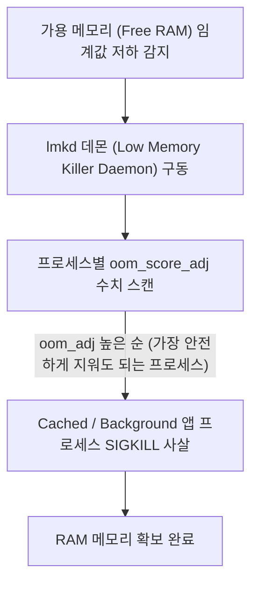

## LMK (Low Memory Killer / lmkd)

### 1. 개요 (Overview)

**LMK (Low Memory Killer / `lmkd`)** 는 Android 시스템의 가용 메모리(RAM)가 부족해질 때, 시스템 전체가 다운(Crash)되는 것을 막기 위해 **우선순위가 낮은 프로세스부터 선별하여 강제로 종료(Kill)시키는 안드로이드 커널/데몬 메모리 관리 메커니즘**이다.

일반 Linux 의 OOM (Out Of Memory) Killer 와 달리, 안드로이드의 프로세스 생명주기 및 사용자 눈앞의 앱 위치(Foreground vs Background)에 맞춰 훨씬 정교한 **OOM Score (`oom_adj`)** 규칙에 따라 실행된다.

---

#### 초보자를 위한 쉽게 이해하는 비유

- **LMK (침몰 위기 배의 비상 과적 화물 방출 요원)**:
  - 배(스마트폰 RAM)에 물이 차올라 침몰 위기가 오면, 승객(Foreground 앱)은 절대 건드리지 않고, **창고 깊숙이 숨어 있는 짐짝(사용자가 안 보고 있는 덤프 Background 앱)부터 하나씩 바다로 던져서(Kill)** 배를 살려내는 보안 요원.



---

### 2. LMK 프로세스 우선순위 계층 (OOM Score Priority)

LMK 는 `oom_score_adj` 수치가 **높은 프로세스(우선순위가 가장 낮은 프로세스)부터 우선적으로 사살**한다.

| 프로세스 상태 (Process State) | `oom_score_adj` 범위 | 사살 수용성 (Kill Priority) |
| :--- | :--- | :--- |
| **Cached / Background App** | **900 ~ 1000** | **1 순위 사살 (가장 먼저 Kill)** |
| **Perceptible / Heavy Background** | 200 ~ 800 | 2 순위 사살 |
| **Foreground Service (음악 재생 등)** | 50 ~ 100 | 3 순위 사살 |
| **Foreground App (현재 화면 보고 있는 앱)**| **0** | **최우선 보존 (절대 안 건드림)** |
| **System Process (`system_server`, `init`)**| **-1000** | **절대 사살 불가 (System Core)** |

---

### 3. LMK 사살 관측 및 앱 대비책

#### 1) 관찰 명령어
```bash
# 특정 앱의 현재 oom_score_adj 조회
adb shell cat /proc/<PID>/oom_score_adj

# lmkd 로그 관측
adb logcat -d | grep lmkd
```

#### 2) 앱 관점에서의 대비책
- 화면이 백그라운드로 전환될 때 `onTrimMemory(TRIM_MEMORY_UI_HIDDEN)` 콜백을 수신하여 뷰 캐시 및 대용량 비트맵 메모리를 즉시 해제해야 LMK 사살 대상 1 순위에서 벗어난다.

---

### 4. 연결 문서 (Related Links)

- [system_server](../04_system_services/system-server.md) - lmkd 데몬과 소통하며 oom_adj 수치를 갱신하는 핵심 서비스
- [ActivityThread](../02_app_framework/activity-thread.md) - LMK 에 의해 사살된 후 재구동 시 SavedInstanceState 로 상태를 복원하는 메인 스레드
- [Linux Kernel](../../../operating-systems/linux-kernel.md) - lmkd 가 연동되는 하위 리눅스 커널 메모리 아키텍처
