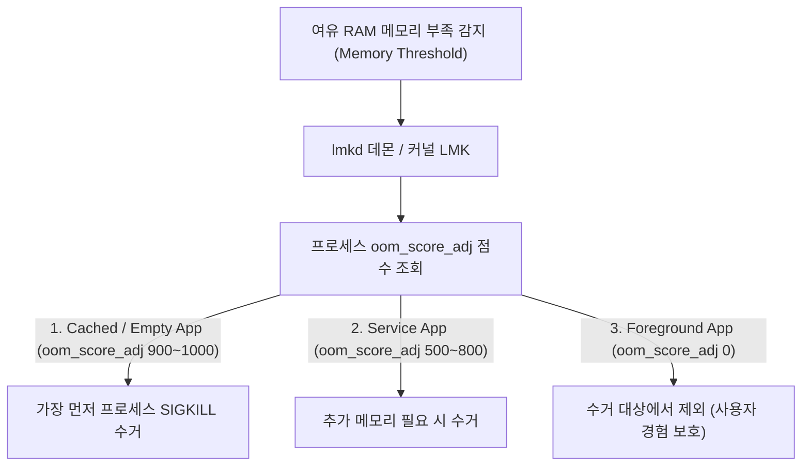

# Low Memory Killer (LMK & lmkd)

## 1. 개요 (Overview)

**Low Memory Killer (LMK / lmkd)** 는 Android 기기의 여유 RAM 메모리가 부족해질 때, 시스템 전체의 가용성을 유지하기 위해 **우선순위가 낮은 백그라운드 프로세스를 `oom_score_adj` 점수에 따라 선별적으로 수거(Kill)하는 안드로이드 커널/네이티브 메모리 관리 엔진**이다.

일반 Linux 의 OOM (Out Of Memory) Killer 가 메모리가 완전히 고갈된 최후의 순간에 한 번에 프로세스를 찌르는 것과 달리, Android LMK 는 메모리 임계값(Threshold)에 따라 단계별로 백그라운드 앱을 사전 제거한다.

---

### 초보자를 위한 쉽게 이해하는 비유

* **LMK (체육관 비상 탈출 정원 정리 시스템)**:
  - 체육관(RAM)이 사람들(프로세스)로 가득 차 산소가 부족해지면, 현재 무대 위에서 연설 중인 주빈([Foreground App](../04_system_services/background-and-notifications/background-work-contracts/foreground-service-contract.md))은 보호하고, 구석에서 자고 있던 관객([Cached Background App](../04_system_services/system-server.md))부터 순서대로 밖으로 퇴장시키는 순차적 안전 요원.



---

## 2. `oom_score_adj` 단계별 수거 순위

1. **Cached / Empty Process (900 ~ 1000)**: 화면에 보이지 않는 백그라운드 저장 프로세스 (가장 먼저 1순위 수거).
2. **Perceptible / Heavy Background (200 ~ 700)**: 백그라운드 작업 중인 서비스 프로세스.
3. **Foreground / Active Service (0 ~ 100)**: 현재 사용자가 보고 있는 활성 앱 및 [Foreground Service](../04_system_services/background-and-notifications/background-work-contracts/foreground-service-contract.md) (보호 대상).

---

## 3. 관측 가능 증거 및 CLI 명령어

`adb shell` 을 통해 안드로이드 기기의 LMK 수거 이력 및 앱별 OOM 점수를 관측할 수 있다:

```bash
# 앱 프로세스의 현재 oom_score_adj 점수 조회
adb shell cat /proc/<pid>/oom_score_adj

# lmkd 데몬의 수거 통계 덤프
adb shell dumpsys activity lru
```

---

## 4. 연결 문서 (Related Links)

- [Android Kernel 특화 구조](android-kernel.md) - 안드로이드 커널 서브시스템
- [Linux 커널](../../../operating-systems/linux-kernel.md) - CS 범용 Linux 커널 메모리 관리
- [system_server 통합 관제 노드](../04_system_services/system-server.md) - AMS 의 oom_score_adj 주입
- [Foreground Service 계약](../04_system_services/background-and-notifications/background-work-contracts/foreground-service-contract.md) - LMK 수거 보호 정책
