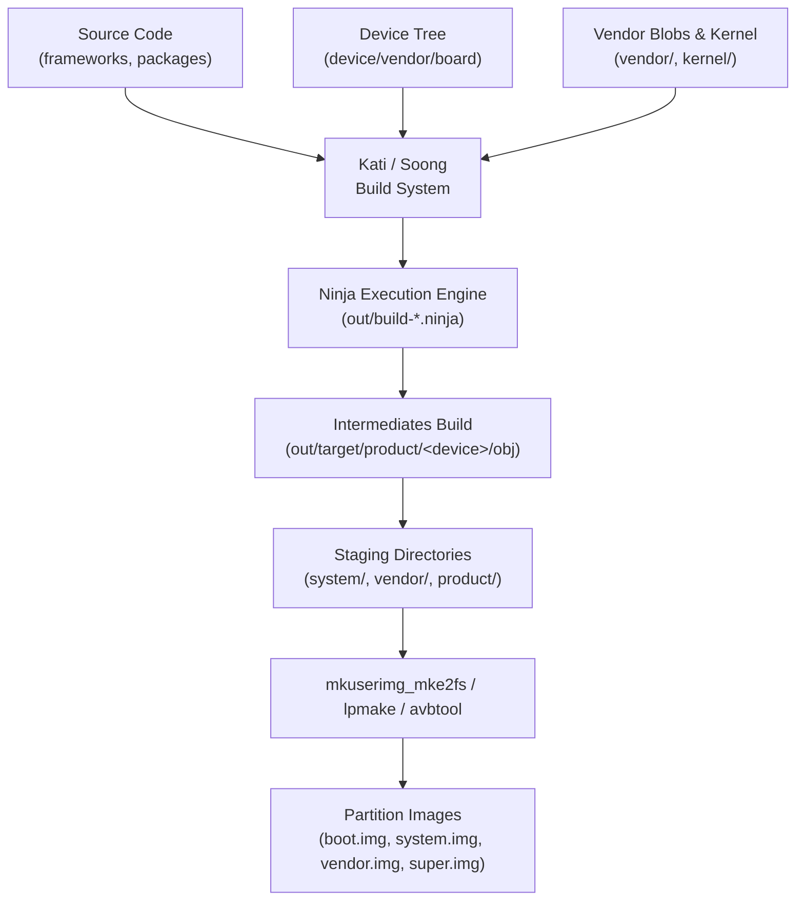

## AOSP build는 source, device, vendor configuration으로 product image를 조립한다

상위 문서: [Platform customization contracts](platform-customization-contracts.md)

AOSP build는 단일 앱 패키지를 컴파일하는 작업이 아니라 platform framework source, device tree, kernel/vendor artifact, product configuration을 결합하여 `boot.img`, `system.img`, `vendor.img`, `product.img`, `system_ext.img`, `super.img` 등의 플래싱 가능한 파티션 이미지를 조립하는 대규모 빌드 프로세스다.

앱 개발 환경의 Gradle 빌드와 달리 AOSP 빌드는 Soong(Go 기반 빌드 시스템), Kati(GNU Make 해석기), Ninja(실행 엔진)가 유기적으로 작동하며, source sync, target architecture 선택(`lunch`), 모듈 의존성 그래프 구축, 이미지 팩킹 tooling, APK/APEX 서명, SELinux policy 컴파일, VINTF 호환성 검증이 하나의 거대한 파이프라인으로 묶여 있다.

---

### 내부 동작 메커니즘 (Soong Build System & Product Image Assembly)

1. **환경 설정 및 Target 선택 (`envsetup.sh` & `lunch`)**:
   - `source build/envsetup.sh` 실행 시 빌드 헬퍼 함수가 쉘에 로드된다.
   - `lunch <product_name>-<build_variant>` (예: `lunch aosp_cf_x86_64_phone-userdebug`)를 통해 `TARGET_PRODUCT`, `TARGET_BUILD_VARIANT`, `TARGET_ARCH` 등 주요 글로벌 파라미터를 확정한다.

2. **Kati & Soong 그래프 생성 (`Android.bp` / `Android.mk` -> `build.ninja`)**:
   - **Kati**: 레거시 `Android.mk` 및 Product Configuration Makefile (`device.mk`, `BoardConfig.mk`)을 해석하여 Ninja 파일로 변환한다.
   - **Soong**: `Android.bp` 파일을 파싱하여 모듈 의존성 DAG(Directed Acyclic Graph)를 생성하고 `build.ninja`를 출력한다.

3. **Product Configuration & Module Inheritance**:
   - `$(call inherit-product, ...)` 구조로 상위 제품 사양을 상속받아 `PRODUCT_PACKAGES`, `PRODUCT_PROPERTY_OVERRIDES`, `PRODUCT_COPY_FILES`를 최종 확정한다.

4. **파티션 이미지 생성 (Image Packing & AVB Signing)**:
   - 각 모듈이 `out/target/product/<device>/system` 등에 설치된 후, `mkuserimg_mke2fs` 또는 `build_image.py` 도구가 파티션 파일시스템 이미지(ext4, erofs)를 생성한다.
   - Dynamic Partition 환경에서는 `lpmake` 도구가 `system`, `vendor`, `product` 등을 통합한 `super.img`를 생성하고, **AVB**(Android Verified Boot — 부트로더가 각 파티션 이미지의 서명과 해시를 검증해 변조된 이미지로는 부팅하지 못하게 막는 체계. 정식 정의는 [AVB는 부팅 이미지의 신뢰와 rollback 방지를 검증한다](../../boot-and-runtime/boot-flow-contracts/avb-verifies-boot-images-and-rollback-protection.md) 참고) 툴인 `avbtool`로 해시 풋터를 추가한다.



#### Product Configuration 코드 예시 (`device.mk` & `BoardConfig.mk`)

```make
# device/acme/rocket/device.mk (Product Configuration)
$(call inherit-product, $(SRC_TARGET_DIR)/product/full_base_telephony.mk)

PRODUCT_NAME := rocket
PRODUCT_DEVICE := rocket
PRODUCT_BRAND := Acme
PRODUCT_MODEL := Rocket One

# 시스템 및 타겟 파티션 탑재 패키지 선언
PRODUCT_PACKAGES += \
    AcmeLauncher \
    com.android.hardware.camera.provider.V2_6 \
    android.hardware.biometrics.fingerprint@2.1-service

# Dynamic Partitions 및 파티션 사이즈 설정 (BoardConfig.mk)
BOARD_SUPER_PARTITION_SIZE := 9663676416
BOARD_SUPER_PARTITION_GROUPS := acme_dynamic_partitions
BOARD_ACME_DYNAMIC_PARTITIONS_SIZE := 4831838208
BOARD_ACME_DYNAMIC_PARTITIONS_PARTITION_LIST := system vendor product system_ext
```

---

### 관찰 가능한 증거 (Observable Evidence)

1. **`lunch` 설정 확인 및 환경변수 출력**:
   ```bash
   source build/envsetup.sh
   lunch aosp_arm64-userdebug
   # 출력 증거:
   # ============================================
   # TARGET_PRODUCT=aosp_arm64
   # TARGET_BUILD_VARIANT=userdebug
   # TARGET_ARCH=arm64
   # TARGET_ARCH_VARIANT=armv8-a
   # HOST_OS=linux
   # ============================================
   ```

2. **빌드 산출물 디렉토리 및 이미지 확인**:
   ```bash
   ls -lh out/target/product/generic_arm64/*.img
   # -rw-r--r-- 1 user group  64M Aug  4 12:00 boot.img
   # -rw-r--r-- 1 user group 2.8G Aug  4 12:05 super.img
   # -rw-r--r-- 1 user group 800M Aug  4 12:03 system.img
   # -rw-r--r-- 1 user group 400M Aug  4 12:03 vendor.img
   ```

3. **설치된 파일 매니페스트 및 모듈 그래프 추적**:
   ```bash
   # 특정 이미지에 포함된 패키지 목록 추적
   cat out/target/product/generic_arm64/installed-files.txt | grep -E "Acme|Launcher"

   # 빌드된 파티션 이미지 기기 플래싱 및 부팅 검증
   adb reboot bootloader
   fastboot flash super out/target/product/generic_arm64/super.img
   fastboot reboot
   ```

---

### 관찰 가능 신호와 디버깅 진입점

- 빌드 실패 시 `out/error.log` 또는 `out/build.log`에서 최초 오류 지점을 검색한다.
- `Soong` 규칙 위반(예: 모듈 이름 중복 `module "XYZ" already defined`) 발생 시 `Android.bp` 모듈 가시성(`visibility`) 및 `name` 유일성을 확인한다.
- `BoardConfig.mk`의 파티션 용량 초과(`Error: system partition size exceeded by 50MB`)가 발생하면 `PRODUCT_PACKAGES`에서 불필요한 패키지를 제거하거나 파티션 크기를 조정한다.

관련 노트: [Device bring-up은 board, kernel, HAL, VINTF, sepolicy 통합이다](device-bring-up-is-board-kernel-hal-vintf-and-sepolicy-integration.md), [product configuration은 package, property, permission, overlay를 선택한다](product-configuration-selects-packages-properties-permissions-and-overlays.md).

공식 문서: [AOSP Build System](https://source.android.com/docs/setup/build)
