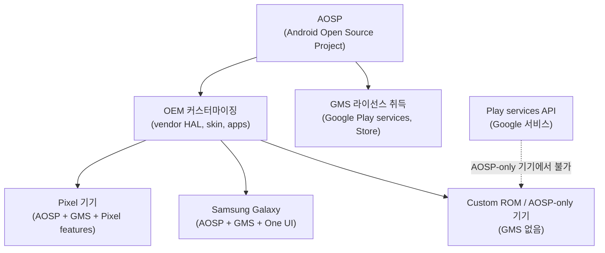

## AOSP 는 완성된 Google 기기 경험이 아니라 기본 플랫폼이다

상위 문서: [Platform customization contracts](platform-customization-contracts.md)

AOSP 는 Android framework, system apps, native services, build system, compatibility 기준을 제공하는 open source platform 이다. 하지만 Play Store, Google Play services, Google apps, Pixel 전용 기능은 AOSP 자체에 포함된다고 가정하면 안 된다.

### 메커니즘: AOSP / GMS / OEM 계층 구조



### 코드 예시: 런타임에서 Google Play services 가용성 확인

```kotlin
// Play services 의존 기능 사용 전 가용성 확인
fun checkPlayServicesAvailability(context: Context): Boolean {
    val googleApiAvailability = GoogleApiAvailability.getInstance()
    val resultCode = googleApiAvailability.isGooglePlayServicesAvailable(context)
    
    return if (resultCode == ConnectionResult.SUCCESS) {
        true
    } else {
        // AOSP-only 기기, 중국 기기 등에서 false
        // Fallback 로직을 제공해야 함
        Log.w("GMS", "Google Play services unavailable: $resultCode")
        false
    }
}

// Feature flag로 기능 분기 (GMS 없이도 동작하는 경우)
fun sendNotification(context: Context, message: String) {
    if (checkPlayServicesAvailability(context)) {
        // FCM 사용
        sendViaFcm(message)
    } else {
        // Fallback: 자체 WebSocket 또는 다른 푸시 메커니즘
        sendViaWebSocket(message)
    }
}
```

### 판단 기준

- \"Android 에서 된다\"와 \"GMS 인증 기기에서 된다\"를 명확히 구분한다.
- platform API(`android.*`), Google Play services API(`com.google.android.gms.*`), OEM private API 는 같은 안정성으로 취급하지 않는다.
- 기기 기능은 AOSP source 존재 여부가 아니라 feature declaration, HAL, permission, certification 상태로 확인한다.
- 중국 출시 기기, 엔터프라이즈 custom ROM, IoT/embedded Android 는 GMS 가 없을 수 있다.

### 경계

- GMS 라이선스와 인증 요건은 [GMS는 AOSP가 아니라 라이선스된 Google services layer다](gms-is-licensed-google-services-layer-not-aosp.md) 가 다룬다.

### 관측 가능한 증거 (Observable Evidence)

```bash
# Google Play services 설치 여부 확인
adb shell pm list packages | grep "com.google.android.gms"

# GMS 버전 확인
adb shell dumpsys package com.google.android.gms | grep "versionName"

# AOSP-only 기기에서 Play services 오류
# logcat에서: "Google Play services is not available on this device"
adb logcat | grep -E "GoogleApiAvailability|PlayServices"

# 기기 certification 상태 (Play Protect 인증)
adb shell dumpsys device_policy | grep -i "certified"
```

### 관련 문서

- [GMS는 AOSP가 아니라 라이선스된 Google services layer다](gms-is-licensed-google-services-layer-not-aosp.md)
