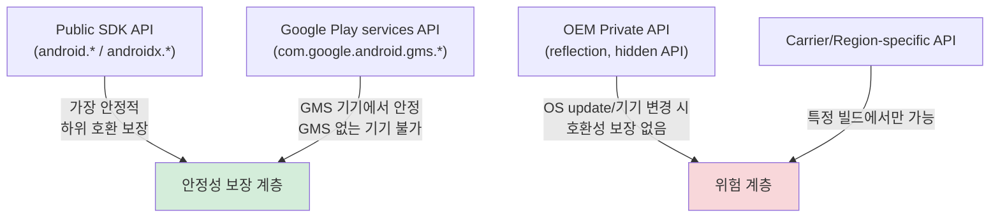

## OEM API 는 stable contract 가 없으면 compatibility risk 다

상위 문서: [Platform customization contracts](platform-customization-contracts.md)

OEM-specific API 는 특정 제조사나 기기군에서만 동작하는 private 또는 semi-public surface 다. 안정적인 SDK, permission, feature declaration, fallback 계약이 없으면 앱은 OS update, device variant, region/carrier build 에 취약해진다.

### 메커니즘: API 안정성 계층



### 코드 예시: Hidden API 위험 패턴 vs. 안전한 대안

```kotlin
// 위험한 패턴 ❌: reflection으로 hidden API 호출
fun getOemBatteryInfo(): Int? {
    return try {
        val clazz = Class.forName("com.samsung.android.hardware.health.BatteryInfoData")
        val method = clazz.getDeclaredMethod("getBatteryCapacity")
        method.isAccessible = true
        method.invoke(null) as? Int  // OS 업데이트 시 깨질 수 있음
    } catch (e: Exception) {
        null  // 다른 기기에서는 항상 null
    }
}

// 안전한 대안 ✅: public API + feature check + fallback
fun getBatteryLevel(context: Context): Int {
    val batteryStatus = context.registerReceiver(
        null,
        IntentFilter(Intent.ACTION_BATTERY_CHANGED)
    )
    val level = batteryStatus?.getIntExtra(BatteryManager.EXTRA_LEVEL, -1) ?: -1
    val scale = batteryStatus?.getIntExtra(BatteryManager.EXTRA_SCALE, -1) ?: -1
    return if (level == -1 || scale == -1) -1 else (level * 100 / scale.toFloat()).toInt()
}

// OEM feature 사용 전 runtime availability check
fun useOemFeatureIfAvailable(pm: PackageManager): Boolean {
    return if (pm.hasSystemFeature("com.samsung.feature.safetynet")) {
        // Samsung 전용 기능 사용 (다른 기기에서는 실행 안됨)
        useSamsungSafetyNet()
        true
    } else {
        false  // Fallback 로직
    }
}
```

### 판단 기준

- Reflection 으로 hidden API 를 호출하는 방식은 release compatibility risk 로 분류한다. Android 9(P) 이후 hidden API 제한이 강화됐다.
- OEM feature 는 feature flag 와 runtime availability check 를 항상 둔다.
- permission 이 `signature`/`privileged` 이면 일반 앱 배포 전략과 분리한다 — 이 앱은 Play Store 배포가 어렵다.
- 같은 제조사라도 device, region, carrier variant 별 차이를 테스트한다.

### 경계

- Public SDK API 가용성 확인 방법은 [앱은 Mainline package 이름보다 API와 feature availability를 확인해야 한다](../../platform-modularity/platform-modularity-contracts/apps-should-check-api-feature-availability-not-mainline-package-names.md)가 다룬다.

### 관측 가능한 증거 (Observable Evidence)

```bash
# Hidden API 접근 경고 로그 (Android 9+)
adb logcat | grep -E "Reflection disallowed|hidden API|Accessing hidden"

# 특정 기기에서 OEM feature 선언 목록
adb shell pm list features | grep -v "android"  # 비표준 feature 목록

# NoSuchMethodException: OEM hidden API 접근 실패
adb logcat | grep -E "NoSuchMethodException|NoSuchFieldException"
```

### 관련 문서

- [앱은 Mainline package 이름보다 API와 feature availability를 확인해야 한다](../../platform-modularity/platform-modularity-contracts/apps-should-check-api-feature-availability-not-mainline-package-names.md)
