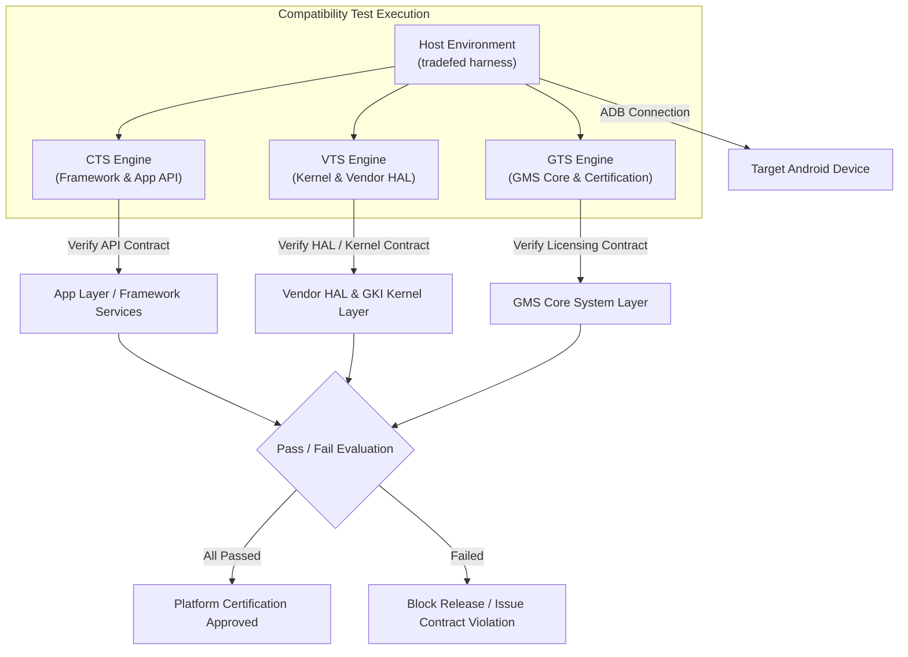

## Platform compatibility test는 앱 기능이 아니라 device contract를 검증한다

상위 문서: [Platform customization contracts](platform-customization-contracts.md)

CTS(Compatibility Test Suite), VTS(Vendor Test Suite), GTS(Google Test Suite), STS(Security Test Suite) 등 플랫폼 호환성 테스트 모음은 단순한 애플리케이션 QA 자동화 도구가 아니다. 이들은 타겟 기기가 Android 에코시스템의 일원으로서 **플랫폼 계약(Platform Contract) 및 계층별 사양(API, HAL, Kernel, Security Policy)**을 정확하게 지키는지 검증하는 엄격한 Release Gate 역할을 한다.

플랫폼 호환성 테스트 실패는 단순히 "단위 테스트 하나가 무작위 실패했다"가 아니라 디바이스의 특정 Layer(Framework, Kernel, Vendor HAL, Permission Enforcement, Media Codec 등) 계약 위반을 의미한다. 따라서 무작정 테스트 코드를 수정하거나 우회하려 하지 않고, 실패가 어떤 시스템 파티션 및 계약 계층에 속하는지 분류하고 해당 커스텀 코드를 정정해야 한다.

---

### 내부 동작 메커니즘 (Tradefed Harness & Compatibility Test Pipeline)

1. **Trade Federation (tradefed) Host Harness**:
   - 호스트 컴퓨터에서 실행되는 테스트 오케스트레이션 엔진으로 `adb` 및 `fastboot` 명령을 통해 타겟 기기를 직접 제어한다.
   - 테스트용 APK(Target-side test app)를 인스턴트 설치하여 실행 상태와 시스템 이벤트를 수집한다.

2. **계층별 Compatibility Test 구분**:
   - **CTS (Compatibility Test Suite)**: Java/Kotlin App Framework API, Permission sandbox, Intent resolution, Security sandbox 동작 검증.
   - **VTS (Vendor Test Suite)**: GKI Kernel 사양, HIDL/AIDL Vendor HAL 구현체, VINTF manifest 호환성, Passthrough/Binderized HAL 경계 검증.
   - **GTS (Google Test Suite)**: GMS 바이너리 통합, Play Services API, DRM/Widevine 폰트/미디어 통합 검증.
   - **STS (Security Test Suite)**: CVE 취약점 관련 보안 패치 반영 여부 자동화 검증.



#### Tradefed 실행 및 XML 테스트 구성 예시

```xml
<!-- cts/tools/cts-tradefed/res/config/cts-suite.xml (Tradefed Test Module Definition) -->
<configuration description="Runs CTS Media Test Plan">
    <option name="test-suite-tag" value="cts" />
    <target_preparer class="com.android.compatibility.common.tradefed.targetprep.ApkInstaller">
        <option name="cleanup-apks" value="true" />
        <option name="test-file-name" value="CtsMediaTestCases.apk" />
    </target_preparer>
    <test class="com.android.tradefed.testtype.AndroidJUnitTest">
        <option name="package" value="android.media.cts" />
        <option name="runner" value="androidx.test.runner.AndroidJUnitRunner" />
    </test>
</configuration>
```

---

### 관찰 가능한 증거 (Observable Evidence)

1. **Host-side CTS / VTS Tradefed 실행 명령**:
   ```bash
   # CTS 실행 (특정 모듈 단독 실행 예시)
   ./cts-tradefed run cts -m CtsMediaTestCases -t android.media.cts.MediaPlayerTest

   # VTS 실행 (HAL 호환성 테스트)
   ./vts-tradefed run vts -m VtsHalCameraProviderV2_4TargetTest
   ```

2. **테스트 결과 리포트 및 XML 덤프 검증**:
   ```bash
   # 테스트 결과 디렉토리 구조 관찰
   ls -lh android-cts/results/latest/
   # test_result.xml  test_result.html  cts.log

   # 실패한 케이스 및 스택 트레이스 검색
   grep -A 10 '<Test result="fail"' android-cts/results/latest/test_result.xml
   ```

3. **Target Device 내 테스트 인스트루멘테이션 흔적**:
   ```bash
   adb shell pm list packages | grep "android.*cts"
   # package:android.media.cts
   ```

---

### 관찰 가능 신호와 디버깅 진입점

- CTS 실패 로그 분석 시 `junit.framework.AssertionFailedError`가 발생하면 테스트 자체의 무작위 실패(Flaky)인지, 타겟 OEM ROM의 Framework 코드 수정으로 인한 표준 비헤이비어 파괴인지 구분해야 한다.
- VTS 실패 시 `lshal`로 원인 대상 HAL이 죽었거나 VINTF 선언 버전과 실제 실행 바이너리 버전이 일치하는지 점검한다.

관련 노트: [Platform debugging은 build, boot, service, VINTF, sepolicy, CTS를 분리한다](platform-debugging-separates-build-boot-service-vintf-sepolicy-and-cts.md), [Testing and quality contracts](../../../06_testing_performance/testing/testing-quality-contracts/testing-quality-contracts.md).

공식 문서: [Android Compatibility Test Suite](https://source.android.com/docs/compatibility/cts)
