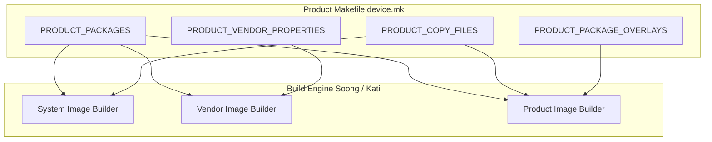

## product configuration 은 package, property, permission, overlay 를 선택한다

상위 문서: [Platform customization contracts](platform-customization-contracts.md)

Android product configuration 은 "어떤 앱을 넣을지"만 고르는 파일이 아니다. product makefile 과 Soong/Make 설정은 package inclusion, system property, permission XML, feature declaration, overlay, partition image 구성을 함께 결정한다.

따라서 customization 을 앱 설치 목록으로만 다루면 부팅, 권한, API availability, resource 값, CTS 결과가 서로 어긋난다. 제품 설정은 device behavior 의 선언적 계약으로 관리해야 한다.

---

### 내부 동작 메커니즘 (Product Makefile & Build Assembly Engine)

AOSP 타깃 기기 빌드 시 `device/<vendor>/<board>/device.mk` 및 `aosp_<target>.mk` 파일은 소스 트리 모듈들을 묶어 파티션 이미지로 조합하는 핵심 선언 파일이다.

1. **`PRODUCT_PACKAGES`**:
   - `/system`, `/vendor`, `/product` 파티션에 탑재할 APK, Native Shared Library, HAL 바이너리를 명시적 선언.
2. **`PRODUCT_PROPERTY_OVERRIDES` / `PRODUCT_VENDOR_PROPERTIES`**:
   - `build.prop` 및 `vendor/build.prop` 파일에 주입되어 SystemProperty 상태를 결정하는 키-값 쌍 정의.
3. **`PRODUCT_COPY_FILES`**:
   - Hardware Feature XML (`android.hardware.wifi.xml`), Privileged Permission Allowlist XML (`privapp-permissions-*.xml`)을 대상 파티션 디렉터리로 직접 복사.
4. **`PRODUCT_PACKAGE_OVERLAYS`**:
   - 타깃 리소스 패키지의 빌드 타임 정적 오버레이(Static Resource Overlay) 및 RRO 패키지 포함 지정.



---

### 구체적 `device.mk` 설정 파일 예시

```makefile
# device/acme/rocket/device.mk

# 1. 탑재 패키지 지정
PRODUCT_PACKAGES += \
    AcmeCustomLauncher \
    android.hardware.vibrator-service.acme \
    com.acme.rro.systemui

# 2. 파티션 속성 정의
PRODUCT_VENDOR_PROPERTIES += \
    ro.vendor.vibrator.supports_haptics=true \
    ro.vendor.display.refresh_rate=120

# 3. Permisison Allowlist & Hardware Feature 복사
PRODUCT_COPY_FILES += \
    device/acme/rocket/permissions/privapp-permissions-acme.xml:$(TARGET_COPY_OUT_PRODUCT)/etc/permissions/privapp-permissions-acme.xml \
    frameworks/native/data/etc/android.hardware.camera.full.xml:$(TARGET_COPY_OUT_VENDOR)/etc/permissions/android.hardware.camera.full.xml
```

---

### 관찰 가능한 증거 (Observable Evidence)

1. **빌드된 `build.prop` 파일 내용 점검**:
   ```bash
   adb shell cat /system/build.prop | grep ro.build.product
   adb shell cat /vendor/build.prop | grep ro.vendor.
   ```
2. **adb shell 로 주입된 System Property 확인**:
   ```bash
   adb shell getprop ro.vendor.vibrator.supports_haptics
   ```

---

### 실무 규칙

- 앱 추가는 privileged permission allowlist 와 shared UID, signing key 요구사항을 같이 확인한다.
- system property 는 runtime feature flag 가 아니라 boot-time/system policy 입력일 수 있다.
- feature XML 은 Play/device capability 판정에도 영향을 준다.
- overlay 와 product package 선택은 같은 변경이라도 책임 경계가 다르다.

관련 노트: [RRO는 target APK를 다시 빌드하지 않고 resource를 바꾼다](rro-changes-resources-without-rebuilding-target-apk.md)

