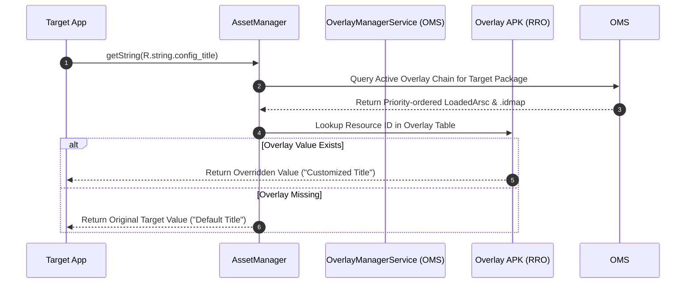

## RRO 는 target APK 를 다시 빌드하지 않고 resource 를 바꾼다

상위 문서: [Platform customization contracts](platform-customization-contracts.md)

Runtime Resource Overlay(RRO)는 target package 의 code 를 수정하지 않고 resource 값을 바꾸는 customization 경계다. OEM theme, device-specific default value, form factor 별 resource 차이를 platform image 나 product image 에서 제어할 때 사용된다.

RRO 는 코드 patch 보다 유지보수성이 좋지만, 아무 resource 나 안전하게 바꿀 수 있다는 뜻은 아니다. overlayable 선언, target package, priority, partition 위치, enable state 가 모두 결과에 영향을 준다.

---

### 내부 동작 메커니즘 (OMS & AssetManager Resource Resolution)

1. **OverlayManagerService (OMS) Registration**:
   - 부팅 시 OMS는 `/system/overlay`, `/vendor/overlay`, `/product/overlay` 파티션의 RRO 패키지를 스캔하고 `idmap2` 툴을 사용하여 Target APK의 리소스 ID와 Overlay APK의 리소스 ID를 매핑하는 `.idmap` 파일을 생성한다.
2. **Dynamic AssetManager Injection**:
   - Target 앱 프로세스 실행 시, OMS가 검증하고 활성화(Enabled)한 Overlay APK의 `LoadedArsc` 리소스 테이블을 Target 앱의 `AssetManager` 리소스 탐색 체인 상단에 동적으로 포함시킨다.
3. **Resource Lookup Resolution**:
   - 앱이 `context.getString(R.string.config_title)`을 호출할 때 `AssetManager`는 Overlay 리소스 테이블을 우선 조회하여 재정의된 값을 반환하고, 오버레이가 없으면 원래 Target APK의 리소스를 복귀(Fallback) 탐색한다.



---

### RRO `AndroidManifest.xml` & `overlays.xml` 설정 예시

```xml
<!-- Overlay APK AndroidManifest.xml -->
<manifest xmlns:android="http://schemas.android.com/apk/res/android"
    package="com.example.custom.overlay">
    
    <overlay android:targetPackage="com.android.systemui"
             android:targetName="CustomSystemUIOverlay"
             android:isStatic="true"
             android:priority="10"/>
</manifest>
```

```xml
<!-- res/xml/overlays.xml -->
<overlay>
    <item target="string/status_bar_notification_info" value="@string/custom_notification_info" />
    <item target="color/system_bar_background" value="@color/custom_bar_color" />
</overlay>
```

---

### 관찰 가능한 증거 (Observable Evidence)

1. **adb shell `cmd overlay` 명령어로 RRO 상태 조회 및 제어**:
   ```bash
   # 모든 RRO 패키지 목록 및 활성화([x]) 상태 조회
   adb shell cmd overlay list

   # 특정 RRO 활성화 및 비활성화
   adb shell cmd overlay enable com.example.custom.overlay
   adb shell cmd overlay disable com.example.custom.overlay
   ```
2. **OMS 및 idmap2 logcat 관찰**:
   ```text
   I idmap2  : idmap created for target package=com.android.systemui overlay=com.example.custom.overlay
   I OverlayManager: State changed for com.example.custom.overlay: STATE_ENABLED
   ```

---

### 실무 규칙

- 동작 로직을 바꾸려는 변경은 overlay 로 숨기지 않는다.
- overlay 충돌은 priority 와 partition 위치를 함께 본다.
- `cmd overlay` 로 runtime state 를 확인하고, build output 만 보고 판단하지 않는다.
- 앱 개발자는 OEM overlay 로 resource 값이 달라질 수 있음을 전제로 UI/설정을 방어적으로 설계한다.

근거: [Runtime resource overlays](https://source.android.com/docs/core/runtime/rros)

