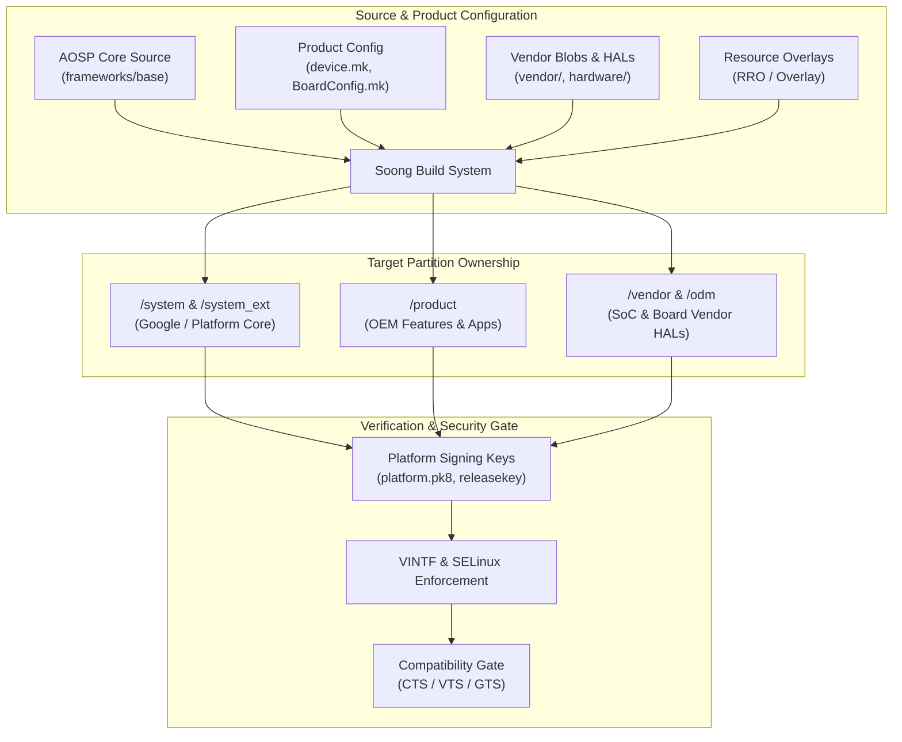

## Platform customization contracts

Android platform customization 은 앱 설정 문제가 아니라 AOSP source, product configuration, partition ownership, vendor boundary, signing, compatibility test 가 맞물리는 플랫폼 통합 문제다. 이 묶음의 독자는 기본적으로 platform/OEM 엔지니어이며, 앱 개발자는 대부분 "내 앱이 이 device variant 에서 왜 다르게 동작하는가"를 판단하기 위한 배경 지식으로만 필요하다.

---

### 플랫폼 커스터마이징 아키텍처 (Customization Architecture Diagram)

---

### 커스터마이징 계약 요약 표 (Customization Boundary Summary Table)

| 구분 | 주요 대상 | 적용 레이어 / 위치 | 주요 소유자 / 책임 |
| :--- | :--- | :--- | :--- |
| **Base Platform** | AOSP Core Framework | `/system` | Google / Open Source |
| **Product Customization** | OEM Apps, Feature Config, Wallpapers | `/product` | Device OEM |
| **Vendor Customization** | Driver Blobs, HIDL/AIDL HALs | `/vendor`, `/odm` | SoC Vendor (Qualcomm, MediaTek) |
| **Resource Overlay** | RRO (Runtime Resource Overlay) | `/vendor/overlay`, `/product/overlay` | System / OEM Designer |
| **Privilege / Signing** | Platform Key, Release Key | system image signing | Security Team |
| **Compatibility Gate** | CTS, VTS, GTS, STS | Test Harness (Tradefed) | Google / Certification Gate |

---

### 읽는 순서와 문제 분류

- **"AOSP 로 무엇이 보장되고 무엇이 안 되는가"를 먼저 확인한다**: [AOSP는 완성된 Google 기기 경험이 아니라 기본 플랫폼이다](aosp-vs-google-experience.md) → [GMS는 AOSP가 아니라 라이선스된 Google services layer다](gms-google-mobile-services.md). 여기서 "Android 에서 된다"와 "GMS 인증 기기에서 된다"를 구분하는 것이 이후 모든 판단의 전제다.
- **"이 커스터마이징이 어느 partition/build 산출물 책임인가"를 물을 때**: [product, vendor, odm, system_ext는 customization ownership을 나눈다](partition-customization-ownership.md) → [product configuration은 package, property, permission, overlay를 선택한다](product-makefiles-configuration.md) → [RRO는 target APK를 다시 빌드하지 않고 resource를 바꾼다](runtime-resource-overlay-rro.md) → [AOSP build는 source, device, vendor configuration으로 product image를 조립한다](aosp-build-system.md).
- **"새 기기를 부팅 가능하게 만드는 작업이 무엇인가"를 물을 때**: [Device bring-up은 board, kernel, HAL, VINTF, sepolicy 통합이다](device-bringup-integration.md) → [Custom ROM 작업은 앱 개발이 아니라 플랫폼 통합이다](custom-rom-platform-integration.md).
- **"배포/신뢰 경계가 어떻게 검증되는가"를 물을 때**: [Platform signing과 release key는 update와 privilege boundary를 정의한다](platform-signing-keys.md) → [Platform compatibility test는 앱 기능이 아니라 device contract를 검증한다](cts-vts-platform-tests.md).
- **"OEM 이 추가한 API 를 앱이 써도 되는가"를 판단할 때**: [OEM API는 stable contract가 없으면 compatibility risk다](oem-api-compatibility.md) — 이 노트가 이 묶음에서 유일하게 앱 개발자가 직접 판단해야 하는 노트다.
- **문제가 build/boot/service 중 어디서 나는지 좁혀야 할 때 마지막으로**: [Platform debugging은 build, boot, service, VINTF, sepolicy, CTS를 분리한다](platform-debugging-framework.md).

---

### 비슷해 보이지만 다른 노트

- **AOSP vs GMS**: AOSP 는 open source platform 자체이고, GMS 는 그 위에 라이선스로 얹는 Google service layer 다. 없어도 Android 는 부팅하지만 Play 생태계는 GMS 에 의존한다.
- **Device bring-up vs Custom ROM**: bring-up 은 신규 하드웨어를 처음 부팅시키는 작업이고, custom ROM 은 이미 존재하는 하드웨어 기기 위에 AOSP/커뮤니티 소스를 재조립하는 작업이다. 둘 다 board/kernel/HAL/VINTF/sepolicy 통합이 필요하지만 시작점과 vendor blob 확보 경로가 다르다.
- **Platform signing vs 앱 배포 서명**: platform signing 은 system image, privileged permission, OTA 신뢰 경계를 정의하고, `03_packaging_deployment` 의 앱 서명은 Play 배포와 앱 업데이트 신뢰 경계를 정의한다. 같은 "서명"이라는 단어를 쓰지만 다른 계약이다.
- **CTS/VTS/GTS**: CTS 는 app-facing framework API 계약을, VTS 는 HAL/vendor 계약을, GTS 는 Google service 통합/인증 계약을 검증한다.

---

### 다른 정본으로 넘길 경계

- Treble, VINTF, HAL 구현은 [HAL native contracts](../kernel-and-hal/hal-native/hal-native.md) 로 둔다.
- Mainline, APEX, SDK Extension 은 [Platform Modularity Contracts](../platform-modularity/android-platform-modularity.md) 로 둔다.
- AVB 와 boot chain 은 [AVB는 부팅 이미지의 신뢰와 rollback 방지를 검증한다](../boot-and-runtime/boot-flow/android-verified-boot.md) 로 둔다.
- 앱 release, Play 배포, APK/AAB signing 은 [Release distribution contracts](../../03_packaging_deployment/distribution/release-distribution/release-distribution.md) 로 둔다.
