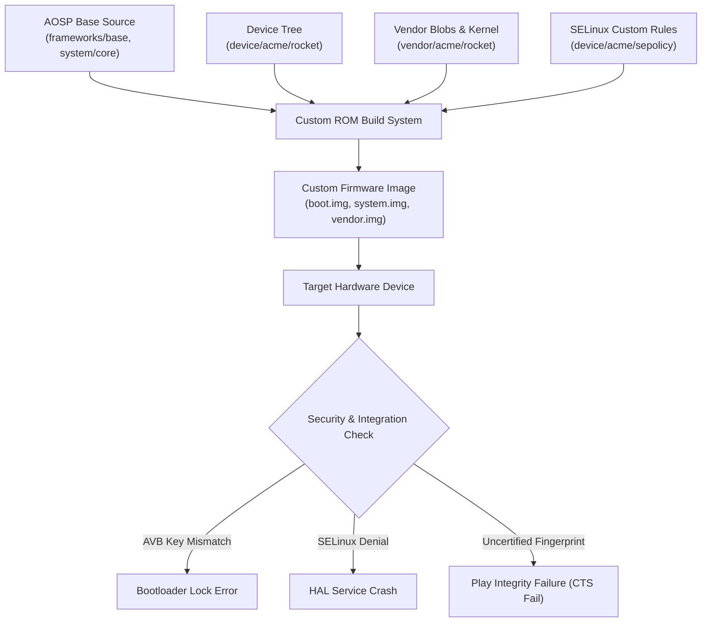

## Custom ROM 작업은 앱 개발이 아니라 플랫폼 통합이다

상위 문서: [Platform customization contracts](platform-customization.md)

Custom ROM 작업은 단순히 사용자 인터페이스(UI) 테마를 바꾸거나 앱 패키지를 추가/삭제하는 애플리케이션 수준의 개발이 아니다. 이는 특정 타겟 타겟 하드웨어의 Device Tree(`device/<vendor>/<codename>`), Vendor Binary Blobs(`vendor/<vendor>/<codename>`), 커널 소스 및 모듈(`kernel/<vendor>/...`), Hardware Abstraction Layer(HAL), SELinux Policy(sepolicy), VINTF 호환성 매니페스트, Platform Signing Key, OTA 서버 인프라, 그리고 Google Play Integrity / Certification 경계를 총괄하는 전형적인 **플랫폼 통합(Platform Integration)** 엔지니어링이다.

커뮤니티 커스텀 ROM 문서나 빌드 스크립트를 단순 추종하여 컴파일을 성공시키더라도, 바이너리 덤프나 HAL 인터페이스 매칭이 어긋나면 카메라 렌즈 지원, 젤리 스크롤/디스플레이 HRR, 센서 하드웨어, DRM(Widevine L1), 무선 모뎀, 지문 인식, NFC 결제, Play Protect 인증 등 최하단 하드웨어 및 보안 경계가 깨지게 된다.

---

### 내부 동작 메커니즘 (Custom ROM Platform Integration Stack)

1. **하드웨어 커스텀 컴포넌트 바인딩**:
   - **Device Tree**: 타겟 칩셋 및 보드 핀맵, 디스플레이, 파티션 테이블 레이아웃 정의 (`BoardConfig.mk`, `device.mk`).
   - **Vendor Tree**: OEM에서 추출한 프로프라이어터리 유저스페이스 셰어드 라이브러리(`*.so`) 및 펌웨어 바이너리 포함.
   - **HAL 및 AIDL/HIDL 서비스**: Framework 인터페이스와 Vendor implementation 연결.

2. **SELinux Policy 통합 (`sepolicy`)**:
   - Custom ROM에 새로 추가되는 System Service나 커스텀 하드웨어 제어 데몬의 Domain/Type 서술 (`*.te`, `file_contexts`).

3. **플랫폼 서명 및 privilege 분리**:
   - AOSP 오픈소스 기본 testkey 대신 커스텀 releasekey를 생성하여 `framework-res.apk` 및 Privileged App 권한 관리.



#### Device & Policy Configuration 예시 (`BoardConfig.mk` & `sepolicy/custom_daemon.te`)

```make
# device/acme/rocket/BoardConfig.mk
TARGET_ARCH := arm64
TARGET_ARCH_VARIANT := armv8-a
TARGET_CPU_ABI := arm64-v8a

# Kernel 및 Vendor Blob 소스 지정
TARGET_KERNEL_SOURCE := kernel/acme/rocket
TARGET_KERNEL_CONFIG := rocket_defconfig
BOARD_VENDOR_SEPOLICY_DIRS += device/acme/rocket/sepolicy

# Custom ROM Feature 파티션 지정
BOARD_HAS_CUSTOM_MODEM_HAL := true
```

```te
# device/acme/rocket/sepolicy/custom_daemon.te
type custom_daemon, domain;
type custom_daemon_exec, exec_type, vendor_file_type, file_type;

init_daemon_domain(custom_daemon)
allow custom_daemon sysfs_hardware_control:file r_file_perms;
allow custom_daemon binder_device:chr_file rw_file_perms;
```

---

### 관찰 가능한 증거 (Observable Evidence)

1. **Build Fingerprint 및 ROM 시스템 속성 확인**:
   ```bash
   adb shell getprop | grep -E "ro.build.display.id|ro.build.fingerprint|ro.rom.version"
   # [ro.build.display.id]: [CustomOS-14-rocket-userdebug]
   # [ro.build.fingerprint]: [Acme/rocket/rocket:14/UP1A.231005.007/20260804:userdebug/dev-keys]
   ```

2. **SELinux Audit Denial (권한 거부) 및 하드웨어 가용성 추적**:
   ```bash
   # 커스텀 데몬의 SELinux 블로킹 확인
   adb logcat -d | grep "avc: denied"
   # audit(1722770000.123:45): avc: denied { read } for pid=1245 comm="custom_daemon" path="/sys/devices/virtual/custom_hw" scontext=u:r:custom_daemon:s0 tcontext=u:object_r:sysfs:s0 tclass=file

   # 하드웨어 HAL 실행 상태 확인
   adb shell lshal | grep -E "camera|fingerprint|nfc"
   ```

3. **GMS 및 Play Integrity 가용성 검증**:
   ```bash
   adb shell dumpsys package com.google.android.gms | grep -E "versionName|pkgFlags"
   ```

---

### 관찰 가능 신호와 디버깅 진입점

- 커스텀 ROM 부팅 중 무한 로딩(Bootloop)이 발생하면 `adb logcat` 이전 단계의 `adb shell dmesg` 및 `/proc/last_kmsg`를 검토하여 커널 패닉이나 `init` 서비스 재시작 실패(Restarting crash loop)를 찾아낸다.
- 카메라/지문인식이 작동하지 않는 경우 `lshal`로 해당 하드웨어 HAL Passthrough 또는 Binderized 데몬이 Binder RPC bus에 등록되었는지 검증한다.

관련 노트: [Device bring-up은 board, kernel, HAL, VINTF, sepolicy 통합이다](device-bring-up-is-board-kernel-hal-vintf-and-sepolicy-integration.md), [GMS는 AOSP가 아니라 라이선스된 Google services layer다](gms-is-licensed-google-services-layer-not-aosp.md), [platform signing과 release key는 update와 privilege boundary를 정의한다](platform-signing-and-release-keys-define-update-and-privilege-boundaries.md).

공식 문서: [Establishing a Custom Device](https://source.android.com/docs/core/architecture)
