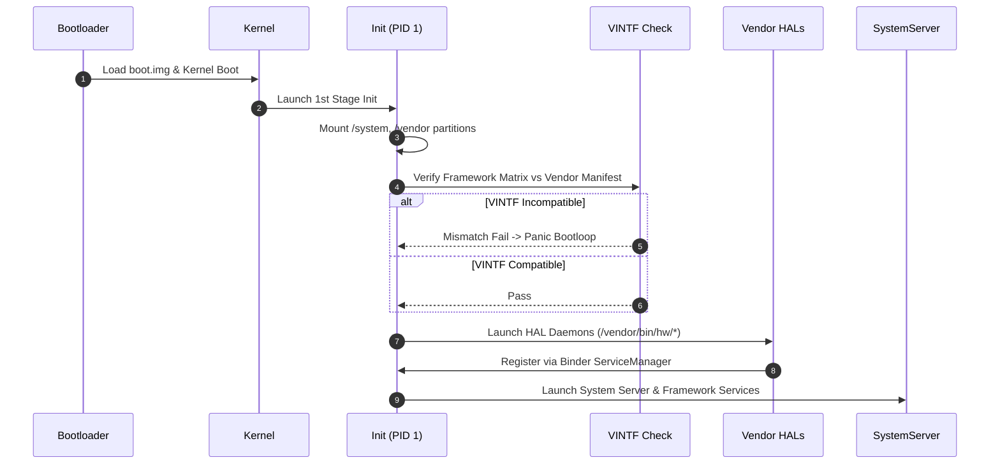

## Device bring-up은 board, kernel, HAL, VINTF, sepolicy 통합이다

상위 문서: [Platform customization contracts](platform-customization.md)

Device bring-up은 빌드된 Android 플랫폼 이미지를 새로운 SoC(System on Chip)나 타겟 보드 하드웨어에서 처음 부팅시키고, 시스템 서비스와 하드웨어 드라이버 간의 상호작용을 정합성 있게 결합하는 플랫폼 엔지니어링의 핵심 단계다.

bring-up의 본질은 단순히 "소스 코드가 컴파일되는가"가 아니라 **각 시스템 레이어의 계약(Contract)이 일치하는가**에 있다. Kernel 이 드라이버를 로드하지 못하거나 Device Tree(DTB)가 어긋나면 Init 단계로 진입하지 못하며, HAL 서비스가 binder bus에 등록되지 못하면 Framework `SystemServer`가 무한 재시작에 빠진다. 또한 VINTF 매니페스트 호환성 실패나 SELinux policy(sepolicy) denial이 발생하면 프로세스가 강제 종료되어 부팅이 완료되지 않는다.

---

### 내부 동작 메커니즘 (Device Bring-up Lifecycle & Verification)

1. **Bootloader & Linux Kernel Stage**:
   - 부트로더가 `boot.img` (Kernel + dtb/ramdisk)를 RAM으로 로드하고 파라미터를 넘긴다.
   - Kernel 초기화 후 `init` (PID 1) 프로세스를 1st Stage Init으로 실행한다.

2. **Init Execution & Partition Mount (First/Second Stage Init)**:
   - `init`이 `/system`, `/vendor`, `/product` 파티션을 mount 한 후 `/init.rc` 및 `/vendor/etc/init/*.rc` 스크립트를 파싱한다.

3. **VINTF Manifest & Matrix Verification (`assemble_vintf`)**:
   - Framework의 Compatibility Matrix(`system/etc/vintf/compatibility_matrix.xml`)와 Vendor의 Manifest(`vendor/etc/vintf/manifest.xml`) 간 버전 호환성을 바이너리 레벨에서 체크한다.
   - 버전 mismatch 시 부팅을 즉시 중단한다.

4. **HAL Registration & Service Launch**:
   - Vendor HAL 데몬들(Audio, Graphics, Camera, Power, Sensors 등)이 실행되어 `hwservicemanager` (HIDL) 또는 `servicemanager` (AIDL)에 Binder 서비스로 자신을 등록한다.

5. **SELinux Policy Enforcement**:
   - Permissive 모드에서 Enforcing 모드로 전환되며, 등록되지 않은 I/O 접근이나 Binder 호출은 Kernel LSM(Linux Security Module)에 의해 즉시 차단(denied)된다.



#### VINTF Manifest 선언 코드 예시 (`vendor/etc/vintf/manifest.xml`)

```xml
<!-- vendor/etc/vintf/manifest.xml -->
<manifest version="1.0" type="device">
    <hal format="aidl">
        <name>android.hardware.light</name>
        <version>1</version>

        <interface>
            <name>ILights</name>

            <instance>default</instance>
        </interface>
    </hal>

    <sepolicy>
        <version>34.0</version>
    </sepolicy>

    <kernel target-level="2024-04">
        <version>6.1.25</version>
    </kernel>
</manifest>
```

---

### 관찰 가능한 증거 (Observable Evidence)

1. **VINTF 호환성 수동 체크 명령어**:
   ```bash
   adb shell vintf check
   # 출력 증거:
   # Compatible? YES
   # (만약 실패 시 mismatch 항목 및 missing HAL interface 정보가 디테일하게 출력됨)
   ```

2. **HAL 서비스 등록 및 상태 관찰 (`lshal`)**:
   ```bash
   adb shell lshal
   # 출력 예시:
   # Interface                                    Server  Clients  Alive?  Transport
   # android.hardware.light@2.0::ILight/default   1234    System   Y       hwbinder
   ```

3. **Init Service State 및 Kernel Log 관찰**:
   ```bash
   # 특정 init 서비스의 상태 관찰 (running, restarting, stopped)
   adb shell getprop | grep "init.svc"
   
   # 부팅 도중 커널 Panic 및 드라이버 오류 디버깅
   adb shell dmesg | grep -E "panic|init|binder"
   ```

---

### 관찰 가능 신호와 디버깅 진입점

- **Bootloop 발생 시 해결 순서**:
  1. `adb shell dmesg`로 커널 단계 실패 여부 확인.
  2. `adb shell getprop init.svc.<service_name>`으로 무한 재시작(`restarting`)되는 하우징 서비스 탐색.
  3. `adb logcat | grep "avc: denied"`로 SELinux 거부로 인한 crash 여부 확인.
  4. `vintf check`로 Framework-Vendor HAL 인터페이스 불일치 점검.

관련 노트: [VINTF는 framework/vendor 호환성을 선언한다](../../kernel-and-hal/hal-native/vintf-declares-framework-vendor-compatibility.md), [GKI는 공통 core kernel과 vendor module을 분리한다](../../kernel-and-hal/kernel/gki-splits-generic-core-from-vendor-modules.md), [platform debugging은 build, boot, service, VINTF, sepolicy, CTS를 분리한다](platform-debugging-separates-build-boot-service-vintf-sepolicy-and-cts.md).

공식 문서: [VINTF Object Overview](https://source.android.com/docs/core/architecture/vintf)
