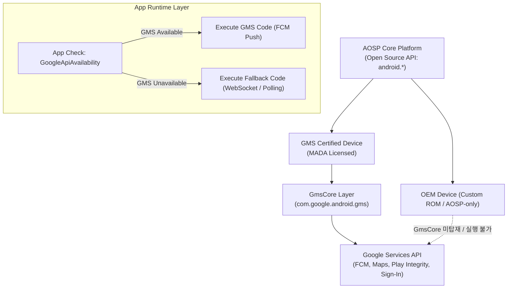

## GMS 는 AOSP 가 아니라 라이선스된 Google services layer 다

상위 문서: [Platform customization contracts](platform-customization.md)

Google Mobile Services(GMS)는 오픈소스 Android(AOSP) 코드베이스에 포함된 기본 구성 요소가 아니라, Google 과의 상업적 라이선스 계약(MADA: Mobile Application Distribution Agreement) 및 플랫폼 인증(Compatibility Test Suite - CTS, Google Test Suite - GTS)을 통과한 기기에만 제공되는 프로프라이어터리(Proprietary) 애플리케이션 및 백그라운드 서비스 레이어다.

개발자 관점에서 `android.*` 파티션의 AOSP 표준 API 와 달리, `com.google.android.gms.*` 백그라운드 API(Google Play Services, Play Store, FCM Push, Google Maps SDK, Sign-In, Play Integrity API)는 AOSP-only 디바이스(중국 내수용 폰, 커스텀 임베디드 장비, 엔터프라이즈 커스텀 ROM)에서 존재하지 않는다. 따라서 앱의 기능 의존성은 GMS 가용성 여부에 따라 우아한 성능 저하(Graceful Degradation) 및 대체 폴백 경로를 마련해야 한다.

---

### 내부 동작 메커니즘 (AOSP vs GMS Layering & Certification)

1. **AOSP Base vs GMS Core Separation**:
   - **AOSP**: 오픈소스 Apache 2.0 라이선스로 제공. `system.img` 기본 프레임워크와 오픈소스 표준 앱(Clock, Settings, Dialer) 포함.
   - **GMS Packages**: `com.google.android.gms` (GmsCore), `com.android.vending` (Google Play Store), `com.google.android.gsf` (Google Services Framework) 등을 system 또는 priv-app 파티션에 인젝션.

2. **GMS Certification Pipeline (CDD & CTS/GTS Gate)**:
   - OEM 이 GMS 를 기기에 탑재하려면 Android Compatibility Definition Document(CDD)를 준수해야 함.
   - **CTS (Compatibility Test Suite)**: AOSP API 동작 완벽 검증.
   - **GTS (Google Test Suite)**: Google 독자 서비스 바이너리와의 통합 정합성 검증.
   - **Play Protect Certification**: 빌드 핑거프린트 서명이 Google 서버에 등록되어 Play Integrity API 토큰 검증 시 인증됨.



#### Kotlin GMS Runtime Check & Graceful Fallback 코드 예시

```kotlin
import com.google.android.gms.common.ConnectionResult
import com.google.android.gms.common.GoogleApiAvailability

class LocationPushManager(private val context: Context) {

    fun initializeServices() {
        val apiAvailability = GoogleApiAvailability.getInstance()
        val resultCode = apiAvailability.isGooglePlayServicesAvailable(context)

        if (resultCode == ConnectionResult.SUCCESS) {
            // GMS 정상 사용 가능 - FCM 및 Google Location Services 등록
            setupFcmPush()
        } else {
            // GMS 사용 불가 (AOSP-only, 중국 내수 디바이스 등)
            Log.w("GMS_Check", "GMS is unavailable. Result code: $resultCode")
            setupAlternativePushService()
        }
    }

    private fun setupFcmPush() {
        // FCM 등록 서비스 호출
    }

    private fun setupAlternativePushService() {
        // 자체 MQTT / WebSocket 폴백 메커니즘 가동
    }
}
```

---

### 관찰 가능한 증거 (Observable Evidence)

1. **GMS 패키지 및 GmsCore 프로세스 활성화 확인**:
   ```bash
   adb shell pm list packages | grep -E "com.google.android.gms|com.android.vending"
   # package:com.google.android.gms
   # package:com.android.vending
   ```

2. **GMS 버전 및 설치 파티션 위치 조회**:
   ```bash
   adb shell dumpsys package com.google.android.gms | grep -E "versionName|codePath"
   # codePath=/system/priv-app/PrebuiltGmsCore
   # versionName=24.16.13 (190400-625890000)
   ```

3. **Play Protect 인증 및 GMS 바인딩 오류 로그**:
   ```bash
   # GMS 미인증 / 미설치 디바이스에서의 logcat 관찰 예시
   adb logcat | grep -E "GooglePlayServicesUtil|GoogleApiAvailability|GmsClient"
   # W GooglePlayServicesUtil: Google Play services is missing.
   ```

---

### 관찰 가능 신호와 디버깅 진입점

- 앱 실행 중 `java.lang.ClassNotFoundException` 또는 GMS Binder 서비스 연결 실패(`API_UNAVAILABLE`)가 보고될 경우, 타겟 기기의 GMS 설치 상태 및 `GoogleApiAvailability` 반환 코드를 가장 먼저 검증한다.
- FCM 푸시 전송 실패 시 디바이스가 GMS 인스턴스를 유지하고 있는지 `dumpsys activity service com.google.android.gms` 로 백그라운드 연결 상태를 확인한다.

관련 노트: [AOSP는 완성된 Google 기기 경험이 아니라 기본 플랫폼이다](aosp-is-base-platform-not-complete-google-device-experience.md), [Play Integrity token은 서버 검증용 risk signal이지 authorization 자체가 아니다](../../../05_security_privacy/integrity-and-attestation/integrity/play-integrity-token-is-server-verified-risk-signal-not-authorization.md).

공식 문서: [Google Mobile Services](https://www.android.com/gms/)
