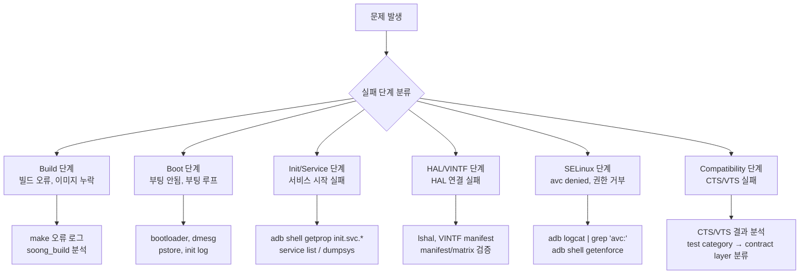

## Platform debugging 은 build, boot, service, VINTF, sepolicy, CTS 를 분리한다

상위 문서: [Platform customization contracts](platform-customization.md)

Platform customization 문제는 앱 crash 처럼 한 로그에서 끝나지 않는다. build graph, image contents, boot stage, init service state, Binder service registration, HAL/VINTF, sepolicy denial, compatibility test failure 를 층별로 분리해야 한다.

### 메커니즘: Platform 디버깅 계층 분류



### 단계별 디버깅 명령 예시

```bash
# 1. Boot 단계: logcat 이전 kernel 로그
adb shell dmesg | head -100
adb shell cat /proc/last_kmsg  # 이전 부팅 crash 로그 (재부팅 후)

# 2. Init/Service 단계: 서비스 상태 확인
adb shell getprop init.svc.surfaceflinger    # running / stopped / restarting
adb shell service list | grep -E "camera|audio|sensor"

# 3. HAL/VINTF 단계: HAL 등록 상태 + manifest 검증
adb shell lshal                              # 실행 중인 HAL 목록
adb shell cat /vendor/etc/vintf/manifest.xml | grep -A5 "camera"
adb shell vintf check                        # manifest/matrix 호환성 검증

# 4. SELinux 단계: denial 로그 확인
adb logcat | grep "avc: denied"
adb shell getenforce                         # Enforcing / Permissive

# 5. Compatibility: CTS 실패 테스트 범위 확인
# cts-tradefed run cts -m CtsMediaTestCases --test ...
adb shell dumpsys package | grep "CTS"
```

### 판단 기준

- 좋은 디버깅은 먼저 실패 지점을 boot 이전, init, framework service, app/API, certification 단계 중 하나로 좁힌다.
- 부팅 전 문제는 bootloader log, kernel log(dmesg), pstore, init log 부터 본다. logcat 은 framework 이후 단계다.
- HAL 문제는 VINTF manifest, service registration, SELinux denial, tombstone 을 함께 본다. 하나만 보고 단정하지 않는다.
- CTS/VTS/GTS 실패는 테스트 이름보다 contract layer(platform API vs. HAL vs. kernel)를 먼저 분류한다.

### 경계

- IPC 디버깅(Binder service 등록, call path)은 [IPC 디버깅은 service 등록, call path, thread state에서 시작한다](../../ipc-and-process/ipc-process/ipc-debugging-starts-from-service-registration-call-path-and-thread-state.md)가 다룬다.

### 관측 가능한 증거 (Observable Evidence)

```bash
# Platform 전반 상태 스냅샷
adb bugreport  # 전체 진단 보고서 생성 (ZIP 파일)

# Binder service 등록 상태
adb shell dumpsys -l | head -30

# VINTF 호환성 오류 (부팅 실패 원인)
adb logcat | grep -E "VINTF|compatibility|manifest"

# init 서비스 재시작 루프 감지
adb shell getprop | grep "init.svc" | grep -v "stopped"
```

### 관련 문서

- [IPC 디버깅은 service 등록, call path, thread state에서 시작한다](../../ipc-and-process/ipc-process/ipc-debugging-starts-from-service-registration-call-path-and-thread-state.md)
- [Debugging contracts](../../../06_testing_performance/debugging/debugging/debugging.md)
