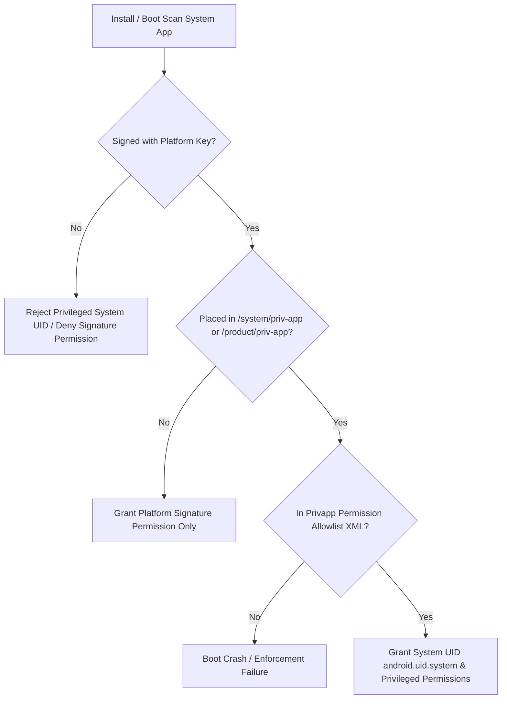

## Platform signing 과 release key 는 update 와 privilege boundary 를 정의한다

상위 문서: [Platform customization contracts](platform-customization.md)

Platform signing key 와 release key 는 단순 배포 서명이 아니라 system image update, privileged permission, shared UID, platform app 신뢰 경계를 정의한다. 같은 APK 라도 어떤 key 로 서명되고 어느 partition 에 놓이는지에 따라 권한과 업데이트 가능성이 달라진다.

앱 개발에서의 Play App Signing 과 플랫폼 이미지 signing 은 같은 "서명"이라는 단어를 쓰지만 책임이 다르다. 플랫폼 signing 은 기기 image 와 OTA, verified boot chain, privileged app policy 와 함께 관리해야 한다.

---

### 내부 동작 메커니즘 (Key Types & Signature Privilege Verification)

Android AOSP 빌드 시스템은 4가지 기본 플랫폼 키 세트를 사용하여 권한 영역을 격리한다.

1. **`platform` key**: `android.uid.system` 공유 UID를 사용하거나 핵심 플랫폼 권한(`protectionLevel="signature"`)을 획득하는 시스템 앱(Settings, SystemUI 등) 서명에 사용.
2. **`shared` key**: Home/Contacts 등 딜러 앱 간 데이터 공유(`android.uid.shared`) 전용.
3. **`media` key**: MediaProvider, Gallery 등 미디어 관련 프로세스 서명.
4. **`networkstack` key**: NetworkStack 모듈 서명 (`android.uid.networkstack`).

**권한 부여 흐름**:
PackageManager는 APK 설치/부팅 검사 시 APK의 서명 인증서 해시를 `/system/etc/security/` 및 빌드 키와 비교한다. 서명이 `platform` 키와 일치할 때만 `signature` 수준의 권한 및 `android.uid.system` 할당을 승인한다.



---

### `Android.bp` & `AndroidManifest.xml` 서명 지정 예시

```bp
// Android.bp
android_app {
    name: "SystemSettings",
    srcs: ["src/**/*.java"],
    certificate: "platform", // platform.pk8 / platform.x509.pem 서명 지정
    privileged: true,        // /system/priv-app 위치 할당
}
```

```xml
<!-- AndroidManifest.xml -->
<manifest xmlns:android="http://schemas.android.com/apk/res/android"
    package="com.android.settings"
    android:sharedUserId="android.uid.system">
    
    <uses-permission android:name="android.permission.SHUTDOWN" />
</manifest>
```

---

### 관찰 가능한 증거 (Observable Evidence)

1. **adb shell 로 빌드 키 상태 확인 (`release-keys` vs `test-keys`)**:
   ```bash
   adb shell getprop ro.build.tags
   # Commercial Device: release-keys
   # Debug/Engineering Build: test-keys (Play Integrity / SafetyNet 실패 사유)
   ```
2. **dumpsys package 로 특정 앱의 서명 및 Signature Permission 부여 상태 검증**:
   ```bash
   adb shell dumpsys package com.android.settings | grep -i "signatures:" -A 5
   adb shell dumpsys package com.android.settings | grep -i "grantedPermissions:" -A 10
   ```

---

### 실무 규칙

- debug/test key 로 만든 image 를 production trust boundary 로 보지 않는다.
- privileged app 권한은 partition 위치, allowlist, signing key 를 함께 본다.
- key rotation 은 update path 와 rollback protection 을 고려한다.
- APK/AAB 배포 서명과 platform image signing 을 같은 절차로 문서화하지 않는다.

관련 노트: [AVB는 부팅 이미지의 신뢰와 rollback 방지를 검증한다](../../boot-and-runtime/boot-flow/avb-verifies-boot-images-and-rollback-protection.md), [Android security and privacy](../../../05_security_privacy/android-security-and-privacy.md)

