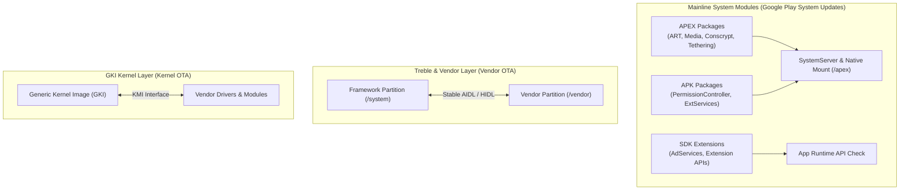

## Android Platform Modularity

Android platform modularity 는 단일 애플리케이션의 모듈 구조가 아니라, OS 배포, 파편화(Fragmentation) 방지, 보안 패치 속도 향상, 그리고 시스템 구성 요소 간의 호환성 경계를 규정하는 System Internals 핵심 주제다.

---

### 플랫폼 모듈화 전체 지형도 (Modularity System Architecture)

---

### 정본 계약 노트 (Core Modularity Contracts)

- [Android 플랫폼 모듈화는 system, vendor, kernel 업데이트 경계를 층위별로 나눈다](platform-modularity-layers.md)
- [Mainline은 선택된 system component를 정규 플랫폼 release 밖에서 업데이트한다](project-mainline-updates.md)
- [Mainline module update는 임의의 새 public API 배포와 같지 않다](mainline-api-boundaries.md)
- [Mainline module 목록은 release와 device에 따라 달라지는 metadata다](mainline-module-metadata.md)
- [APEX는 APK 모델로 다루기 어려운 lower-level system module을 담는다](apex-module-packaging.md)
- [APEX activation은 boot-time mount, version selection, rollback 경계다](apex-activation-and-rollback.md)
- [APEX build와 device support는 앱 개발 API가 아니라 플랫폼 통합 계약이다](apex-build-and-device-support.md)
- [SDK Extensions는 SDK_INT만으로 표현되지 않는 API availability를 나타낸다](sdk-extensions.md)
- [SDK Extension API 사용은 compileSdkExtension과 runtime check가 모두 필요하다](sdk-extension-checks.md)
- [ModuleMetadata는 기기에 있는 Mainline module 목록을 설명한다](mainline-module-metadata.md)
- [앱은 Mainline package 이름보다 API와 feature availability를 확인해야 한다](mainline-api-feature-checks.md)

---

### 이미 존재하는 인접 정본

- [Treble separates system and vendor through stable interfaces](../kernel-and-hal/hal-native/project-treble-hal.md)
- [VINTF declares framework/vendor compatibility](../kernel-and-hal/hal-native/vintf-manifest-compatibility.md)
- [GKI splits generic core from vendor modules](../kernel-and-hal/kernel/generic-kernel-image.md)
- [KMI stability](../kernel-and-hal/kernel/kernel-module-interface.md)

---

### 문제 분류 기준

- **"이 API 가 왜 이 기기에서만 없지"처럼 앱 API 존재 여부가 궁금하면**: [SDK Extensions](sdk-extensions.md)와 [앱은 Mainline package 이름보다 API와 feature availability를 확인해야 한다](mainline-api-feature-checks.md) 로 이동한다.
- **OTA/Play system update 이후 기기 동작이 바뀌었다면**: [Mainline](project-mainline-updates.md)과 [APEX activation](apex-activation-and-rollback.md) 으로 이동한다.
- **플랫폼/기기 빌드 관점에서 module 을 새로 추가하거나 지원해야 한다면**: [APEX build/device support](apex-build-and-device-support.md) 로 이동한다.

공식 문서: [Mainline](https://source.android.com/docs/core/ota/modular-system), [APEX file format](https://source.android.com/docs/core/ota/apex), [SDK Extensions](https://developer.android.com/guide/sdk-extensions)

---

### 모듈화 층위별 계약 요약 표 (Modularity Layering Summary Table)

| 구분 | 대상 컴포넌트 | 배포 수단 / 포맷 | 가용성 판단 검사 수단 |
| :--- | :--- | :--- | :--- |
| **Treble** | Vendor HALs (`/vendor`) | Vendor Image OTA / HIDL, AIDL | VINTF Manifest / `vintf check` |
| **GKI** | Generic Kernel Image | Kernel Boot Image (`boot.img`) | `/proc/version` / KMI 버전 |
| **Mainline** | ART, Media, Net, Conscrypt | APEX (`.apex`) / APK (`.apk`) | `SdkExtensions.getExtensionVersion()` |
| **SDK Extensions** | AdServices, SDK Extension APIs | Dynamic Mainline System Module | `getExtensionVersion(SdkExtensions.S)` |

---

---

### 읽는 순서

1. [Android 플랫폼 모듈화는 system, vendor, kernel 업데이트 경계를 층위별로 나눈다](platform-modularity-layers.md) — "모듈식"이라는 말이 가리키는 층위를 먼저 구분한다.
2. [Mainline은 선택된 system component를 정규 플랫폼 release 밖에서 업데이트한다](project-mainline-updates.md), [Mainline module 목록은 release와 device에 따라 달라지는 metadata다](mainline-module-metadata.md), [ModuleMetadata는 기기에 있는 Mainline module 목록을 설명한다](mainline-module-metadata.md) — Mainline 이 무엇을 언제 업데이트하는지.
3. [APEX는 APK 모델로 다루기 어려운 lower-level system module을 담는다](apex-module-packaging.md), [APEX activation은 boot-time mount, version selection, rollback 경계다](apex-activation-and-rollback.md), [APEX build와 device support는 앱 개발 API가 아니라 플랫폼 통합 계약이다](apex-build-and-device-support.md) — Mainline 이 쓰는 패키지 포맷(APEX)의 부팅/빌드 계약.
4. [Mainline module update는 임의의 새 public API 배포와 같지 않다](mainline-api-boundaries.md), [앱은 Mainline package 이름보다 API와 feature availability를 확인해야 한다](mainline-api-feature-checks.md) — 위 사실에서 앱 개발자가 흔히 잘못 추론하는 두 가지를 바로잡는다.
5. [SDK Extensions는 SDK_INT만으로 표현되지 않는 API availability를 나타낸다](sdk-extensions.md), [compileSdkExtension과 runtime check는 별개 단계다](sdk-extension-checks.md) — 앱이 실제로 사용할 수 있는 availability check 방법.

---

### 비슷한 노트 구분

- "Mainline module update 는 임의의 새 public API 배포와 같지 않다"는 *개념 정정*(왜 오해인지)이고, "앱은 Mainline package 이름보다 API 와 feature availability 를 확인해야 한다"는 *실행 방법*(무엇을 대신 확인해야 하는지)이다. 개념이 필요하면 앞을, 체크리스트가 필요하면 뒤를 읽는다.
- "APEX build 와 device support" 노트는 platform/device 통합 담당자용이고, "APEX activation" 노트는 이미 지원되는 기기에서 런타임에 무슨 일이 일어나는지를 다룬다. 앱 개발자는 보통 activation 노트만 필요하다.

---

### 경계 규칙

- Mainline/APEX/SDK Extensions 는 이 폴더가 정본이다. Treble/VINTF/HAL, GKI/KMI 는 [HAL native contracts](../kernel-and-hal/hal-native/hal-native.md), [kernel 정본](../kernel-and-hal/android-kernel-runtime.md) 이 정본이므로 여기서 재설명하지 않는다.
- 앱 개발자 관점 판단(package 이름 대신 API/feature 확인)은 이 폴더에 남기고, 권한/AppOps 판단 기준은 [permission 정본](../../05_security_privacy/permissions/permissions.md) 으로 넘긴다.
