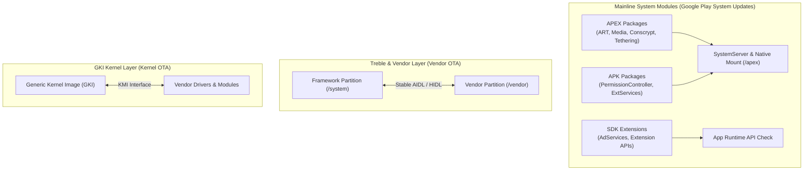

## Android Platform Modularity

Android platform modularity는 단일 애플리케이션의 모듈 구조가 아니라, OS 배포, 파편화(Fragmentation) 방지, 보안 패치 속도 향상, 그리고 시스템 구성 요소 간의 호환성 경계를 규정하는 System Internals 핵심 주제다.

---

### 플랫폼 모듈화 전체 지형도 (Modularity System Architecture)

---

### 정본 계약 노트 (Core Modularity Contracts)

- [Android 플랫폼 모듈화는 system, vendor, kernel 업데이트 경계를 층위별로 나눈다](platform-modularity-contracts/android-platform-modularity-splits-update-boundaries-by-system-layer.md)
- [Mainline은 선택된 system component를 정규 플랫폼 release 밖에서 업데이트한다](platform-modularity-contracts/mainline-updates-selected-system-components-outside-normal-platform-releases.md)
- [Mainline module update는 임의의 새 public API 배포와 같지 않다](platform-modularity-contracts/mainline-module-updates-do-not-equal-arbitrary-new-public-apis.md)
- [Mainline module 목록은 release와 device에 따라 달라지는 metadata다](platform-modularity-contracts/mainline-module-list-is-device-and-release-dependent-metadata.md)
- [APEX는 APK 모델로 다루기 어려운 lower-level system module을 담는다](platform-modularity-contracts/apex-packages-lower-level-system-modules-that-apk-cannot-model-well.md)
- [APEX activation은 boot-time mount, version selection, rollback 경계다](platform-modularity-contracts/apex-activation-uses-boot-time-mounting-version-selection-and-rollback.md)
- [APEX build와 device support는 앱 개발 API가 아니라 플랫폼 통합 계약이다](platform-modularity-contracts/apex-build-and-device-support-are-platform-integration-contracts.md)
- [SDK Extensions는 SDK_INT만으로 표현되지 않는 API availability를 나타낸다](platform-modularity-contracts/sdk-extensions-express-api-availability-beyond-sdk-int.md)
- [SDK Extension API 사용은 compileSdkExtension과 runtime check가 모두 필요하다](platform-modularity-contracts/sdk-extension-compile-sdk-extension-and-runtime-check-are-separate-steps.md)
- [ModuleMetadata는 기기에 있는 Mainline module 목록을 설명한다](platform-modularity-contracts/modulemetadata-describes-mainline-modules-on-a-device.md)
- [앱은 Mainline package 이름보다 API와 feature availability를 확인해야 한다](platform-modularity-contracts/apps-should-check-api-feature-availability-not-mainline-package-names.md)

---

### 이미 존재하는 인접 정본

- [Treble separates system and vendor through stable interfaces](../kernel-and-hal/hal-native-contracts/treble-separates-system-and-vendor-through-stable-interfaces.md)
- [VINTF declares framework/vendor compatibility](../kernel-and-hal/hal-native-contracts/vintf-declares-framework-vendor-compatibility.md)
- [GKI splits generic core from vendor modules](../kernel-and-hal/kernel-contracts/gki-splits-generic-core-from-vendor-modules.md)
- [KMI stability](../kernel-and-hal/kernel-contracts/kmi-is-stable-only-within-a-gki-lts-and-android-branch.md)

---

### 문제 분류 기준

- **"이 API 가 왜 이 기기에서만 없지"처럼 앱 API 존재 여부가 궁금하면**: [SDK Extensions](platform-modularity-contracts/sdk-extensions-express-api-availability-beyond-sdk-int.md)와 [앱은 Mainline package 이름보다 API와 feature availability를 확인해야 한다](platform-modularity-contracts/apps-should-check-api-feature-availability-not-mainline-package-names.md)로 이동한다.
- **OTA/Play system update 이후 기기 동작이 바뀌었다면**: [Mainline](platform-modularity-contracts/mainline-updates-selected-system-components-outside-normal-platform-releases.md)과 [APEX activation](platform-modularity-contracts/apex-activation-uses-boot-time-mounting-version-selection-and-rollback.md)으로 이동한다.
- **플랫폼/기기 빌드 관점에서 module 을 새로 추가하거나 지원해야 한다면**: [APEX build/device support](platform-modularity-contracts/apex-build-and-device-support-are-platform-integration-contracts.md)로 이동한다.

공식 문서: [Mainline](https://source.android.com/docs/core/ota/modular-system), [APEX file format](https://source.android.com/docs/core/ota/apex), [SDK Extensions](https://developer.android.com/guide/sdk-extensions)
