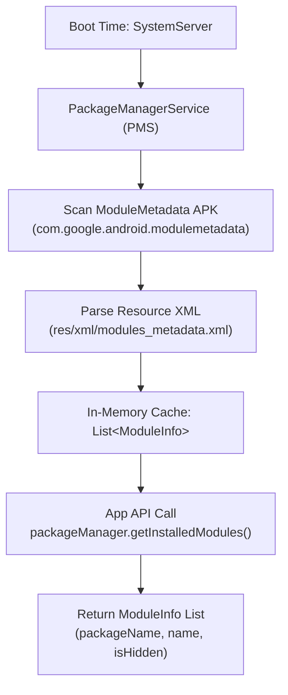

## ModuleMetadata는 기기에 있는 Mainline module 목록을 설명한다

상위 문서: [Platform modularity contracts](android-platform-modularity.md)

ModuleMetadata (`com.android.modulemetadata` 또는 `com.google.android.modulemetadata`)는 특정 타겟 디바이스에 탑재되고 활성화된 Mainline 모듈들의 상세 메타데이터(Module Name, Package Name, Hidden 여부, 업그레이드 지원 여부 등)를 구조화하여 제공하는 시스템 컴포넌트 패키지다.

`SystemServer` 부팅 과정에서 `PackageManagerService`가 `ModuleMetadata` 패키지 내부의 메타데이터 XML 매니페스트(`res/xml/modules_metadata.xml`)를 캐싱하며, 공개 API인 `PackageManager.getInstalledModules()` 및 `ModuleInfo` 클래스를 통해 타겟 기기의 모듈화 상태를 조회할 수 있게 한다.

---

### 내부 동작 메커니즘 (ModuleMetadata Boot Parsing & Query Engine)

1. **시스템 서버 초기화 및 XML 파싱**:
   - `SystemServer` 진입 시 `PackageManagerService`가 `/system/app/ModuleMetadata` 또는 `/system/priv-app/ModuleMetadata`를 스캔한다.
   - `modules_metadata.xml`을 파싱하여 시스템 메모리의 `ModuleInfo` 레지스트리에 캐싱한다.

2. **`ModuleInfo` 데이터 구조체**:
   - `getName()`: 사용자 가독형 모듈 명칭 (예: "Media Framework Framework").
   - `getPackageName()`: 메인라인 APEX/APK 패키지명 (예: `com.google.android.media`).
   - `isHidden()`: 설정 UI 등에서 은닉되는 내부 시스템 모듈 여부.

3. **앱 레이어 조회 권한 및 경계**:
   - 일반 써드파티 앱도 `packageManager.getInstalledModules(0)`를 호출하여 기기 메타데이터를 조회할 수 있지만, 패키지 이름 존재 여부로 하드코딩된 기능 제어를 수행하면 안 된다.



#### Kotlin / Java API 사용 예시 (`ModuleInfo` 조회)

```kotlin
import android.content.pm.ModuleInfo
import android.content.pm.PackageManager
import android.content.Context

fun printInstalledMainlineModules(context: Context) {
    val packageManager = context.packageManager
    
    // 설치된 모든 Mainline 모듈 목록 조회
    val installedModules: List<ModuleInfo> = packageManager.getInstalledModules(PackageManager.MATCH_ALL)
    
    for (module in installedModules) {
        val name = module.name // 예: "AdServices", "Conscrypt"
        val packageName = module.packageName // 예: "com.google.android.adservices"
        val isHidden = module.isHidden
        
        Log.d("MainlineMetadata", "Module: $name ($packageName), Hidden: $isHidden")
    }
}
```

---

### 관찰 가능한 증거 (Observable Evidence)

1. **기기의 ModuleMetadata 패키지 설치 상태 확인**:
   ```bash
   adb shell pm list packages --show-versioncode | grep modulemetadata
   # package:com.google.android.modulemetadata versionCode:341000000
   ```

2. **PackageManager 쉘 명령을 통한 Mainline 모듈 목록 조회**:
   ```bash
   adb shell pm list modules
   # 출력 예시:
   # module:com.google.android.art name:ART Package
   # module:com.google.android.media name:Media Provider Package
   # module:com.google.android.sdkext name:SDK Extensions Package
   ```

3. **ModuleMetadata 패키지 상세 덤프 확인**:
   ```bash
   adb shell dumpsys package com.google.android.modulemetadata | grep -E "versionName|codePath"
   # codePath=/system/app/ModuleMetadata
   # versionName=2026-08-01
   ```

---

### 관찰 가능 신호와 디버깅 진입점

- 앱의 호환성 디버깅 시 `pm list modules` 출력을 사용하여 해당 기기 제조사가 특정 메인라인 모듈(예: `com.google.android.tethering`)을 순정 AOSP 모듈로 유지했는지, custom 벤더 바이너리로 교체했는지 추적한다.
- 특정 API 사용 여부를 결정할 때는 `ModuleInfo` 패키지 이름 비교 대신 `SdkExtensions.getExtensionVersion()` 또는 `PackageManager.hasSystemFeature()`를 사용하는 것이 Google 호환성 지침에 부합한다.

관련 노트: [Mainline module 목록은 release와 device에 따라 달라지는 metadata다](mainline-module-metadata.md), [앱은 Mainline 패키지 이름이 아니라 API/feature availability를 검사해야 한다](mainline-api-feature-checks.md).

공식 문서: [ModuleMetadata Specs](https://source.android.com/docs/core/ota/modular-system/metadata)

---

### 올바른 모듈 가용성 확인 방법

```kotlin
// 잘못된 방법 ❌: 패키지 이름으로 모듈 존재 여부 확인
fun checkDnsResolverWrong(pm: PackageManager): Boolean {
    return try {
        pm.getPackageInfo("com.google.android.resolv", 0)
        true
    } catch (e: PackageManager.NameNotFoundException) {
        false  // AOSP 기기에서는 "com.android.resolv" 이름이 다름
    }
}

// 올바른 방법 ✅: API/Feature availability check
fun checkNetworkFeature(pm: PackageManager): Boolean {
    // 패키지 이름이 아닌 feature flag나 API level로 판단
    return Build.VERSION.SDK_INT >= Build.VERSION_CODES.Q
        || pm.hasSystemFeature(PackageManager.FEATURE_WIFI)
}

// ModuleMetadata API로 현재 기기의 Mainline 모듈 목록 조회
fun listMainlineModules(pm: PackageManager): List<ModuleInfo> {
    return if (Build.VERSION.SDK_INT >= Build.VERSION_CODES.Q) {
        pm.getInstalledModules(0)  // Android 10+ API
    } else emptyList()
}
```

### 대표적인 Mainline 모듈 (Android 12+ 기준)

| 모듈 기능 | Google 패키지명 (참고용) | 업데이트 주기 |
|:---|:---|:---:|
| ART Runtime | `com.google.android.art` | Play Store |
| DNS Resolver | `com.google.android.resolv` | Play Store |
| Media | `com.google.android.media` | Play Store |
| Wi-Fi | `com.google.android.wifi` | Play Store |
| SDK Extensions | `com.google.android.sdkext` | Play Store |

> ⚠️ 이 목록은 예시이며 release/device마다 다르다. 실제 기기의 모듈 목록은 항상 런타임에서 확인한다.

### 판단 기준

- 앱 기능 분기는 package name 나열보다 API/feature availability check 를 우선한다. 패키지 이름은 기기/빌드 flavor에 따라 다르다.
- 기기에서 module identity 가 필요하면 `PackageManager.getInstalledModules()`로 조회한다.
- 특정 모듈이 설치됐는지보다 해당 API 가 동작하는지 직접 확인하는 것이 더 강건한 방어 코드다.

### 경계

- 기기의 Mainline 모듈을 조회하는 `ModuleMetadata` 구현체는 [ModuleMetadata는 기기에 설치된 Mainline 모듈을 나타낸다](mainline-module-metadata.md)가 다룬다.
- SDK extension과 feature availability 확인 패턴은 [앱은 Mainline 패키지 이름이 아닌 API/feature availability를 확인해야 한다](mainline-api-feature-checks.md)가 다룬다.

### 관측 가능한 증거 (Observable Evidence)

```bash
# 기기에 설치된 Mainline 모듈 목록 확인
adb shell pm list packages --apex-only

# 특정 모듈 버전 확인
adb shell pm list packages --show-versioncode --apex-only | grep -i "media\|art\|dns"

# ModuleMetadata 파일 직접 확인
adb shell cat /system/etc/vintf/packages.xml | grep "module"
```

### 관련 문서

- [ModuleMetadata는 기기에 설치된 Mainline 모듈을 나타낸다](mainline-module-metadata.md)
- [앱은 Mainline 패키지 이름이 아닌 API/feature availability를 확인해야 한다](mainline-api-feature-checks.md)
- [Mainline은 정규 플랫폼 릴리스 외부에서 선택된 시스템 컴포넌트를 업데이트한다](project-mainline-updates.md)

공식 문서: [Mainline available modules](https://source.android.com/docs/core/ota/modular-system), [ModuleMetadata](https://source.android.com/docs/core/ota/modular-system/metadata)
