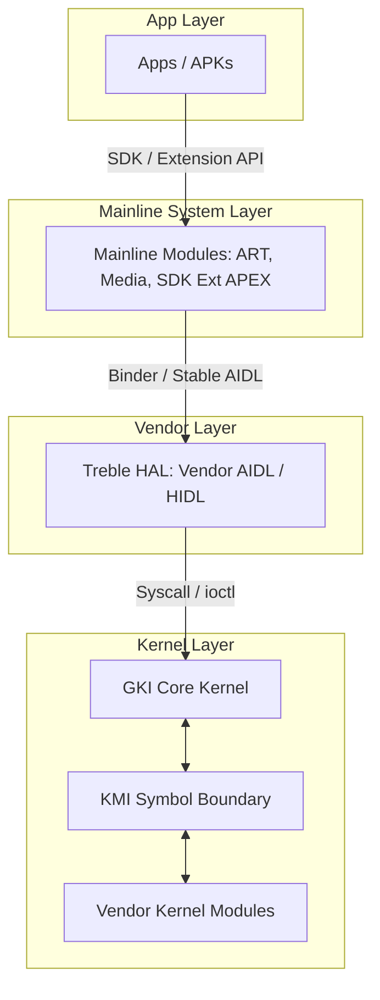

## Android 플랫폼 모듈화는 system, vendor, kernel 업데이트 경계를 층위별로 나눈다

Android 플랫폼 모듈화는 하나의 기능이 아니라 fragmentation 을 줄이기 위한 여러 update boundary 의 조합이다. Mainline 은 일부 system component 를 독립 module 로 만들고, APEX 는 lower-level module 을 boot-aware package 로 담으며, SDK Extensions 는 일부 API availability 를 platform release 밖에서 표현한다.

Treble 과 GKI 는 더 낮은 층위의 경계다. Treble 은 system image 와 vendor implementation 을 stable interface 로 분리하고, GKI 는 common kernel 과 vendor kernel module 을 KMI 경계로 분리한다.

따라서 "Android 가 모듈식이다"라는 말은 어느 층을 말하는지 먼저 정해야 한다. 앱 개발자는 SDK Extension 과 feature availability 를 확인하고, 플랫폼 개발자는 APEX/Mainline/Treble/GKI 각각의 compatibility contract 를 확인한다.

---

### 내부 동작 메커니즘 (4-Layer Update Boundaries)

Android의 모듈화는 각 Layer 마다 업데이트 주체와 상호 운용성 계약(Compatibility Contract)이 엄격히 나뉘어 있다.

1. **Application Layer (APK / AAB)**:
   - Google Play / Sideload를 통해 동적으로 설치/업데이트. PackageManager 및 Dalvik/ART ClassLoader가 격리 관리.
2. **Modular System Components Layer (Mainline APEX / APK)**:
   - ART, Media, Conscrypt, DNS Resolver 등 핵심 시스템 컴포넌트. Google Play System Update(GPSU)를 통해 전체 OS OTA 없이 개별 APEX 단위로 업데이트.
3. **Framework / HAL Layer (Treble Boundary)**:
   - `/system` (Google Framework)과 `/vendor` (SoC/OEM Hardware Abstraction)를 AIDL/HIDL 버전화된 인터페이스로 분리.
4. **Kernel Layer (GKI & KMI Boundary)**:
   - Generic Kernel Image(GKI)로 리눅스 커널 코어를 통일하고, 드라이버는 Vendor Kernel Module(VKM)로 분리. Kernel Module Interface(KMI) 심볼 버전으로 호환성 유지.



---

### AOSP `Android.bp` APEX 모듈 정의 예시

```bp
// Mainline APEX 모듈 파일 시스템 포맷 선언
apex {
    name: "com.android.art",
    manifest: "manifest.json",
    java_libs: [
        "core-oj",
        "core-libart",
    ],
    native_shared_libs: [
        "libart",
        "libartbase",
    ],
    key: "com.android.art.key",
    certificate: ":com.android.art.certificate",
    updatable: true,
}
```

---

### 관찰 가능한 증거 (Observable Evidence)

1. **층위별 상태 관찰 adb 명령어**:
   ```bash
   # Mainline APEX 활성화 목록 및 버전 확인
   adb shell pm list packages --apex-only -u

   # Treble VINTF 매니페스트 (System <-> Vendor 호환성) 확인
   adb shell dumpsys vintf

   # GKI 커널 버전 확인 (generic kernel 여부 확인)
   adb shell uname -r
   # Example: 5.15.110-android14-11-g1234567 (GKI release format)
   ```
2. **Mainline APEX 마운트 경로 확인**:
   ```bash
   adb shell mount | grep /apex
   # Example: /dev/block/loop0 on /apex/com.android.art type ext4 (ro,nodev,relatime)
   ```

---

관련 노트: [Mainline 경계](mainline-updates-selected-system-components-outside-normal-platform-releases.md), [Treble 정본](../../kernel-and-hal/hal-native-contracts/treble-separates-system-and-vendor-through-stable-interfaces.md), [GKI 정본](../../kernel-and-hal/kernel-contracts/gki-splits-generic-core-from-vendor-modules.md).

공식 문서: [Mainline](https://source.android.com/docs/core/ota/modular-system), [Partitions overview](https://source.android.com/docs/core/architecture/partitions)

