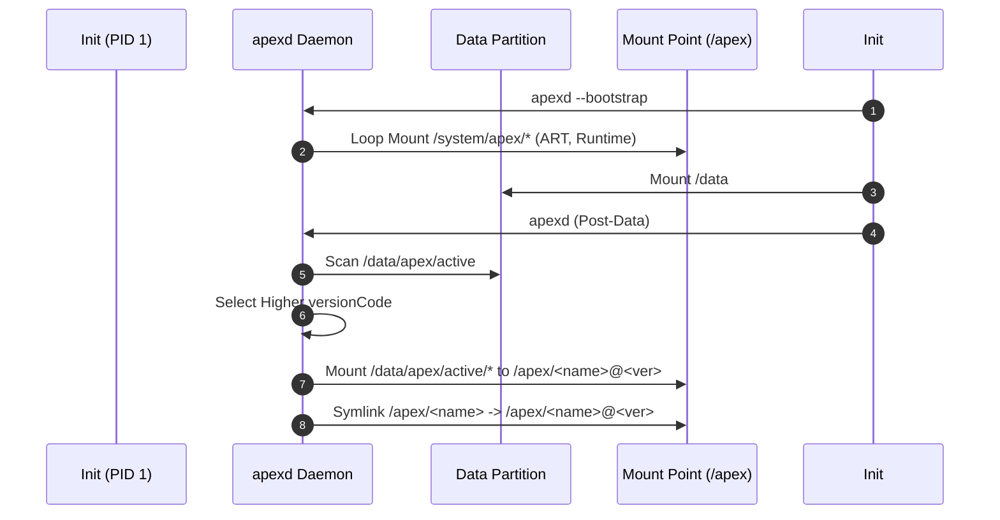

## APEX activation 은 boot-time mount, version selection, rollback 경계다

APEX update 는 설치 즉시 running system 을 임의로 바꾸는 모델이 아니다. updated APEX 는 기존 built-in package 를 shadow 할 수 있고, activation 은 boot 과정에서 `apexd`(native daemon, system_server 보다 이른 단계)가 version 을 선택하고 mount 하면서 이루어진다. 이 계약은 native/platform 계층 책임이며, 앱 코드는 activation 시점을 관찰할 수만 있고 직접 제어하지 못한다.

Mainline module update 는 필요한 module 묶음이 원자적으로 적용되거나 rollback 될 수 있어야 한다. 일부만 적용되어 system component set 이 어긋나는 상태를 피하는 것이 핵심이다.

Compressed APEX 는 업데이트 후 built-in APEX 가 차지하는 저장 공간 문제를 줄이기 위한 포맷이다. 성능 최적화 포맷이라기보다 system partition 과 `/data` update copy 사이의 storage tradeoff 를 다루는 장치다.

---

### 내부 동작 메커니즘 (apexd Boot Activation & Rollback Engine)

APEX의 활성화 및 롤백 처리는 부팅 단계에서 Native Daemon인 `apexd`가 총괄한다.

1. **Bootstrap Activation (Init 1st/2nd Stage)**:
   - `/data` 파티션이 마운트되기 전, `init`이 `apexd --bootstrap`을 실행한다.
   - `/system/apex`에 내장된 필수 APEX(`com.android.runtime`, `com.android.art`, `com.android.conscrypt`)를 마운트하여 기본 런타임 환경을 구축한다.
2. **Post-Data Activation & Version Selection**:
   - `/data` 마운트 후 `apexd`가 `/data/apex/active`에 다운로드된 업그레이드 APEX를 스캔한다.
   - 내장 버전(System)과 업데이트 버전(Data)의 `versionCode`를 비교하여 높은 버전을 선택한다.
   - `apex_payload.img`(ext4/erofs 이미지)를 `/dev/block/loopN` 루프백 디바이스로 연결하고, `/apex/<package_name>@<version>` 경로에 마운트한 뒤 `/apex/<package_name>` 심볼릭 링크를 업데이트한다.
3. **Boot Loop Prevention & Rollback**:
   - 새로 마운트된 APEX 업데이트로 인해 `system_server`가 크래시를 반복하면, System Watchdog / Rescue Party가 롤백 플래그를 세운다.
   - 다음 부팅 시 `apexd`는 해당 업데이트를 "revert" 상태로 격리하고 안전한 `/system/apex` 내장 버전으로 심볼릭 링크를 원복(Rollback)한다.



---

### 관찰 가능한 증거 (Observable Evidence)

1. **dumpsys apexservice 상태 점검**:
   ```bash
   adb shell dumpsys apexservice
   # Output: Active APEX list, Staged APEX list, Rollback history
   ```
2. **logcat 태그 `apexd` 활성화 및 롤백 로그**:
   ```text
   I apexd: Activating /data/apex/active/com.android.art@330000000.apex
   I apexd: Mounted /apex/com.android.art@330000000 on /dev/block/loop3
   W apexd: Health check failed! Rolling back staged APEX session 12345
   ```
3. **마운트 포인트 및 심볼릭 링크 관찰**:
   ```bash
   adb shell ls -la /apex
   # drwxr-xr-x 4 root root 0 2026-08-01 00:00 com.android.art -> com.android.art@330000000
   ```

---

### 관찰 가능 신호와 디버깅 진입점

- `adb shell pm list packages --apex-only` 로 현재 활성화된 APEX 목록과 버전을 볼 수 있다.
- logcat 에서 `apexd` tag 를 확인하면 activation, staged install, rollback 시도를 볼 수 있다.
- staged APEX 설치는 재부팅이 있어야 activation 이 완료되므로, "설치했는데 반영이 안 됐다"는 보고는 재부팅 여부부터 확인한다.

관련 노트: [APEX package 경계](apex-packages-lower-level-system-modules-that-apk-cannot-model-well.md), [boot/runtime 정본](../../boot-and-runtime/android-boot-and-runtime.md), [platform-modularity hub](../android-platform-modularity.md).

공식 문서: [How To APEX](https://android.googlesource.com/platform/system/apex/+/refs/heads/main/docs/howto.md)

공식 문서: [APEX file format](https://source.android.com/docs/core/ota/apex)

