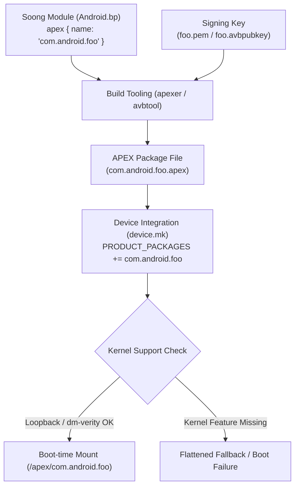

## APEX build와 device support는 앱 개발 API가 아니라 플랫폼 통합 계약이다

상위 문서: [Platform modularity contracts](platform-modularity-contracts.md)

**APEX**(패키지/컨테이너 포맷 — 정식 정의는 [APEX 는 APK 모델로 다루기 어려운 lower-level system module 을 담는다](apex-packages-lower-level-system-modules-that-apk-cannot-model-well.md) 참고) 패키지를 빌드하고 런타임에 업데이트 가능하게 탑재하는 과정은 앱 개발자가 Gradle 의존성을 추가하는 유저스페이스 작업이 아니다. 이는 **Soong**(Android.bp 파일로 빌드 규칙을 선언하는 AOSP 전용 빌드 시스템 — Make를 대체한다) 빌드 시스템 모듈 정의(`apex {}`), **AVB**(Android Verified Boot — 부팅 이미지와 파티션이 변조되지 않았음을 서명으로 검증하는 체계. 배경 지식: [root-of-trust-and-chain-of-trust](01_inbox/security/fundamentals/root-of-trust-and-chain-of-trust.md)) 서명 키 교체, init service script override, 커널 레벨 루프백 디바이스 지원(`CONFIG_BLK_DEV_LOOP`, **dm-verity**: 블록 디바이스를 읽을 때마다 해시를 검증해 파티션 변조를 탐지하는 커널 메커니즘. 배경 지식: [device-mapper-and-dm-verity](02_references/operating-systems/device-mapper-and-dm-verity.md)), 파티션 마운트 정책이 완벽히 정합성을 이루어야 하는 **플랫폼 통합 계약(Platform Integration Contract)**이다.

네이티브 공유 라이브러리(`*.so`), ART/Dalvik 컴파일러, **Bionic libc**(Android가 자체적으로 만든 경량 C 표준 라이브러리 구현체 — glibc 대신 쓰인다), Conscrypt보안 모듈 등 네이티브 및 프레임워크 최하단 컴포넌트를 분리 배포하려면 기기 보드 레벨에서 Updatable APEX 지원이 선언되어 있어야 한다.

---

### 내부 동작 메커니즘 (APEX Build System & Device Support Contracts)

1. **Soong 빌드 모듈 정의 (`Android.bp`)**:
   - `apex {}` 규칙을 통해 네이티브 바이너리(`binaries`), 라이브러리(`native_shared_libs`), Java 라이브러리(`java_libs`), 서티피케이트(`certificate`), init 스크립트(`init_rc`)를 묶어 ext4/erofs 페이로드 이미지(`apex_payload.img`)로 팩킹한다.

2. **커널 및 기기 빌드 의존성 선언**:
   - **Kernel Requirement**: 루프백 블록 디바이스(`CONFIG_BLK_DEV_LOOP`), dm-verity 무결성 검증(`CONFIG_DM_VERITY`), 파일시스템(`CONFIG_EXT4_FS` 또는 `CONFIG_EROFS_FS`)이 필수다.
   - **Device Makefile Requirement**: `OVERRIDE_TARGET_FLATTEN_APEX := false` (Non-flattened APEX 활성화)를 선언하여 부팅 시 마운트 포인트를 생성하도록 지정한다.

3. **APEX 내 Init Service Override**:
   - APEX 내부 `/etc/init.rc` 스크립트에서 기존 `/system/etc/init/*.rc`에 위치한 서비스를 대체하기 위해 `override` 지시어를 사용한다.



#### Soong `Android.bp` & `device.mk` 선언 예시

```bp
// Android.bp (APEX Module Definition)
apex {
    name: "com.android.mediaprovider",
    manifest: "manifest.json",
    bootclasspath_fragments: ["com.android.mediaprovider-bootclasspath-fragment"],
    java_libs: ["framework-mediaprovider"],
    native_shared_libs: ["libmediaprovider_jni"],
    multilib: {
        both: {
            binaries: ["mediaprovider_service"],
        },
    },
    key: "com.android.mediaprovider.key",
    certificate: ":com.android.mediaprovider.certificate",
    updatable: true,
}
```

```make
# device/acme/rocket/device.mk (Updatable APEX Device Configuration)
OVERRIDE_TARGET_FLATTEN_APEX := false
PRODUCT_PACKAGES += com.android.mediaprovider
```

---

### 관찰 가능한 증거 (Observable Evidence)

1. **apexd 및 APEX 마운트 상태 확인**:
   ```bash
   adb shell dumpsys apexservice
   # 출력 증거:
   # Active APEX packages:
   #   com.android.mediaprovider v340000000 [path: /system/apex/com.android.mediaprovider.apex]
   ```

2. **기기의 Flattened / Non-flattened APEX 지원 여부 확인**:
   ```bash
   adb shell getprop ro.apex.updatable
   # true (Updatable APEX 지원 기기 증거)
   ```

3. **마운트된 루프백 블록 디바이스 관찰**:
   ```bash
   adb shell mount | grep /apex
   # /dev/block/loop2 on /apex/com.android.mediaprovider@340000000 type ext4 (ro,nodev,relatime)
   ```

---

### 관찰 가능 신호와 디버깅 진입점

- APEX 패키지 빌드 시 `error: module "XYZ" is not targeted at android` 오류가 나타나면 해당 네이티브 라이브러리의 `apex_available` 목록에 해당 APEX 이름이 누락되었는지 검증한다.
- 디바이스 부팅 중 APEX 마운트에 실패하면 `adb logcat -b main | grep apexd` 로그에서 dm-verity 해시 불일치나 커널 루프백 디바이스 부족(`No free loop device`) 증상을 확인한다.

관련 노트: [APEX activation은 boot-time mount, version selection, rollback 경계다](apex-activation-uses-boot-time-mounting-version-selection-and-rollback.md), [APEX는 APK 모델로 다루기 어려운 lower-level system module을 담는다](apex-packages-lower-level-system-modules-that-apk-cannot-model-well.md), [android-platform-modularity hub](../android-platform-modularity.md).

공식 문서: [How To APEX](https://android.googlesource.com/platform/system/apex/+/refs/heads/main/docs/howto.md)
