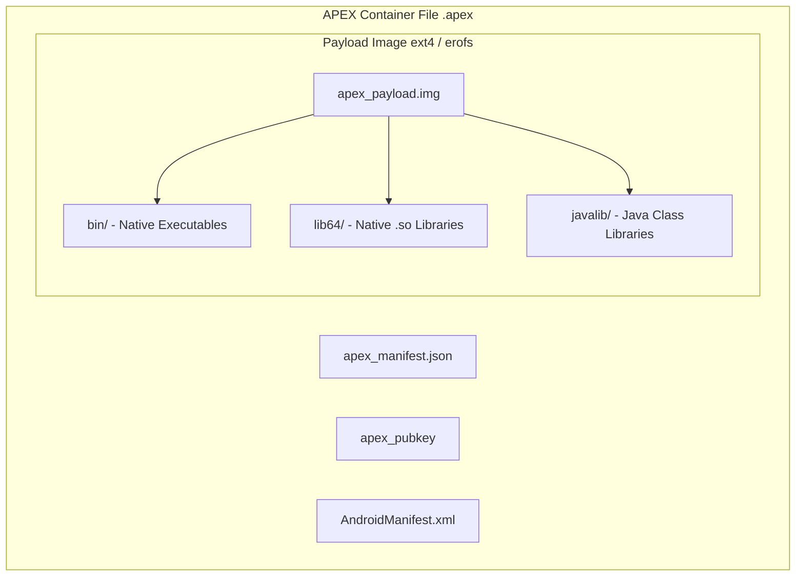

## APEX 는 APK 모델로 다루기 어려운 lower-level system module 을 담는다

APEX(Android Pony EXpress)는 Android 10 에서 도입된 package/container format 이다. ART, native service, class library, HAL 처럼 APK 설치 모델만으로는 boot timing 과 system integration 을 다루기 어려운 lower-level component 를 업데이트하기 위해 만들어졌다.

APEX 파일은 package identity 와 version metadata, payload image, public key 같은 요소를 포함하고, apexd 가 boot 과정에서 activation 을 관리한다. 어떤 APEX 는 매우 이른 boot 단계에 필요하므로 일반 APK 처럼 PackageManager 가 준비된 뒤에만 다루는 모델이 맞지 않는다.

APEX 는 "앱 배포 포맷의 다른 이름"이 아니다. platform partition, verified payload, boot activation, rollback, signing key 가 얽힌 system update 경계다.

---

### 내부 동작 메커니즘 (APEX File Structure & Payload Engine)

APEX 컨테이너는 Google Play 배포 호환성을 위한 Zip Archive 포맷이며 내부 구조는 다음과 같다.

1. **`apex_manifest.json`**: APEX 패키지 이름(`name`)과 `version` 코드 정의.
2. **`apex_payload.img`**: ext4 또는 erofs 파일 시스템 이미지. Native Shared Library (`lib64/*.so`), Java JAR (`javalib/*.jar`), Executable Binary (`bin/*`)가 포함됨.
3. **`apex_pubkey`**: payload 이미지를 검증하기 위한 RSA Public Key.
4. **`AndroidManifest.xml`**: Google Play Store가 APK 인프라를 사용해 수신/설치할 수 있도록 패키지명과 버전을 동일하게 포장하는 APK Wrapper 레이어.



---

### `apex_manifest.json` 설정 예시

```json
{
  "name": "com.android.art",
  "version": 330000000,
  "provideNativeLibs": [
    "libart.so",
    "libartbase.so"
  ],
  "requireNativeLibs": [
    "libc.so",
    "libdl.so",
    "libm.so"
  ]
}
```

---

### 관찰 가능한 증거 (Observable Evidence)

1. **deapexer 도구를 이용한 APEX 이미지 내부 추출 및 확인**:
   ```bash
   # APEX 파일 내부 목록 확인
   deapexer list com.android.art.apex

   # APEX 이미지 내용 디렉토리에 추출
   deapexer extract com.android.art.apex ./art_apex_extracted
   ```
2. **adb shell 로 마운트된 APEX 내부 바이너리/라이브러리 구조 확인**:
   ```bash
   adb shell ls -la /apex/com.android.art/bin
   adb shell ls -la /apex/com.android.art/lib64
   ```

---

관련 노트: [APEX activation/rollback](apex-activation-uses-boot-time-mounting-version-selection-and-rollback.md), [boot/runtime 정본](../../boot-and-runtime/android-boot-and-runtime.md), [platform-modularity hub](../android-platform-modularity.md).

공식 문서: [APEX file format](https://source.android.com/docs/core/ota/apex)

