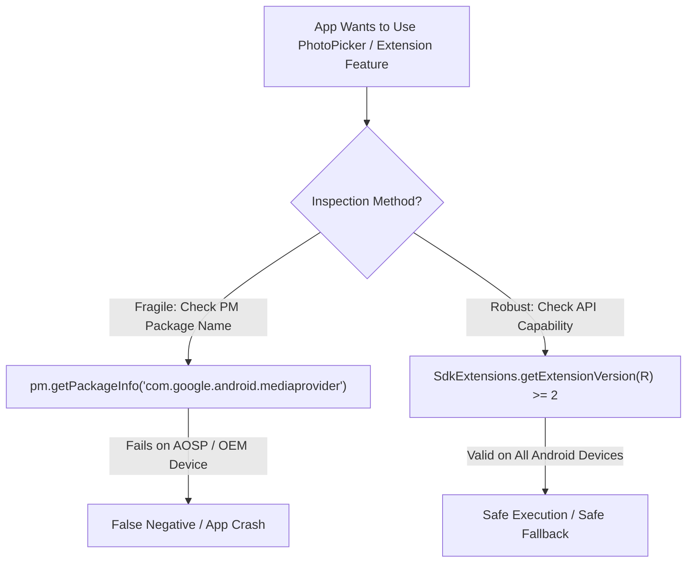

## 앱은 Mainline 패키지 이름이 아니라 API/feature availability 를 검사해야 한다

상위 문서: [Platform modularity contracts](platform-modularity-contracts.md)

앱 코드가 특정 Mainline APEX 의 패키지명(예: `com.google.android.mediaprovider`)이나 설치 버전을 직접 검사해서 기능을 켜고 끄는 것은 취약한 패턴이다. 패키지 이름과 내부 구성은 AOSP 와 GMS 디바이스 사이, 혹은 빌드 타깃에 따라 다를 수 있다.

올바른 계약은 `SdkExtensions.getExtensionVersion()`, `PackageManager.hasSystemFeature()`, 또는 해당 API 클래스의 존재 유무를 확인하는 것이다.

---

### 내부 동작 메커니즘 (Package Name Fragility vs API Capability Contract)

1. **Mainline Package Identity Abstraction**:
   - Google GMS 빌드 디바이스에서는 APEX 패키지명이 `com.google.android.mediaprovider`로 포함될 수 있지만, AOSP 빌드나 중국 내수용 OEM 빌드에서는 `com.android.mediaprovider`로 명명되거나 OEM 커스텀 APEX 패키지로 변경될 수 있다.
2. **PackageManager Feature & Extension API Mapping**:
   - 플랫폼은 개별 APEX 패키지명을 가리고 `PackageManager.hasSystemFeature(String featureName)` 또는 `SdkExtensions.getExtensionVersion(int api)`라는 추상화된 공개 호환성 레이어를 제공한다.
   - 앱이 이 호환성 레이어를 조회할 때 Framework는 내부적으로 `/system/etc/permissions/*.xml` 또는 `/apex/com.android.sdkext/etc/sdkinfo.binarypb`를 파싱하여 정확한 가용성을 리턴한다.



---

### 올바른 Feature Check vs 취약한 Package Check 예시 (Kotlin)

```kotlin
// [INCORRECT] 취약한 패키지명 직접 검사 (OEM/AOSP 빌드에서 오동작 위험)
fun isMediaProviderUpdatedFragile(context: Context): Boolean {
    return try {
        val info = context.packageManager.getPackageInfo("com.google.android.mediaprovider", 0)
        info.longVersionCode >= 330000000
    } catch (e: PackageManager.NameNotFoundException) {
        false
    }
}

// [CORRECT] 플랫폼 호환성 계약을 활용한 확장 API 가용성 검사
fun isMediaProviderUpdatedRobust(): Boolean {
    return if (Build.VERSION.SDK_INT >= Build.VERSION_CODES.R) {
        SdkExtensions.getExtensionVersion(Build.VERSION_CODES.R) >= 2
    } else {
        false
    }
}
```

---

### 관찰 가능한 증거 (Observable Evidence)

1. **디바이스 시스템 Feature 목록 덤프 확인**:
   ```bash
   adb shell pm list features
   # Output: feature:android.hardware.telephony, feature:android.software.cts ...
   ```
2. **GMS vs AOSP APEX 패키지 이름 이원화 관찰**:
   ```bash
   # GMS Device:
   adb shell pm list packages --apex-only | grep mediaprovider
   # package:com.google.android.mediaprovider

   # AOSP Emulator:
   adb shell pm list packages --apex-only | grep mediaprovider
   # package:com.android.mediaprovider
   ```

---

관련 노트: [SDK Extensions](sdk-extensions-express-api-availability-beyond-sdk-int.md), [compile/runtime check](sdk-extension-compile-sdk-extension-and-runtime-check-are-separate-steps.md).

공식 문서: [SDK Extensions](https://developer.android.com/guide/sdk-extensions), [SdkExtensions API](https://developer.android.com/reference/android/os/ext/SdkExtensions)
