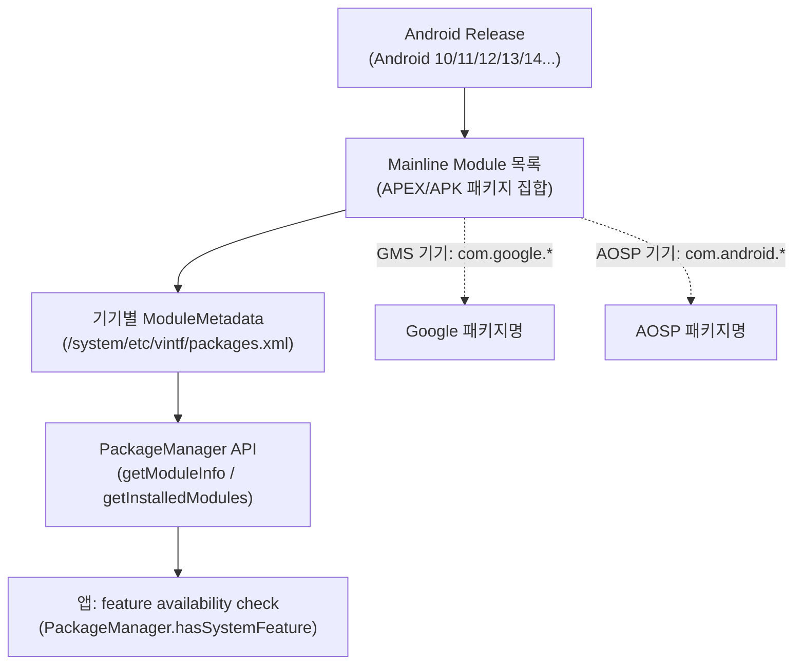

## Mainline module 목록은 release 와 device 에 따라 달라지는 metadata 다

상위 문서: [Platform Modularity 계약](platform-modularity-contracts.md)

Mainline module 목록은 고정된 암기표가 아니다. Android release 가 올라가며 module 이 추가되고, package format 도 APK 또는 APEX 로 다를 수 있으며, device 와 build flavor 에 따라 Google package name 과 AOSP package name 이 다를 수 있다.

### 메커니즘: Mainline 모듈 메타데이터 조회 경로



### 올바른 모듈 가용성 확인 방법

```kotlin
// 잘못된 방법 ❌: 패키지 이름으로 모듈 존재 여부 확인
fun checkDnsResolverWrong(pm: PackageManager): Boolean {
    return try {
        pm.getPackageInfo("com.google.android.resolv", 0)
        true
    } catch (e: PackageManager.NameNotFoundException) {
        false  // AOSP 기기에서는 "com.android.resolv" 이름이 다름
    }
}

// 올바른 방법 ✅: API/Feature availability check
fun checkNetworkFeature(pm: PackageManager): Boolean {
    // 패키지 이름이 아닌 feature flag나 API level로 판단
    return Build.VERSION.SDK_INT >= Build.VERSION_CODES.Q
        || pm.hasSystemFeature(PackageManager.FEATURE_WIFI)
}

// ModuleMetadata API로 현재 기기의 Mainline 모듈 목록 조회
fun listMainlineModules(pm: PackageManager): List<ModuleInfo> {
    return if (Build.VERSION.SDK_INT >= Build.VERSION_CODES.Q) {
        pm.getInstalledModules(0)  // Android 10+ API
    } else emptyList()
}
```

### 대표적인 Mainline 모듈 (Android 12+ 기준)

| 모듈 기능 | Google 패키지명 (참고용) | 업데이트 주기 |
|:---|:---|:---:|
| ART Runtime | `com.google.android.art` | Play Store |
| DNS Resolver | `com.google.android.resolv` | Play Store |
| Media | `com.google.android.media` | Play Store |
| Wi-Fi | `com.google.android.wifi` | Play Store |
| SDK Extensions | `com.google.android.sdkext` | Play Store |

> ⚠️ 이 목록은 예시이며 release/device마다 다르다. 실제 기기의 모듈 목록은 항상 런타임에서 확인한다.

### 판단 기준

- 앱 기능 분기는 package name 나열보다 API/feature availability check 를 우선한다. 패키지 이름은 기기/빌드 flavor에 따라 다르다.
- 기기에서 module identity 가 필요하면 `PackageManager.getInstalledModules()`로 조회한다.
- 특정 모듈이 설치됐는지보다 해당 API 가 동작하는지 직접 확인하는 것이 더 강건한 방어 코드다.

### 경계

- 기기의 Mainline 모듈을 조회하는 `ModuleMetadata` 구현체는 [ModuleMetadata는 기기에 설치된 Mainline 모듈을 나타낸다](modulemetadata-describes-mainline-modules-on-a-device.md)가 다룬다.
- SDK extension과 feature availability 확인 패턴은 [앱은 Mainline 패키지 이름이 아닌 API/feature availability를 확인해야 한다](apps-should-check-api-feature-availability-not-mainline-package-names.md)가 다룬다.

### 관측 가능한 증거 (Observable Evidence)

```bash
# 기기에 설치된 Mainline 모듈 목록 확인
adb shell pm list packages --apex-only

# 특정 모듈 버전 확인
adb shell pm list packages --show-versioncode --apex-only | grep -i "media\|art\|dns"

# ModuleMetadata 파일 직접 확인
adb shell cat /system/etc/vintf/packages.xml | grep "module"
```

### 관련 문서

- [ModuleMetadata는 기기에 설치된 Mainline 모듈을 나타낸다](modulemetadata-describes-mainline-modules-on-a-device.md)
- [앱은 Mainline 패키지 이름이 아닌 API/feature availability를 확인해야 한다](apps-should-check-api-feature-availability-not-mainline-package-names.md)
- [Mainline은 정규 플랫폼 릴리스 외부에서 선택된 시스템 컴포넌트를 업데이트한다](mainline-updates-selected-system-components-outside-normal-platform-releases.md)

공식 문서: [Mainline available modules](https://source.android.com/docs/core/ota/modular-system), [ModuleMetadata](https://source.android.com/docs/core/ota/modular-system/metadata)
