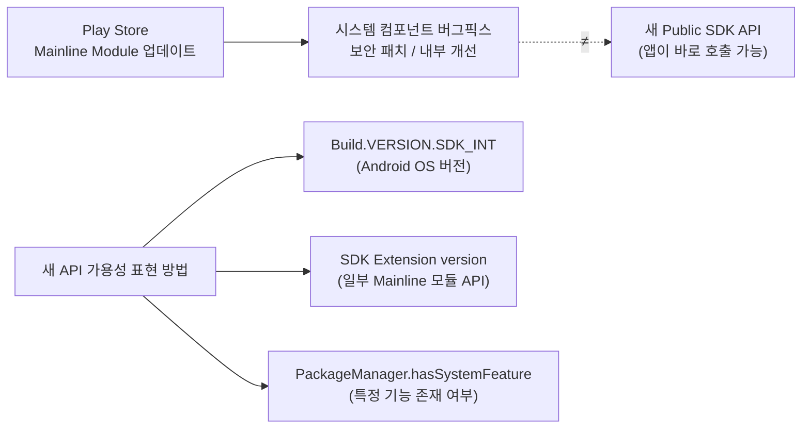

## Mainline module update 는 임의의 새 public API 배포와 같지 않다

상위 문서: [Platform Modularity 계약](platform-modularity-contracts.md)

Mainline module update 가 곧 앱이 바로 호출할 수 있는 새 public SDK API 를 뜻하지는 않는다.

### 메커니즘: Mainline 업데이트 vs API 가용성 경계



Mainline 은 **delivery mechanism**(패치 전달 수단)이고, SDK Extensions 는 **app-facing 계약**(API 가용성 표현)이다.

### 올바른 API 가용성 확인 패턴

```kotlin
// 잘못된 접근 ❌: Mainline 모듈 업데이트 여부로 API 가용 판단
fun isNewBlobstoreApiAvailable(pm: PackageManager): Boolean {
    return try {
        // Mainline BlobStore 모듈 버전 확인 → 신뢰할 수 없음
        pm.getPackageInfo("com.google.android.blobstore", 0).longVersionCode > 12345L
    } catch (e: PackageManager.NameNotFoundException) { false }
}

// 올바른 접근 ✅: SDK_INT 또는 SDK Extension으로 판단
fun isBlobstoreApiAvailable(): Boolean {
    return Build.VERSION.SDK_INT >= Build.VERSION_CODES.R  // Android 11+
}

// SDK Extensions가 있는 API (Android 12L+ 일부 API)
fun checkExtensionVersion(): Boolean {
    if (Build.VERSION.SDK_INT >= Build.VERSION_CODES.S) {
        // SdkExtensions.getExtensionVersion은 특정 Mainline API 가용성을 표현
        val extVersion = SdkExtensions.getExtensionVersion(SdkExtensions.AD_SERVICES)
        return extVersion >= 4  // 특정 AdServices API가 Extension v4 이상에서 가용
    }
    return false
}
```

### 판단 기준

- Mainline module 은 SDK API, System API, stable C API, stable AIDL 같은 compatibility 가 보장되는 경계 안에서만 나머지 platform 과 통신해야 한다. 이 경계를 벗어난 임의 API 는 Mainline update로 배포할 수 없다.
- 앱 개발자에게 중요한 질문은 \"이 module 이 업데이트됐는가\"보다 \"내가 호출하려는 API 가 이 device 에서 사용 가능한가\"다.
- API 가용성 판단 우선순위: `SDK_INT` → SDK Extension version → `hasSystemFeature` → 런타임 reflection.

### 경계

- SDK Extensions의 compile-time/runtime 가용성 모델은 [SDK Extensions는 SDK_INT를 넘어서는 API 가용성을 표현한다](sdk-extensions-express-api-availability-beyond-sdk-int.md)가 다룬다.
- Mainline 모듈 목록과 기기별 메타데이터는 [Mainline module 목록은 release와 device에 따라 달라지는 metadata다](mainline-module-list-is-device-and-release-dependent-metadata.md)가 다룬다.

### 관측 가능한 증거 (Observable Evidence)

```bash
# 기기의 SDK Extension version 확인 (런타임 확인)
adb shell getprop ro.build.version.sdk_ext.r
adb shell getprop ro.build.version.sdk_ext.s

# 현재 설치된 Mainline 모듈 버전 확인
adb shell pm list packages --apex-only --show-versioncode

# API 가용성 오류: NoSuchMethodError (잘못된 SDK_INT 판단 결과)
adb logcat | grep "NoSuchMethodError"
```

### 관련 문서

- [SDK Extensions는 SDK_INT를 넘어서는 API 가용성을 표현한다](sdk-extensions-express-api-availability-beyond-sdk-int.md)
- [앱은 Mainline 패키지 이름이 아닌 API/feature availability를 확인해야 한다](apps-should-check-api-feature-availability-not-mainline-package-names.md)
- [Mainline module 목록은 release와 device에 따라 달라지는 metadata다](mainline-module-list-is-device-and-release-dependent-metadata.md)

공식 문서: [Mainline](https://source.android.com/docs/core/ota/modular-system), [SDK Extensions](https://developer.android.com/guide/sdk-extensions)
