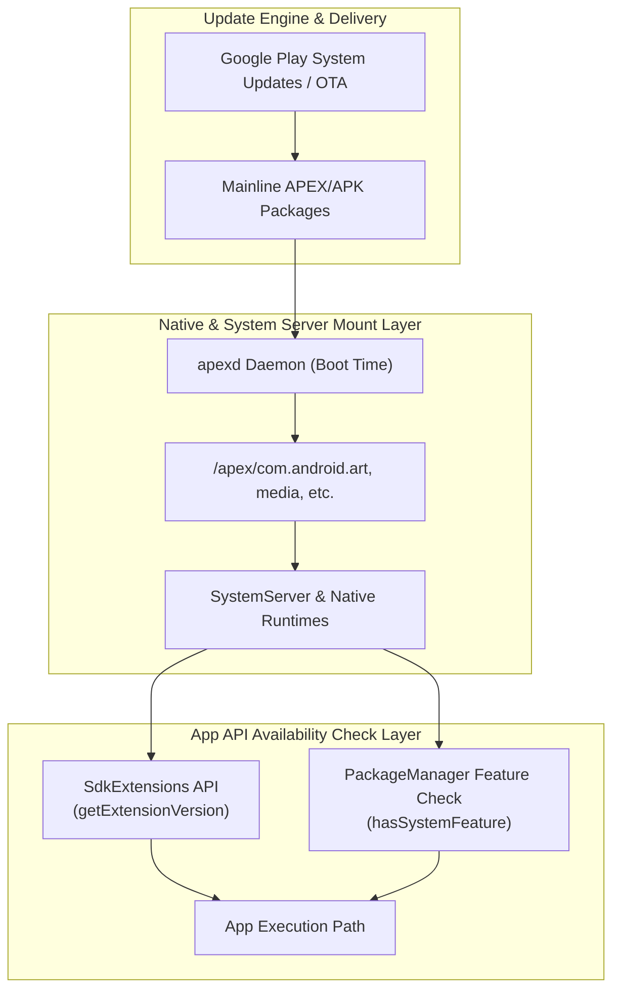

## Platform Modularity Contracts

이 노트는 상위 지도인 [Android Platform Modularity](../android-platform-modularity.md)가 가리키는 11개 원자 노트를 읽는 순서와 내부 경계로 묶은 Contract Map이다. 상위 지도가 Treble/GKI 같은 인접 도메인과의 관계를 다룬다면, 이 노트는 Mainline/APEX/SDK Extensions 내부의 판단 순서와 기술적 계약을 다룬다.

---

### 플랫폼 모듈화 아키텍처 (Platform Modularity Architecture)

---

### 모듈화 층위별 계약 요약 표 (Modularity Layering Summary Table)

| 구분 | 대상 컴포넌트 | 배포 수단 / 포맷 | 가용성 판단 검사 수단 |
| :--- | :--- | :--- | :--- |
| **Treble** | Vendor HALs (`/vendor`) | Vendor Image OTA / HIDL, AIDL | VINTF Manifest / `vintf check` |
| **GKI** | Generic Kernel Image | Kernel Boot Image (`boot.img`) | `/proc/version` / KMI 버전 |
| **Mainline** | ART, Media, Net, Conscrypt | APEX (`.apex`) / APK (`.apk`) | `SdkExtensions.getExtensionVersion()` |
| **SDK Extensions** | AdServices, SDK Extension APIs | Dynamic Mainline System Module | `getExtensionVersion(SdkExtensions.S)` |

---

### 읽는 순서

1. [Android 플랫폼 모듈화는 system, vendor, kernel 업데이트 경계를 층위별로 나눈다](android-platform-modularity-splits-update-boundaries-by-system-layer.md) — "모듈식"이라는 말이 가리키는 층위를 먼저 구분한다.
2. [Mainline은 선택된 system component를 정규 플랫폼 release 밖에서 업데이트한다](mainline-updates-selected-system-components-outside-normal-platform-releases.md), [Mainline module 목록은 release와 device에 따라 달라지는 metadata다](mainline-module-list-is-device-and-release-dependent-metadata.md), [ModuleMetadata는 기기에 있는 Mainline module 목록을 설명한다](modulemetadata-describes-mainline-modules-on-a-device.md) — Mainline 이 무엇을 언제 업데이트하는지.
3. [APEX는 APK 모델로 다루기 어려운 lower-level system module을 담는다](apex-packages-lower-level-system-modules-that-apk-cannot-model-well.md), [APEX activation은 boot-time mount, version selection, rollback 경계다](apex-activation-uses-boot-time-mounting-version-selection-and-rollback.md), [APEX build와 device support는 앱 개발 API가 아니라 플랫폼 통합 계약이다](apex-build-and-device-support-are-platform-integration.md) — Mainline 이 쓰는 패키지 포맷(APEX)의 부팅/빌드 계약.
4. [Mainline module update는 임의의 새 public API 배포와 같지 않다](mainline-module-updates-do-not-equal-arbitrary-new-public-apis.md), [앱은 Mainline package 이름보다 API와 feature availability를 확인해야 한다](apps-should-check-api-feature-availability-not-mainline-package-names.md) — 위 사실에서 앱 개발자가 흔히 잘못 추론하는 두 가지를 바로잡는다.
5. [SDK Extensions는 SDK_INT만으로 표현되지 않는 API availability를 나타낸다](sdk-extensions-express-api-availability-beyond-sdk-int.md), [compileSdkExtension과 runtime check는 별개 단계다](sdk-extension-compile-sdk-extension-and-runtime-check-are-separate-steps.md) — 앱이 실제로 사용할 수 있는 availability check 방법.

---

### 비슷한 노트 구분

- "Mainline module update는 임의의 새 public API 배포와 같지 않다"는 *개념 정정*(왜 오해인지)이고, "앱은 Mainline package 이름보다 API와 feature availability를 확인해야 한다"는 *실행 방법*(무엇을 대신 확인해야 하는지)이다. 개념이 필요하면 앞을, 체크리스트가 필요하면 뒤를 읽는다.
- "APEX build와 device support" 노트는 platform/device 통합 담당자용이고, "APEX activation" 노트는 이미 지원되는 기기에서 런타임에 무슨 일이 일어나는지를 다룬다. 앱 개발자는 보통 activation 노트만 필요하다.

---

### 경계 규칙

- Mainline/APEX/SDK Extensions는 이 폴더가 정본이다. Treble/VINTF/HAL, GKI/KMI는 [HAL native contracts](../../kernel-and-hal/hal-native/hal-native.md), [kernel 정본](../../kernel-and-hal/android-kernel-runtime.md)이 정본이므로 여기서 재설명하지 않는다.
- 앱 개발자 관점 판단(package 이름 대신 API/feature 확인)은 이 폴더에 남기고, 권한/AppOps 판단 기준은 [permission 정본](../../../05_security_privacy/permissions-and-sandbox/permissions/permission.md)으로 넘긴다.
