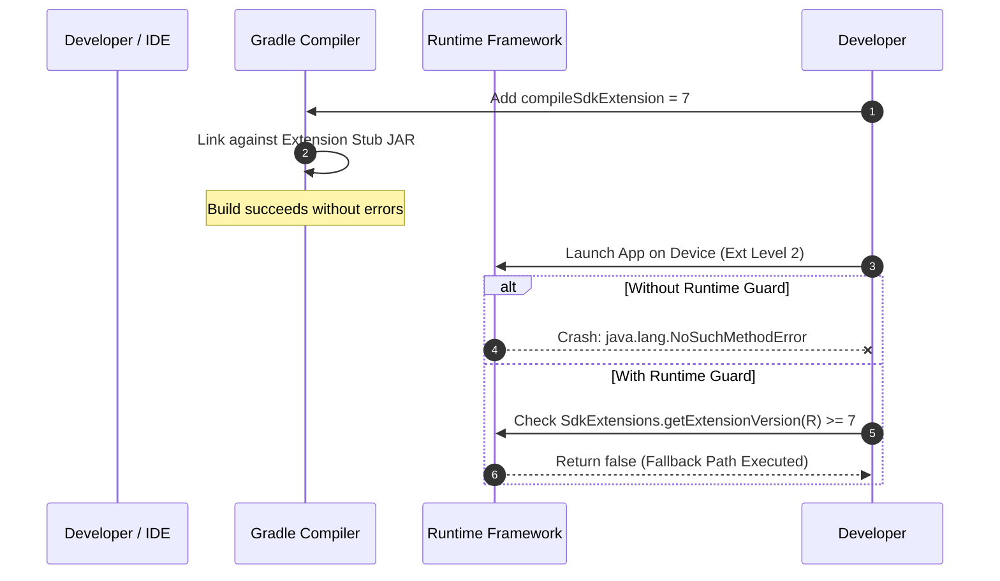

## compileSdkExtension 과 runtime check 는 별개 단계다

상위 문서: [Platform modularity contracts](platform-modularity.md)

`compileSdkExtension` 은 컴파일 타임에 특정 SDK Extension 에 포함된 심볼을 참조할 수 있게 해주는 빌드 설정이다. 하지만 그것이 앱이 실행되는 모든 기기에 해당 API 가 존재함을 보장하지는 않는다.

따라서 `compileSdkExtension` 을 올렸다고 해서 runtime check 를 생략하면 안 된다. 컴파일 단계의 심볼 가시성과 실행 단계의 API 가용성은 별개의 계약이다.

---

### 내부 동작 메커니즘 (Build-Time Stubs vs Runtime Dispatch)

1. **Build-Time Symbol Resolution**:
   - `compileSdk = 34`, `compileSdkExtension = 7`로 지정하면 Gradle 빌드 시스템은 해당 확장 버전에 정의된 API stub jar(`android-sdk-ext-7.jar`)를 컴파일 클래스패스에 포함시킨다.
   - 이로 인해 개발 도구(Android Studio/kotlinc)에서 확장 API 심볼(예: `AdServicesManager`)을 참조하는 코드가 정적 컴파일을 통과한다.
2. **Runtime Execution Hazard**:
   - 확장 SDK가 업데이트되지 않은 구형 기기(예: Extension Level이 낮은 Android 11 기기)에서 이 앱을 실행하면 framework 런타임 클래스패스에 해당 클래스/메서드가 존재하지 않는다.
   - 따라서 가드 조건 없는 직렬 실행 시 런타임 크래시(`NoClassDefFoundError` 또는 `NoSuchMethodError`)가 발생한다.



---

### Gradle Config & Kotlin Runtime Guard 코드

```kotlin
// build.gradle.kts (Module level)
android {
    compileSdk = 34
    // SDK Extension 7 심볼 참조 허용
    compileSdkExtension = 7
    
    defaultConfig {
        minSdk = 24
        targetSdk = 34
    }
}
```

```kotlin
// App Code (Kotlin)
import android.os.Build
import android.os.ext.SdkExtensions
import android.adservices.measurement.MeasurementManager

fun triggerAdMeasurement(context: Context) {
    // 1. Compile time 에는 MeasurementManager 심볼이 노출됨.
    // 2. Runtime 에는 반드시 Extension Version 가드 조건 작성 필수.
    if (Build.VERSION.SDK_INT >= Build.VERSION_CODES.R &&
        SdkExtensions.getExtensionVersion(Build.VERSION_CODES.R) >= 7) {
        
        val manager = context.getSystemService(MeasurementManager::class.java)
        manager?.registerSource(...)
    } else {
        // Fallback 로직
        Log.i("AdMeasurement", "AdServices Extension 7 is not supported on this device.")
    }
}
```

---

### 관찰 가능한 증거 (Observable Evidence)

1. **가드 조건 누락 시 발생하는 런타임 Exception Logcat**:
   ```text
   E AndroidRuntime: FATAL EXCEPTION: main
   Process: com.example.app, PID: 5432
   java.lang.NoSuchMethodError: No static method registerSource in class Landroid/adservices/measurement/MeasurementManager;
   ```
2. **adb shell 로 현재 디바이스 Extension Level 확인**:
   ```bash
   adb shell getprop ro.build.version.extensions.r
   ```

---

관련 노트: [SDK Extensions](sdk-extensions-express-api-availability-beyond-sdk-int.md), [앱 availability check](apps-should-check-api-feature-availability-not-mainline-package-names.md).

공식 문서: [SDK Extensions](https://developer.android.com/guide/sdk-extensions)
