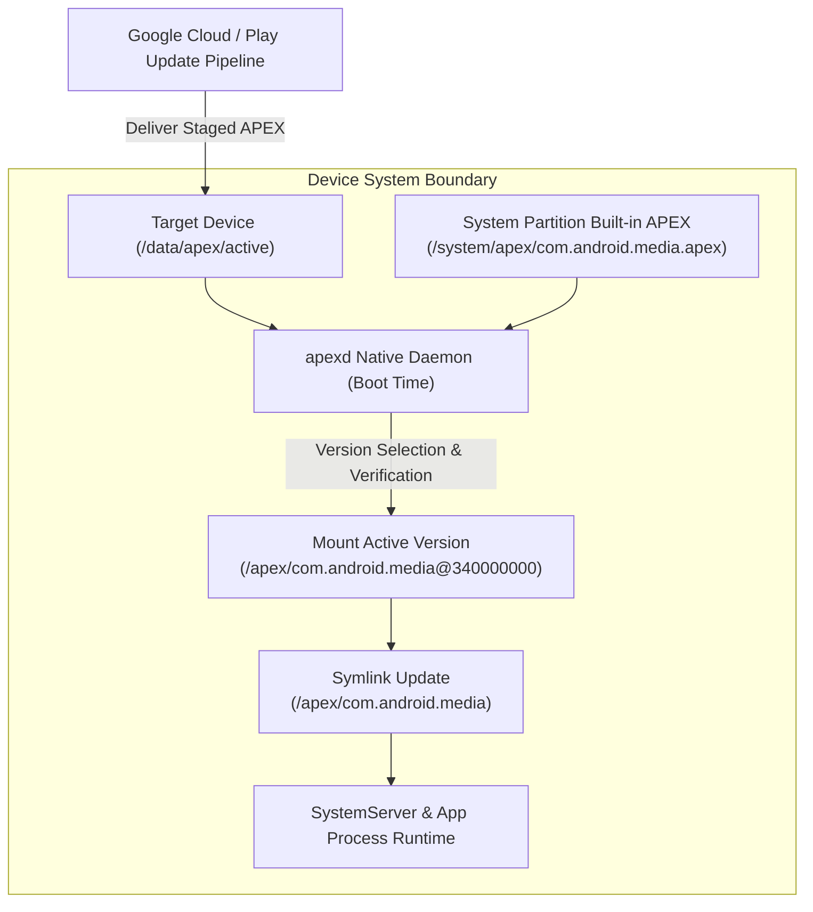

## Mainline은 선택된 system component를 정규 플랫폼 release 밖에서 업데이트한다

상위 문서: [Platform modularity contracts](android-platform-modularity.md)

Project Mainline(Modular System Components)은 Android 10(API 29)부터 도입되어 연간 정규 OS 메이저 업데이트 및 OEM 통신사 OTA 배포 주기와 독립적으로, 핵심 시스템 컴포넌트를 모듈 단위로 분리하여 Google Play System Updates(또는 오프라인 팩)를 통해 신속하게 배포할 수 있도록 설계된 모듈화 아키텍처다.

보안 취약점(CVE) 패치, 표준 미디어 코덱 업데이트, 네트워크 스택 파퓰레이션, AdServices/SDK Extensions 등의 필수 시스템 구성 요소를 제조사의 칩셋/보드 재인증 없이 원자적으로 업데이트할 수 있도록 안정된 Stable Interface(NDK, `@SystemApi`, Stable AIDL)와 **CTS/VTS**(각각 Compatibility Test Suite / Vendor Test Suite — 기기가 Android 플랫폼/HAL 계약을 지키는지 검증하는 공식 테스트 스위트) 테스트 모듈성을 계약 조건으로 보장한다.

---

### 내부 동작 메커니즘 (Mainline Component Isolation & Delivery Architecture)

1. **컴포넌트 바운더리 격리 (Component Boundaries)**:
   - 모든 시스템 컴포넌트가 Mainline 모듈이 될 수 있는 것은 아니다. 하드웨어 드라이버와의 밀접도가 낮고, NDK 및 `@SystemApi` 수준의 하위 호환성 안정 API가 정의되어 있으며, 독립적인 CTS 패키지로 호환성이 테스트될 수 있는 영역만 모듈화된다. (예: ART, Media, Networking, Tethering, Conscrypt, Permission, SDK Extensions).

2. **패키징 포맷 및 서명 수명주기**:
   - **APEX Package**: Native Shared Libraries, Bionic, 컴파일러, 시스템 데몬 모듈 (`/apex`).
   - **APK Package**: Pure Java/Kotlin Framework 서비스 및 UI 컴포넌트 모듈 (`/system/priv-app`).
   - **GMS vs AOSP Signature**: GMS 인증 기기에서는 Google 서명(`com.google.android.*`)을 사용하고, AOSP 디바이스는 벤더 서명(`com.android.*`)을 사용한다.

3. **업데이트 배포 및 마운트 흐름**:
   - Google Play Store / OTA 데몬이 업데이트 파이프라인을 통해 백그라운드로 `.apex` 바이너리를 `/data/apex/active`에 수신한다.
   - 다음 부팅 시 `apexd` 데몬이 마운트 심볼릭 링크를 원자적으로 교체한다.



#### API 가용성 runtime 검사 예시 (Mainline Dynamic Extension)

```kotlin
import android.os.Build
import android.ext.SdkExtensions
import android.os.ext.SdkExtensions.getExtensionVersion

fun checkMainlineFeatureAvailability(): Boolean {
    // Android 11 (API 30) 이상에서 SDK Extension 및 Mainline 모듈 버전 런타임 확인
    return if (Build.VERSION.SDK_INT >= Build.VERSION_CODES.R) {
        val extensionVersion = getExtensionVersion(Build.VERSION_CODES.R)
        // Mainline R Extension v4 이상 지원 여부 판단
        extensionVersion >= 4
    } else {
        false
    }
}
```

---

### 관찰 가능한 증거 (Observable Evidence)

1. **설치된 Mainline 모듈 목록 및 업데이트 버전 확인**:
   ```bash
   adb shell pm list packages --show-versioncode --apex-only
   # package:com.google.android.media versionCode:341000000
   # package:com.google.android.art versionCode:341000000
   # package:com.google.android.cellbroadcast versionCode:341000000
   ```

2. **Google Play System Update 스플래시 버전 및 시스템 속성 확인**:
   ```bash
   adb shell getprop ro.build.version.security_patch
   # 2026-08-01 (보안 패치 날짜)
   adb shell getprop ro.build.version.extensions.r
   # 7 (R SDK Extension 버전)
   ```

3. **apexd 모듈 활성화 로그 확인**:
   ```bash
   adb logcat -d | grep -E "apexd|Active APEX"
   # I apexd: Activating /data/apex/active/com.google.android.media@341000000.apex
   ```

---

### 관찰 가능 신호와 디버깅 진입점

- "특정 기기에서 최신 시스템 API 호환성 문제"가 보고될 경우 `Build.VERSION.SDK_INT` 판단에만 의존하지 않고, `SdkExtensions.getExtensionVersion()`을 사용하여 해당 Mainline 모듈의 Extension 버전을 독립 확인한다.
- 롤백(Rollback)이 의심되는 경우 `adb shell dumpsys apexservice`에서 `Rollback History` 레코드를 조회하여 부팅 루프 방지 로직 작동 여부를 점검한다.

관련 노트: [Mainline module 목록은 release와 device에 따라 달라지는 metadata다](mainline-module-metadata.md), [APEX는 APK 모델로 다루기 어려운 lower-level system module을 담는다](apex-module-packaging.md), [SDK Extensions는 SDK_INT만으로 표현되지 않는 API availability를 나타낸다](sdk-extensions.md).

공식 문서: [Modular System Components](https://source.android.com/docs/core/ota/modular-system)
