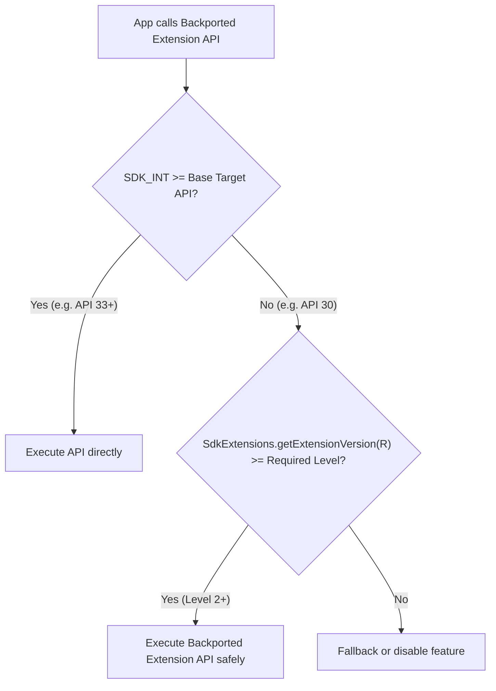

## SDK Extensions 는 SDK_INT 만으로 표현되지 않는 API availability 를 나타낸다

SDK Extensions 는 modular system component update 를 통해 일부 API 가 이전 Android API level 기기에도 제공될 수 있음을 표현한다. Android 11(API 30) 이상 기기는 extension version set 을 가질 수 있고, API reference 에는 어떤 extension version 부터 API 를 쓸 수 있는지가 표시된다.

`Build.VERSION.SDK_INT >= 33` 같은 check 는 여전히 유효하지만, extension API 는 더 낮은 platform API level 에서도 특정 extension version 이상이면 사용 가능할 수 있다. 그래서 SDK_INT 만 보면 false negative 가 생길 수 있다.

앱은 `SdkExtensions.getExtensionVersion(…)` 또는 Jetpack helper 를 사용해 runtime availability 를 확인한다. 이 값은 public API 사용 가능성을 판단하는 계약이지, 개별 Mainline package version 을 직접 추적하라는 뜻이 아니다.

---

### 내부 동작 메커니즘 (SdkExtensions Version Query & Binary Proto)

1. **`sdkinfo.binarypb` Metadata Parsing**:
   - `SdkExtensions` 시스템 서비스는 Boot 시 `/apex/com.android.sdkext/etc/sdkinfo.binarypb` 프로토콜 버퍼 파일을 읽어 기기에 마운트된 각 Extension SDK ID(예: `Build.VERSION_CODES.R`, `Build.VERSION_CODES.S`, `Build.VERSION_CODES.TIRAMISU`, `AD_SERVICES`)의 버전을 메모리에 인덱싱한다.
2. **Backported API Resolution**:
   - 예를 들어 PhotoPicker API는 Android 13(API 33)에 도입되었으나, Android 11(API 30) 기기라도 `com.google.android.mediaprovider` APEX 업그레이드를 통해 `R Extension Level 2` 이상을 포함하면 PhotoPicker API를 구동할 수 있다.
3. **Runtime Lookup Mechanism**:
   - `SdkExtensions.getExtensionVersion(Build.VERSION_CODES.R)` 호출 시 내부적으로 인덱싱된 확장 버전 정수값(예: 4)을 반환한다.



---

### Kotlin Runtime SDK Extension Check 코드 예시

```kotlin
import android.os.Build
import android.os.ext.SdkExtensions
import android.provider.MediaStore

fun isPhotoPickerAvailable(): Boolean {
    return when {
        // 1. Android 13 (API 33) 이상 기본 지원
        Build.VERSION.SDK_INT >= Build.VERSION_CODES.TIRAMISU -> true
        
        // 2. Android 11 (API 30) 이상 기기 중 R Extension Level 2 이상 탑재 여부 확인
        Build.VERSION.SDK_INT >= Build.VERSION_CODES.R -> {
            SdkExtensions.getExtensionVersion(Build.VERSION_CODES.R) >= 2
        }
        
        else -> false
    }
}
```

---

### 관찰 가능한 증거 (Observable Evidence)

1. **adb shell 로 디바이스 SDK Extension Version 속성 확인**:
   ```bash
   adb shell getprop | grep ro.build.version.extensions
   # Output:
   # [ro.build.version.extensions.r]: [7]
   # [ro.build.version.extensions.s]: [7]
   # [ro.build.version.extensions.tiramisu]: [7]
   # [ro.build.version.extensions.ad_services]: [7]
   ```
2. **dumpsys sdk_sandbox / systemui 확인**:
   ```bash
   adb shell dumpsys package com.google.android.sdkext
   ```

---

관련 노트: [compile/runtime check](sdk-extension-checks.md), [앱 availability check](mainline-api-feature-checks.md).

공식 문서: [SDK Extensions](https://developer.android.com/guide/sdk-extensions), [SdkExtensions API](https://developer.android.com/reference/android/os/ext/SdkExtensions)
