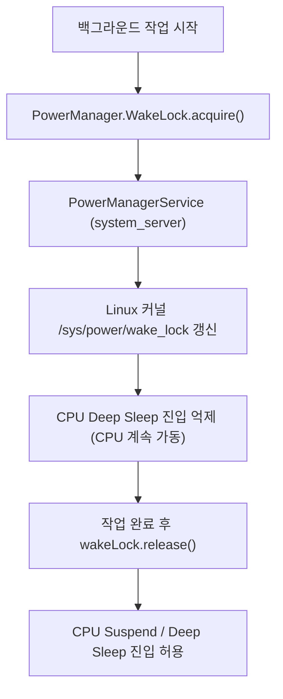

# WakeLocks (안드로이드 전력 유지 메커니즘)

## 1. 개요 (Overview)

**WakeLocks (웨이크 락)** 은 Android 기기의 화면(Screen)이 꺼진 상태에서도 특정 작업(음악 재생, 파일 다운로드, 위치 추적)을 완료하기 위해 **CPU 가 수면 상태(Deep Sleep / Suspend)에 빠지지 않도록 켜짐 상태를 유지시키는 안드로이드 전력 통제 메커니즘**이다.

Linux 커널의 전력 관리 메커니즘(`sys/power/wake_lock`)과 Android `PowerManagerService` 가 통합되어 작동하며, 잘못 관리될 경우 앱이 배터리를 고갈시키는 **WakeLock 누수(Battery Drain)** 의 원인이 된다.

---

### 초보자를 위한 쉽게 이해하는 비유

* **WakeLocks (건물 야간 경비원 깨움 버튼)**:
  - 야간에 건물의 불이 모두 꺼지고 경비원(CPU)이 수면(Deep Sleep)에 들어가려고 할 때, 백그라운드 작업자가 **"저 아직 야근 작업 중이니 1시간만 자지 말고 깨어있어 주세요"** 하고 켜두는 타이머 경보 버튼.



---

## 2. WakeLock 주요 종류

1. **`PARTIAL_WAKE_LOCK`**: 화면과 키패드는 꺼져도 CPU 는 계속 켜진 상태 유지 (가장 흔함).
2. **`SCREEN_DIM_WAKE_LOCK` / `SCREEN_BRIGHT_WAKE_LOCK`**: (Deprecated) 화면 켜짐 유지.

---

## 3. 관측 가능 증거 및 CLI 명령어

`adb shell` 로 현재 안드로이드 기기에서 잡혀 있는 WakeLock 과 배터리 소모 현황을 덤프할 수 있다:

```bash
# 현재 CPU 를 잡고 있는 활성 WakeLock 목록 덤프
adb shell dumpsys power

# 앱별 WakeLock 소모 시간 및 배터리 통계 덤프
adb shell dumpsys batterystats
```

---

## 4. 연결 문서 (Related Links)

- [Android Kernel 특화 구조](android-kernel.md) - 안드로이드 커널 전력 관리
- [Linux 커널](../../../operating-systems/linux-kernel.md) - CS 범용 Linux 커널 Power Management
- [WorkManager 예약 작업](../04_system_services/background-and-notifications/background-work-contracts/work-manager-contract.md) - 내부적으로 SafeWakeLock 적용
- [dumpsys 시스템 진단 도구](../06_testing_performance/debugging/dumpsys.md) - dumpsys power 진단
