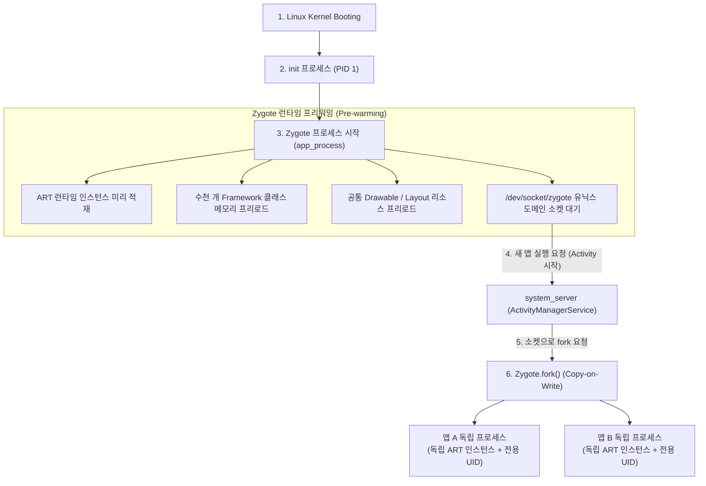

## Zygote 프로세스와 앱 프로세스 생성 메커니즘

### 1. 개요 (Overview)

Android OS 에서 **Zygote (자이고트)** 는 **"모든 안드로이드 앱 프로세스의 모체(Parent) 역할을 하는 마스터 프로세스"** 이다.

> [!IMPORTANT]
> **"Android 에서 가상 머신(ART/Dalvik)은 OS 에 1 개만 떠 있는 것이 아니라, 모든 앱 프로세스마다 독립적으로 1 개씩 존재한다."**
> 만약 앱을 실행할 때마다 매번 밑바닥부터 무거운 가상 머신(ART)을 초기화하고 기본 프레임워크 클래스들을 메모리에 새로 올린다면, 앱 하나를 켜는 데 수 초 이상의 딜레이가 발생한다. Zygote 는 이러한 문제를 해결하기 위해 도입된 **초고속 프로세스 생성 및 런타임 프리워밍(Pre-warming) 메커니즘**이다.

---

### 2. Zygote 의 핵심 메커니즘과 이점

1. **`fork()` 및 Copy-on-Write (COW) 메모리 공유**:
   - 리눅스 `fork()` 시스템 콜을 사용하여 Zygote 의 프로세스 메모리 공간을 그대로 복제한다.
   - 실제 물리 메모리 페이지는 복사되지 않고 읽기 전용으로 공유(COW)되므로, **새로운 앱 프로세스 생성 시간이 수 ms 수준으로 획기적으로 단축**된다.
   - 여러 앱이 동일한 프레임워크 클래스와 수십 MB 의 런타임 라이브러리 메모리를 공유하므로 RAM 사용량이 크게 절약된다.
2. **프로세스 전문화 (Specialization) 및 독립 런타임**:
   - `fork()`된 직후, 자식 프로세스는 가상 머신을 처음부터 다시 띄우지 않고, 복제된 ART 런타임 위에서 자신만의 **고유한 Linux UID/GID 보안 샌드박스**와 앱 엔트리포인트(`ActivityThread`)를 부여받아 완전히 독립된 앱 프로세스로 동작한다.
   - 따라서 특정 앱 프로세스가 OOM 이나 크래시로 종료되어도, 독립된 별개의 프로세스이므로 다른 앱이나 OS 시스템에 전혀 영향을 주지 않는다.

---

### 3. 연결 문서 (Related Links)

- [ART (Android Runtime)](art.md) - Zygote 가 미리 로딩해 두는 가상 머신 런타임
- [Dalvik VM](dalvik-vm.md) - Dalvik 가상 머신의 독립 정의 노드
- [system_server](../04_system_services/system-server.md) - Zygote 에게 process fork 를 요청하는 관리 주체
- [JDK vs JRE vs JVM 의 차이와 런타임의 본질](../../../computer-science/jdk-vs-jre-vs-jvm.md)
- [Binder IPC](binder-ipc.md) - 프로세스 생성 후 통신을 담당하는 IPC
