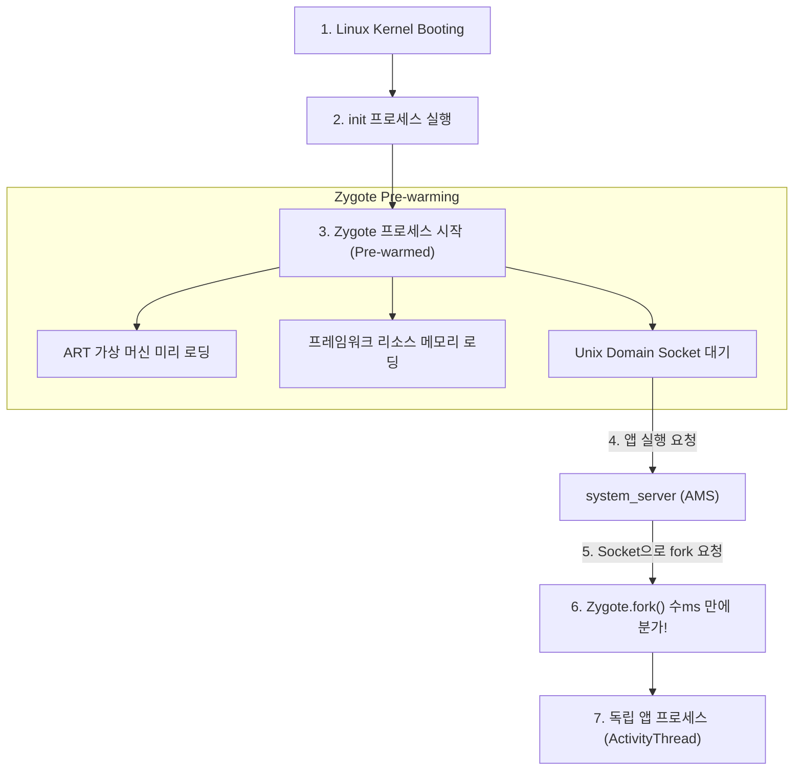

## Zygote 란 무엇인가

Android OS 에서 **Zygote (자이고트)** 는 **"모든 안드로이드 앱 프로세스의 모체(Parent) 역할을 하는 마스터 프로세스"** 이다.

새로운 앱을 실행할 때마다 매번 처음부터 가상 머신(ART)을 로딩하고 기본 라이브러리를 메모리에 새로 올리면 앱 시작 속도가 극도로 느려진다. Zygote 는 이러한 문제를 해결하기 위해 도입된 **초고속 프로세스 생성 메커니즘**이다.

---

## Zygote 의 핵심 메커니즘과 이점

1. **`fork()` 및 Copy-on-Write (COW) 메모리 공유**:
   - 리눅스 `fork()` 시스템 콜을 사용하여 Zygote 의 메모리 공간을 그대로 복사한다.
   - 이때 실제 메모리 페이지는 복사되지 않고 읽기 전용으로 공유(COW)되므로, **앱 프로세스 생성 시간이 수 ms 수준으로 획기적으로 단축**된다.
   - 앱들 간에 프레임워크 클래스와 수십 MB 이상의 리소스 메모리를 공유하므로 RAM 사용량이 크게 절약된다.

2. **프로세스 전문화 (Specialization)**:
   - Zygote 에서 `fork()`된 직후, 자식 프로세스는 자바 가상 머신을 다시 띄우지 않고 자식 전용의 [UID/GID 보안 샌드박스](../05_security_privacy/appops-and-permissions.md) 와 프로세스 이름(`ActivityThread`)을 부여받아 독립된 앱 프로세스로 변신한다.

---

## 연결 문서

- [ART (Android Runtime)](art.md) - Zygote 가 미리 로딩해 두는 가상 머신 런타임
- [system_server](../04_system_services/system-server.md) - Zygote 에게 process fork 를 요청하는 관리 주체
- [Binder IPC](binder-ipc.md) - 프로세스 생성 후 통신을 담당하는 IPC
