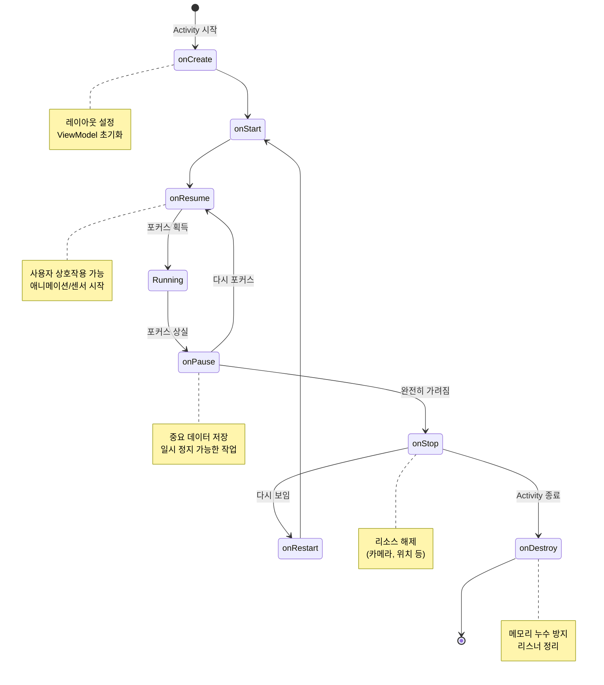

# Activity 생명주기 상세

상위 노트: [[android-app-components-deep-dive]]

Activity 는 사용자가 보는 화면이며, 복잡한 생명주기를 가진다.

##### 생명주기 콜백 순서

1. **onCreate()**: Activity 가 처음 만들어질 때. `setContentView()` 로 레이아웃을 설정하고, ViewModel 을 초기화한다.
2. **onStart()**: 화면에 보이기 시작. 아직 포커스는 없다.
3. **onResume()**: 포커스를 받아 사용자와 상호작용 가능. 애니메이션/센서를 시작하기 좋은 시점.
4. **onPause()**: 포커스를 잃음. 다른 Activity 가 위에 뜨거나 멀티윈도우 상태. 중요한 데이터를 저장한다.
5. **onStop()**: 완전히 가려짐. 무거운 리소스 (카메라, 위치 리스너) 를 해제한다.
6. **onDestroy()**: Activity 가 종료됨. 메모리 누수를 막기 위해 리스너를 정리한다.



##### 설정 변경과 상태 보존

화면 회전이나 언어 변경 시 Activity 가 재생성된다.

```kotlin
// ViewModel 사용 (권장)
class MyViewModel : ViewModel() {
    val data = MutableLiveData<String>()
}

class MyActivity : AppCompatActivity() {
    private val viewModel: MyViewModel by viewModels()
    
    override fun onCreate(savedInstanceState: Bundle?) {
        super.onCreate(savedInstanceState)
        // ViewModel 의 데이터는 설정 변경 시에도 유지됨
        viewModel.data.observe(this) { value ->
            // UI 업데이트
        }
    }
}

// onSaveInstanceState 사용 (간단한 데이터)
override fun onSaveInstanceState(outState: Bundle) {
    super.onSaveInstanceState(outState)
    outState.putString("key", "value")
}

override fun onCreate(savedInstanceState: Bundle?) {
    super.onCreate(savedInstanceState)
    savedInstanceState?.getString("key")?.let {
        // 복원된 데이터 사용
    }
}
```

더 자세한 내용은 [[android-viewmodel]] 참고.

##### Task 와 Back Stack

Task 는 사용자가 작업을 수행하는 Activity 의 스택이다.

- **Standard**: 기본 모드. 매번 새 인스턴스 생성.
- **SingleTop**: 스택 최상단에 이미 있으면 `onNewIntent()` 호출, 아니면 새로 생성.
- **SingleTask**: Task 내에 하나만 존재. 이미 있으면 위의 Activity 들을 모두 제거.
- **SingleInstance**: 독립된 Task 에 혼자 존재. 다른 Activity 와 스택을 공유하지 않음.

```xml
<!-- AndroidManifest.xml -->
<activity
    android:name=".MainActivity"
    android:launchMode="singleTop" />
```

```kotlin
// 프로그래밍 방식으로 제어
val intent = Intent(this, DetailActivity::class.java).apply {
    flags = Intent.FLAG_ACTIVITY_NEW_TASK or Intent.FLAG_ACTIVITY_CLEAR_TOP
}
startActivity(intent)
```

##### Intent Filter 와 암시적 Intent

Activity 가 어떤 작업을 처리할 수 있는지 선언한다. Intent 에 대한 자세한 내용은 [[android-intent-and-ipc]] 참고.

```xml
<activity android:name=".ShareActivity">
    <intent-filter>
        <action android:name="android.intent.action.SEND" />
        <category android:name="android.intent.category.DEFAULT" />
        <data android:mimeType="text/plain" />
    </intent-filter>
</activity>
```

```kotlin
// 암시적 Intent 로 공유
val sendIntent = Intent().apply {
    action = Intent.ACTION_SEND
    putExtra(Intent.EXTRA_TEXT, "공유할 텍스트")
    type = "text/plain"
}
val shareIntent = Intent.createChooser(sendIntent, null)
startActivity(shareIntent)
```

>[!WARNING] **Android 11+ `<queries>` 태그 필수**
>암시적 Intent 로 외부 앱을 실행하거나 `resolveActivity()` 를 호출하려면 매니페스트에 `<queries>` 를 선언해야 한다. 미선언 시 대상 앱이 보이지 않아 `null` 반환.
>상세는 [[android-intent-and-ipc]] 참고.
