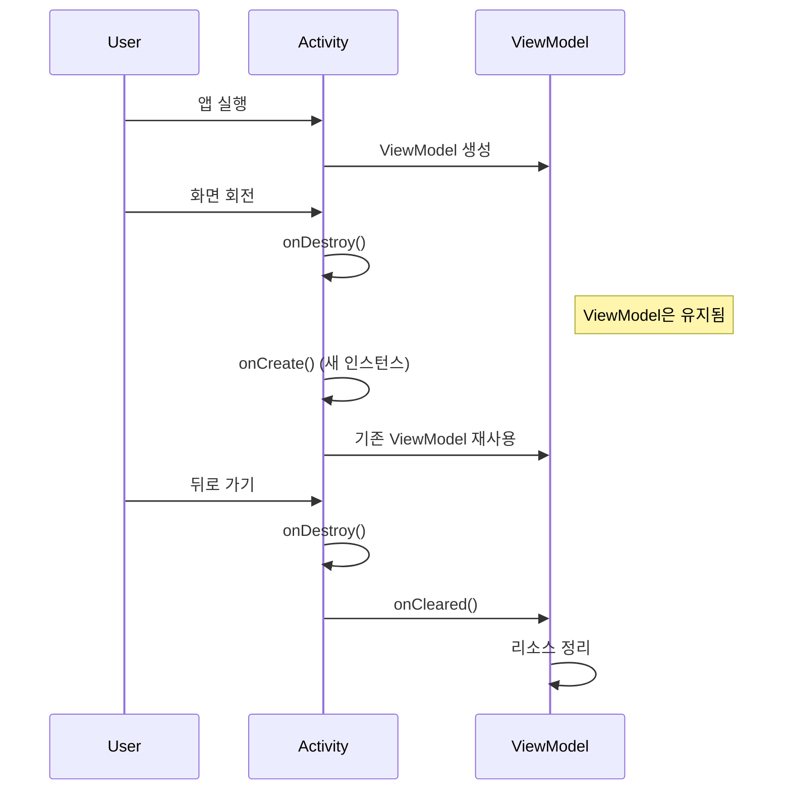

# ViewModel 생명주기

상위 노트: [[android-viewmodel]]

ViewModel 은 Activity/Fragment 의 생명주기보다 길게 살아남는다.



**주요 특징:**

- Activity 가 `finish()` 되거나 Fragment 가 제거될 때만 `onCleared()` 호출
- 설정 변경으로 재생성될 때는 ViewModel 이 유지됨
- `onCleared()` 에서 코루틴 취소, 리스너 정리 등 수행

```kotlin
class MyViewModel : ViewModel() {
    private val job = Job()
    private val scope = CoroutineScope(Dispatchers.IO + job)
    
    override fun onCleared() {
        super.onCleared()
        // ViewModel이 완전히 제거될 때 호출
        job.cancel()
        Log.d("ViewModel", "Cleared")
    }
}
```
