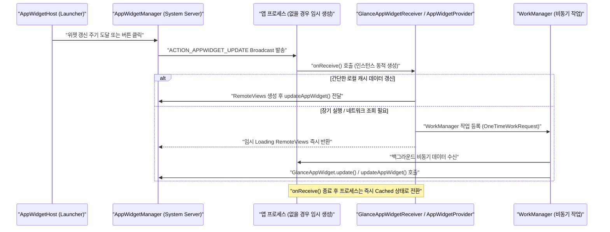

## AppWidgetProvider lifecycle은 지속 프로세스가 아니라 broadcast로 갱신된다

### 1. 개념 및 비유로 이해하는 개념 (What & Analogy)

- **이벤트 기반 단기 생명주기 (Short-lived Event Lifecycle)**:
  `AppWidgetProvider`(및 Glance의 `GlanceAppWidgetReceiver`)의 생명주기는 메인 UI Activity처럼 메모리에 백그라운드로 지속 상주하면서 화면 갱신을 처리하는 프로세스 생명주기가 아니다. 위젯의 갱신 신호는 OS 및 시스템 서비스(`AppWidgetManager`)가 전송하는 **Broadcast Intent**를 통해 발생하며, 브로드캐스트 리시버 실행 타임아웃 예산(약 10초) 내에서 순간적으로 수행되고 즉시 파기 대기 상태로 전환되는 짧은 수명 계약을 따른다.

- **쉬운 비유로 이해하기**:
  - **상주 프로세스 (Persistent Process)**: 24시간 내내 자리를 지키며 서 있는 **상주 경비원**과 같다.
  - **AppWidgetProvider (Broadcast-triggered Worker)**: 알람 벨이 울릴 때만 순간적으로 출근하여 확인 도장을 찍고 바로 퇴근하는 **호출형 알바생**과 같다. 벨이 울리지 않는 평소에는 프로세스가 전혀 메모리를 점유하지 않는다.

---

### 2. 왜 지속 프로세스가 아닌가? (Why)

1. **시스템 리소스 보존 (Battery & Memory Optimization)**:
   - 홈 화면 위젯은 기기 부팅 시점부터 홈 화면에 상시 노출될 수 있다. 모든 설치된 앱의 위젯이 별도의 전용 백그라운드 프로세스나 서비스(Service)를 계속 유지한다면 시스템 메모리와 배터리가 순식간에 소진된다.
2. **비동기 이탈 및 작업 위임 (Asynchronous Delegation)**:
   - 위젯 갱신 콜백(`onUpdate` 또는 Glance의 `provideGlance`)은 `BroadcastReceiver` 맥락에서 수행된다. 여기서 동기적 네트워크 요청이나 대용량 DB 쿼리를 수행하면 리시버 실행 타임아웃(10초)에 걸려 **ANR(Application Not Responding)**을 유발하거나 프로세스가 강제 종료된다.
   - 따라서 시간이 걸리는 데이터 로딩은 **WorkManager**로 위임하고, 작업이 끝난 후 결과를 이용해 위젯을 재갱신해야 한다.

---

### 3. 내부 메커니즘 (How)

#### 위젯 갱신 및 처리 흐름도



#### 주요 생명주기 콜백 계약

- `onEnabled()`: 해당 Provider의 위젯 인스턴스가 홈 화면에 **최초 1개 생성**되었을 때 단 한 번 호출된다. (초기 스케줄러 등록 지점)
- `onUpdate()`: 위젯 ID 목록(`appWidgetIds`)에 대해 UI 갱신이 필요할 때 호출된다.
- `onDeleted()`: 개별 위젯 인스턴스가 홈 화면에서 **삭제**될 때 호출된다. (해당 위젯의 설정값/캐시 정리 지점)
- `onDisabled()`: 홈 화면에서 해당 Provider의 **마지막 위젯 인스턴스까지 모두 삭제**되었을 때 호출된다. (등록된 알람/스케줄러 최종 해제 지점)

---

### 4. 현대 표준 예시 (Jetpack Glance vs 레거시 XML)

#### Modern Jetpack Glance Implementation

```kotlin
// 1. GlanceAppWidget 선언
class WeatherGlanceWidget : GlanceAppWidget() {
    override async fun provideGlance(context: Context, id: GlanceId) {
        // 빠른 Caching 레포지토리에서 로컬 데이터 수신
        val temp = WeatherRepository.getCachedTemperature(context)

        provideContent {
            GlanceTheme {
                Column(modifier = GlanceModifier.fillMaxSize()) {
                    Text(text = "현재 기온: ${temp}°C")
                    Button(
                        text = "새로고침",
                        onClick = actionRunCallback<RefreshWeatherAction>()
                    )
                }
            }
        }
    }
}

// 2. GlanceAppWidgetReceiver 선언 (BroadcastReceiver 표준 계약 연동)
class WeatherGlanceWidgetReceiver : GlanceAppWidgetReceiver() {
    override val glanceAppWidget: GlanceAppWidget = WeatherGlanceWidget()
}
```

```xml
<!-- AndroidManifest.xml -->
<receiver
    android:name=".WeatherGlanceWidgetReceiver"
    android:exported="true">
    <intent-filter>
        <action android:name="android.appwidget.action.APPWIDGET_UPDATE" />
    </intent-filter>
    <meta-data
        android:name="android.appwidget.provider"
        android:resource="@xml/weather_widget_info" />
</receiver>
```

---

### 5. 관측 가능 증거 및 진단 (Observability)

- **위젯 브로드캐스트 수신 및 프로세스 생명주기 관측**:
  ```bash
  adb logcat -s ActivityManager AppWidgetManager GlanceAppWidgetReceiver
  ```
- **리시버 execution 타임아웃(ANR) 확인**:
  `onUpdate` 내에서 `Thread.sleep(15000)`과 같이 동기 지연을 유발하면 다음 ANR 로그 발생:
  `ANR in <package> (Broadcast of Intent { act=android.appwidget.action.APPWIDGET_UPDATE })`

---

### 6. 관련 문서 및 참조

- 상위 계약 문서: [App Widget 계약](./app-widget-contracts.md)
- 비교 문서: [RemoteViews vs Jetpack Glance](../glance-vs-remoteviews.md)
- 연관 atomic 계약 문서:
  - [Glance는 Compose UI가 아니라 RemoteViews를 통해 위젯을 렌더링한다](./glance-renders-app-widgets-through-remoteviews-not-compose-ui.md)
  - [RemoteViews는 위젯 layout을 고정된 View 부분집합으로 제한한다](./remoteviews-restricts-widget-layouts-to-a-fixed-view-subset.md)
  - [WorkManager는 지연 가능한 보장 작업의 기본 선택이다](../../../04_system_services/background-and-notifications/background-work-contracts/workmanager-is-default-for-deferrable-guaranteed-work.md)
- 상위 구조 문서: [Android 앱 아키텍처는 UI 패턴보다 수명과 OS 진입점을 나누는 문제다](../../architecture/android-app-architecture.md)
- 공식 문서: [AppWidgetProvider API Reference](https://developer.android.com/reference/android/appwidget/AppWidgetProvider)

검증일: 2026-08-06. BroadcastReceiver 기반 수명 및 GlanceAppWidgetReceiver 동작 가이드 검증 완료.
