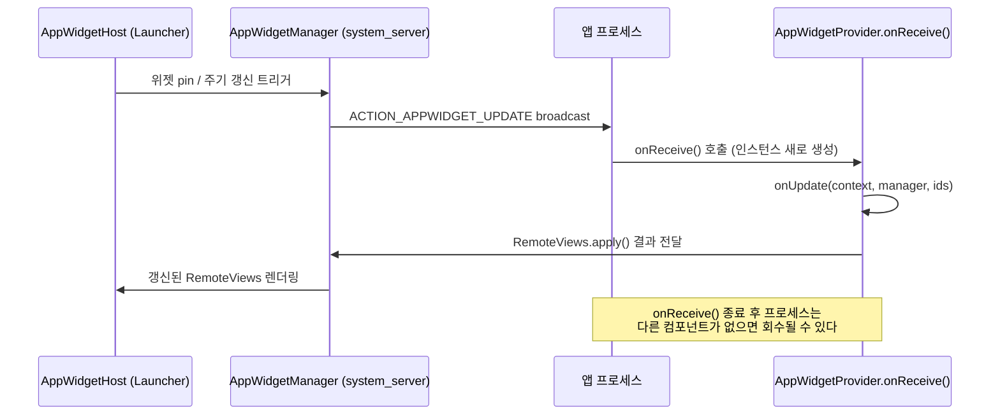

## AppWidgetProvider lifecycle 은 지속 프로세스가 아니라 broadcast 로 갱신된다

`AppWidgetProvider` 는 `BroadcastReceiver` 의 하위 클래스다. Activity 처럼 화면을 소유한 채 계속 살아있는 컴포넌트가 아니고, Service 처럼 명시적으로 시작해 오래 실행하는 컴포넌트도 아니다. 시스템(launcher/home 이 host 인 `AppWidgetHost`)이 `AppWidgetManager` 를 거쳐 broadcast 를 보낼 때마다 `onReceive()` 가 호출되고, 그 안에서 action 에 따라 `onUpdate`, `onEnabled`, `onDisabled`, `onDeleted`, `onAppWidgetOptionsChanged` 로 분기한다. 각 호출 사이에 widget 전용 프로세스나 인스턴스가 계속 남아 있다고 가정하면 안 된다.

### 내부 동작 메커니즘

- 위젯이 홈 화면에 추가되면 host 는 `AppWidgetManager` 를 통해 `ACTION_APPWIDGET_UPDATE` broadcast 를 보낸다. `AppWidgetProvider.onReceive()` 가 이 action 을 가로채 `onUpdate(context, appWidgetManager, appWidgetIds)` 로 위임한다.
- `onEnabled()` 는 이 앱의 위젯 인스턴스가 처음 하나라도 생겼을 때, `onDisabled()` 는 마지막 인스턴스가 제거됐을 때 한 번씩만 불린다. `onDeleted()` 는 개별 위젯 인스턴스가 삭제될 때마다 그 `appWidgetIds` 를 알려준다.
- `onReceive()` 는 여느 `BroadcastReceiver` 와 같은 실행 예산 안에서 동작해야 한다. `onUpdate()` 안에서 네트워크 호출이나 무거운 계산을 동기적으로 수행하면 시간 예산을 넘겨 ANR(Application Not Responding) 로 표시될 수 있다. 그래서 실제 데이터 갱신은 `onUpdate()` 안에서 `WorkManager` 작업을 enqueue 하거나 이미 갱신된 로컬 데이터를 읽어 `RemoteViews` 에 반영하는 정도로 짧게 끝내야 한다.
- 위젯은 host 프로세스(런처)에 표시되지만 실행 코드는 앱 자신의 프로세스(UID)에서 `onReceive()` 콜백으로 실행된다. 즉 "위젯 전용 프로세스"는 없고, 시스템이 필요할 때만 앱 프로세스를 깨워 broadcast 를 전달하는 모델이다.



### 코드 예시

```kotlin
class BenefitWidgetProvider : AppWidgetProvider() {

    override fun onUpdate(
        context: Context,
        appWidgetManager: AppWidgetManager,
        appWidgetIds: IntArray
    ) {
        for (widgetId in appWidgetIds) {
            val views = RemoteViews(context.packageName, R.layout.widget_benefit).apply {
                // onUpdate 안에서는 이미 로컬에 있는 값만 짧게 읽어 반영한다.
                setTextViewText(R.id.widget_title, readCachedTitle(context))
            }
            appWidgetManager.updateAppWidget(widgetId, views)
        }
    }

    override fun onEnabled(context: Context) {
        // 이 앱의 위젯 인스턴스가 처음 생성됐을 때 한 번
    }

    override fun onDisabled(context: Context) {
        // 마지막 위젯 인스턴스가 제거됐을 때 한 번, 주기 작업 정리 지점
    }

    override fun onDeleted(context: Context, appWidgetIds: IntArray) {
        // 개별 위젯 인스턴스 삭제, 해당 id 의 저장 상태를 정리
    }
}
```

```xml
<!-- AndroidManifest.xml -->
<receiver
    android:name=".BenefitWidgetProvider"
    android:exported="false">
    <intent-filter>
        <action android:name="android.appwidget.action.APPWIDGET_UPDATE" />
    </intent-filter>
    <meta-data
        android:name="android.appwidget.provider"
        android:resource="@xml/benefit_widget_info" />
</receiver>
```

### 관측 가능한 증거

- `adb shell dumpsys appwidget` 로 현재 등록된 provider, 위젯 id, host 정보를 확인한다.
- `adb logcat -s ActivityManager` 로 `onReceive()` 실행 중 시간 초과가 발생하면 "ANR in <package> (Broadcast of Intent { act=android.appwidget.action.APPWIDGET_UPDATE })" 형태의 로그가 남는다.
- `onUpdate()` 안에서 예외가 발생하면 `RemoteViews$ActionException` 이 아니라 일반 앱 크래시로 logcat 에 스택 트레이스가 남는다. host 는 해당 위젯을 빈 상태로 표시한다.

상위 문서: [Android 앱 아키텍처는 UI 패턴보다 수명과 OS 진입점을 나누는 문제다](../../architecture/android-app-architecture.md)

관련 노트: [RemoteViews는 위젯 layout을 고정된 View 부분집합으로 제한한다](./remoteviews-restricts-widget-layouts-to-a-fixed-view-subset.md), [updatePeriodMillis는 최소 간격만 보장하는 best-effort 스케줄이다](./updateperiodmillis-is-a-best-effort-minimum-interval-not-a-guarantee.md), [Android App Components](../../architecture/app-components/android-app-components.md)

공식 문서: [App widgets overview](https://developer.android.com/develop/ui/views/appwidgets/overview), [AppWidgetProvider](https://developer.android.com/reference/android/appwidget/AppWidgetProvider)

검증일: 2026-08-04. onUpdate/onEnabled/onDisabled/onDeleted 콜백 존재와 broadcast 기반 갱신은 공식 문서 원문으로 확인했다. ANR 발생 조건의 정확한 시간 임계값은 버전마다 달라질 수 있어 본문에 구체적인 초 단위 수치를 넣지 않았다.
