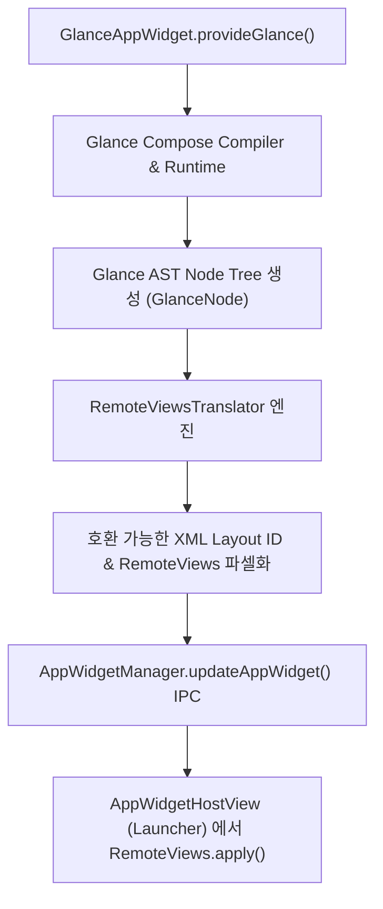

## Glance는 Compose UI가 아니라 RemoteViews를 통해 위젯을 렌더링한다

**Jetpack Glance**는 Kotlin Compose 코루틴 및 선언형 DSL 문법으로 위젯 UI를 작성할 수 있게 해주는 라이브러리지만, 렌더링 엔진 수준에서 일반 안드로이드 `androidx.compose.ui` 컴포지션을 호스트 프로세스에서 구동하는 것이 아니다. Glance 의 선언형 코드는 내부적(Composition Runtime)으로 노드 트리를 구축한 후, 최종적으로 호스트 프로세스(Launcher)가 해석 가능한 **`RemoteViews` 파셀 객체로 렌더링 결과를 벼환**한다.

---

### 1. 개념 및 핵심 명제 (What)

- **Compose Runtime 추상화 층**: Glance 는 `androidx.compose.runtime` (State, Composition) 엔진만 재활용하며, UI 렌더링 캔버스로 `androidx.compose.ui.platform` (Canvas, LayoutNode, RenderNode) 대신 **Glance Node Tree -> RemoteViews Translator** 시스템을 사용한다.
- **컴포넌트 및 Modifier 차별화**:
  - 일반 Compose UI 컴포넌트(`androidx.compose.material3.Text`, `Button`, `Row`)나 일반 `Modifier`(`fillMaxSize()`, `clickable()`)를 Glance 코드에 사용할 수 없다.
  - Glance 전용 패키지(`androidx.glance.text.Text`, `androidx.glance.Button`, `GlanceModifier`)를 반드시 사용해야 한다.

---

### 2. 왜 이러한 구조인가? (Why)

1. **프로세스 격리와 Launcher 인프라의 한계**: 홈 화면 런처는 OS 버전별로 호환되는 `RemoteViews` 및 `AppWidgetHostView` 인프라 위에서 구동된다. 런처 앱이 제3자 앱의 임의 Compose UI 캔버스나 커스텀 렌더링 그래픽 노드를 자신의 프로세스 메모리 내에 직접 인스턴스화하고 관리하도록 허용하면 보안 및 메모리 파편화 문제가 발생한다.
2. **선언형 생산성과 안전성의 양립**: 기존 XML `RemoteViews` 작성 시 겪던 유연성 부족, 수동 `PendingIntent` 결합, 상태 반영의 복잡함을 Compose 의 선언형 문법으로 해소하되, 런처와의 경계는 검증된 `RemoteViews` IPC 프로토콜로 안전하게 유지하기 위함이다.

---

### 3. 내부 메커니즘 (How)



1. **Glance AST Node 트리의 RemoteViews 변환**:
   - `provideGlance()` 함수가 실행되면 Glance 컴포저블 블록이 컴파일되어 `GlanceNode` 트리로 구성된다.
   - `RemoteViewsTranslator` 는 `GlanceNode` 를 순회하며 `LinearLayout`, `RelativeLayout`, `TextView`, `ImageView` 등 호환 가능한 View 레이아웃으로 대응시킨다.
2. **GlanceStateDefinition 을 통한 상태 관리**:
   - 위젯은 [viewmodel](../../viewmodel.md) 의 `[stateflow](../../stateflow-and-sharedflow.md)` 나 인메모리 반응형 상태를 직접 관찰할 수 없다.
   - Glance 는 `PreferencesGlanceStateDefinition` 또는 커스텀 DataStore 기반의 `GlanceStateDefinition` 을 통해 영속화된 상태(State)를 로딩하고, 상태 변경 발생 시 `GlanceAppWidget.update(context, glanceId)` 를 통해 재컴포지션 및 RemoteViews 재생성을 수행한다.

---

### 4. 현대 표준 코드 예시 (Jetpack Glance)

```kotlin
import androidx.glance.GlanceId
import androidx.glance.GlanceModifier
import androidx.glance.appwidget.GlanceAppWidget
import androidx.glance.appwidget.provideContent
import androidx.glance.appwidget.action.actionRunCallback
import androidx.glance.action.ActionParameters
import androidx.glance.appwidget.action.ActionCallback
import androidx.glance.layout.Column
import androidx.glance.layout.fillMaxSize
import androidx.glance.text.Text

class StockGlanceWidget : GlanceAppWidget() {
    override async fun provideGlance(context: Context, id: GlanceId) {
        // Glance 전용 state 또는 저장소 데이터 조회
        val price = StockRepository.getPrice()

        provideContent {
            // Glance 전용 Modifier와 Component 사용
            Column(modifier = GlanceModifier.fillMaxSize()) {
                Text(text = "종목가: $$price")
                androidx.glance.Button(
                    text = "시세 갱신",
                    onClick = actionRunCallback<RefreshStockActionCallback>()
                )
            }
        }
    }
}

class RefreshStockActionCallback : ActionCallback {
    override async fun onAction(
        context: Context,
        glanceId: GlanceId,
        parameters: ActionParameters
    ) {
        // 비동기 시세 갱신 후 위젯 재컴포지션 요청
        StockRepository.fetchLatestPrice()
        StockGlanceWidget().update(context, glanceId)
    }
}
```

---

### 5. 관측 가능 증거 및 진단 (Observability)

- **Glance 에서 생성된 RemoteViews 레이아웃 구조 확인**:
  ```bash
  adb shell dumpsys appwidget
  ```
  *(Glance 가 호스트로 전송한 RemoteViews 의 Layout Resource ID 및 Action 데이터 목록 확인 가능)*
- **Glance 액션 및 상태 변경 로그 추적**:
  ```bash
  adb logcat -s GlanceAppWidget GlanceState
  ```

---

### 6. 관련 문서 및 참조

- 상위 문서: [Android 앱 아키텍처는 UI 패턴보다 수명과 OS 진입점을 나누는 문제다](../../architecture/android-app-architecture.md)
- 관련 계약 문서:
  - [App Widget 계약](./app-widget-contracts.md)
  - [RemoteViews는 위젯 layout을 고정된 View 부분집합으로 제한한다](./remoteviews-restricts-widget-layouts-to-a-fixed-view-subset.md)
  - [AppWidgetProvider lifecycle은 지속 프로세스가 아니라 broadcast로 갱신된다](./appwidgetprovider-lifecycle-runs-through-broadcasts-not-a-persistent-process.md)
- 공식 문서: [Jetpack Glance Overview](https://developer.android.com/develop/ui/compose/glance), [Build widgets with Glance](https://developer.android.com/develop/ui/compose/glance/build-ui)

검증일: 2026-08-05. Glance Compose Runtime 및 RemoteViews 변환 메커니즘 공식 가이드 검증 완료.
