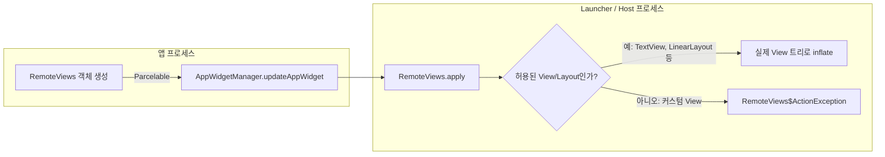

## RemoteViews 는 위젯 layout 을 고정된 View 부분집합으로 제한한다

`RemoteViews` 는 `View` 계층을 직접 전달하는 객체가 아니라, "어떤 layout 을 inflate 하고 어떤 값을 채워라"는 지시를 담은 `Parcelable` 설명서다. 위젯은 앱 프로세스가 아니라 launcher(host) 프로세스에서 그려지므로, host 는 앱이 정의한 커스텀 `View` 클래스를 알지 못한다. 그래서 `RemoteViews` 는 host 도 이미 알고 있는 플랫폼 기본 `View`/`ViewGroup` 집합만 허용하고, 커스텀 `View` 나 그 하위 클래스는 허용하지 않는다.

### 내부 동작 메커니즘

- `RemoteViews` 생성자는 `context.packageName` 과 layout 리소스 id 를 받는다. 실제 inflate 는 이 정보를 넘겨받은 host 프로세스에서 일어난다. 앱 프로세스의 커스텀 `View` 코드는 host 의 classpath 에 없으므로 inflate 자체가 실패한다.
- 공식 문서는 이 제약을 다음과 같이 명시한다. "widget layouts are based on RemoteViews, which doesn't support every kind of layout or view widget... You can't use custom views or subclasses of the views that are supported by RemoteViews."
- 허용되는 layout 은 `FrameLayout`, `LinearLayout`, `RelativeLayout`, `GridLayout` 같은 기본 container 이고, 허용되는 view 는 `TextView`, `Button`, `ImageView`, `ImageButton`, `ProgressBar`, `ListView`, `GridView` 같은 기본 컴포넌트다. `ViewStub` 도 지원되는데, 이는 런타임에 layout 을 지연 inflate 하기 위한 빈 자리 표시자다.
- Android 12(API 31)부터는 `CheckBox`, `Switch`, `RadioButton` 이 상태를 가진(stateful) component 로 추가 지원된다. 이 이전 버전에서는 이런 상태 표현을 직접 구현해야 했다.
- click 이벤트도 앱 코드가 직접 리스너로 받을 수 없다. host 프로세스는 앱 코드를 호출할 수 없으므로 `setOnClickPendingIntent()` 로 `PendingIntent` 를 등록해 두면, host 가 클릭 시 그 `PendingIntent` 를 통해 다시 앱(또는 `AppWidgetProvider`)을 깨우는 방식으로 우회한다.



### 코드 예시

```kotlin
val views = RemoteViews(context.packageName, R.layout.widget_benefit).apply {
    setTextViewText(R.id.widget_title, "이번 달 혜택")
    setImageViewResource(R.id.widget_icon, R.drawable.ic_benefit)

    // 클릭 시 앱 코드를 직접 호출하지 못하므로 PendingIntent 로 위임한다.
    val openAppIntent = PendingIntent.getActivity(
        context, 0,
        Intent(context, MainActivity::class.java),
        PendingIntent.FLAG_UPDATE_CURRENT or PendingIntent.FLAG_IMMUTABLE
    )
    setOnClickPendingIntent(R.id.widget_root, openAppIntent)
}
appWidgetManager.updateAppWidget(appWidgetId, views)
```

```xml
<!-- widget_benefit.xml: RemoteViews가 허용하는 기본 View만 사용한다. -->
<LinearLayout xmlns:android="http://schemas.android.com/apk/res/android"
    android:id="@+id/widget_root"
    android:orientation="vertical"
    android:layout_width="match_parent"
    android:layout_height="match_parent">

    <ImageView android:id="@+id/widget_icon" android:layout_width="24dp" android:layout_height="24dp" />
    <TextView android:id="@+id/widget_title" android:layout_width="wrap_content" android:layout_height="wrap_content" />
</LinearLayout>
```

### 관측 가능한 증거

- 지원되지 않는 View(커스텀 View 또는 `RecyclerView` 같은 미지원 클래스)를 layout 에 넣으면 런타임에 `android.view.InflateException` 또는 `RemoteViews$ActionException: Layout inflation ... only certain classes allowed` 형태의 예외가 host 프로세스 쪽 logcat 에 남는다.
- `adb shell dumpsys appwidget` 으로 특정 위젯이 어느 layout 리소스를 사용 중인지, 갱신이 성공했는지 확인할 수 있다.

상위 문서: [Android 앱 아키텍처는 UI 패턴보다 수명과 OS 진입점을 나누는 문제다](../../architecture/android-app-architecture.md)

관련 노트: [AppWidgetProvider lifecycle은 지속 프로세스가 아니라 broadcast로 갱신된다](./appwidgetprovider-lifecycle-runs-through-broadcasts-not-a-persistent-process.md), [Glance는 Compose UI가 아니라 RemoteViews 위젯 경계로 렌더링한다](./glance-renders-app-widgets-through-remoteviews-not-compose-ui.md)

공식 문서: [Create a simple widget](https://developer.android.com/guide/topics/appwidgets), [RemoteViews](https://developer.android.com/reference/android/widget/RemoteViews)

검증일: 2026-08-04. "커스텀 View/하위 클래스 불허" 문구와 Android 12 CheckBox/Switch/RadioButton stateful 지원은 공식 가이드 원문으로 확인했다. 지원 view/layout 전체 목록은 공식 레퍼런스 페이지가 스크립트 렌더링이라 전체 표를 직접 인용하지 못해, 오래 안정적으로 유지돼 온 기본 항목만 예시로 제시했다.
