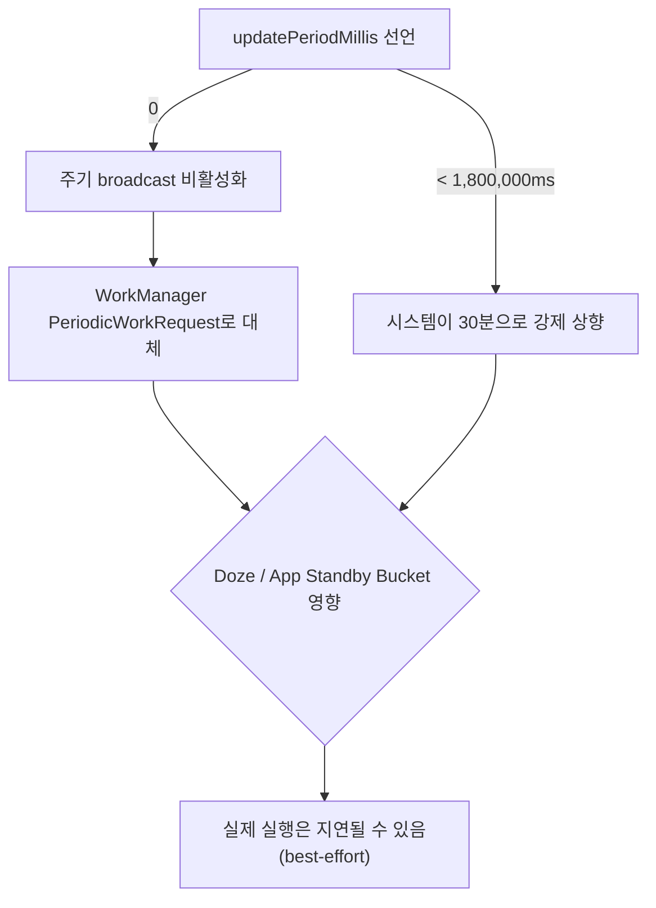

## updatePeriodMillis 는 최소 간격만 보장하는 best-effort 스케줄이다

`android:updatePeriodMillis` 는 정확한 주기 타이머가 아니라 시스템이 알아서 배터리를 고려해 묶어 보내는 최소 간격 힌트다. 공식 문서는 그 하한을 명시한다. "updatePeriodMillis doesn't support values of less than 30 minutes. However, if you want to disable periodic updates, you can specify 0." 30 분보다 짧게 설정해도 시스템은 30 분 간격으로만 broadcast 를 보낸다.

### 내부 동작 메커니즘

- `updatePeriodMillis` 로 예약된 갱신은 `AppWidgetManager` 가 내부적으로 alarm 성격의 스케줄로 관리하며, 여러 위젯의 갱신 시각을 배터리 절약을 위해 한데 묶어(batch) 보낼 수 있다. 그래서 "정확히 N 분마다"가 아니라 "N 분 이상 지난 뒤 시스템이 편한 시점에" 정도로 이해해야 한다.
- 15 분처럼 더 촘촘하거나 사용자가 자유롭게 바꿀 수 있는 주기가 필요하면, 공식 문서는 `updatePeriodMillis` 를 0(비활성)으로 두고 대신 `WorkManager` 의 `PeriodicWorkRequest` 를 쓰라고 안내한다. "In this case, set the updatePeriodMillis to 0 and use WorkManager instead."
- 다만 `WorkManager` 로 옮긴다고 배터리 정책에서 자유로워지는 것은 아니다. 같은 문서는 "Using repeating tasks with WorkManager is a good option, but similar power restrictions apply."라고 명시한다. App Standby Bucket, Doze 같은 시스템 전원 정책은 `updatePeriodMillis` 든 `WorkManager` 주기 작업이든 동일하게 지연시킬 수 있다.
- 결론적으로 두 메커니즘의 차이는 "주기를 세밀하게 제어할 수 있는가"와 "작업 상태를 영속적으로 추적할 수 있는가"에 있다. `updatePeriodMillis` 는 선언만 하면 되는 대신 30 분 하한과 배칭에 묶이고, `WorkManager` 는 constraint(네트워크, 충전 상태)와 재시도 정책을 세밀하게 정할 수 있는 대신 별도로 enqueue 코드를 작성해야 한다.



### 코드 예시

```xml
<!-- 30분 이하로 적어도 시스템은 30분 간격으로만 갱신한다. -->
<appwidget-provider xmlns:android="http://schemas.android.com/apk/res/android"
    android:updatePeriodMillis="1800000"
    android:initialLayout="@layout/widget_benefit" />
```

```kotlin
// 15분처럼 더 촘촘한 주기가 필요하면 updatePeriodMillis=0으로 두고
// WorkManager PeriodicWorkRequest로 직접 위젯을 갱신한다.
class WidgetRefreshWorker(
    context: Context,
    params: WorkerParameters
) : CoroutineWorker(context, params) {
    override suspend fun doWork(): Result {
        val manager = AppWidgetManager.getInstance(applicationContext)
        val ids = manager.getAppWidgetIds(
            ComponentName(applicationContext, BenefitWidgetProvider::class.java)
        )
        val views = RemoteViews(applicationContext.packageName, R.layout.widget_benefit)
        manager.updateAppWidget(ids, views)
        return Result.success()
    }
}

val request = PeriodicWorkRequestBuilder<WidgetRefreshWorker>(15, TimeUnit.MINUTES)
    .setConstraints(Constraints.Builder().setRequiresBatteryNotLow(true).build())
    .build()

WorkManager.getInstance(context)
    .enqueueUniquePeriodicWork("widget-refresh", ExistingPeriodicWorkPolicy.KEEP, request)
```

### 관측 가능한 증거

- `adb shell dumpsys appwidget` 으로 등록된 provider 의 `updatePeriodMillis` 설정값과 실제 마지막 갱신 시각을 확인할 수 있다.
- `WorkManager` 로 옮긴 경우 `adb shell dumpsys jobscheduler` 에서 해당 작업의 실행 이력과 지연 여부를 확인한다. `PeriodicWorkRequest` 의 최소 반복 간격도 15 분이라는 별도 하한이 있으므로, 요청한 간격보다 짧게 실행되지 않는 것이 정상이다.
- 기기를 Doze 모드로 두고(`adb shell dumpsys deviceidle force-idle`) 위젯 갱신이 지연되는지 관찰하면 best-effort 특성을 직접 확인할 수 있다.

상위 문서: [Android 앱 아키텍처는 UI 패턴보다 수명과 OS 진입점을 나누는 문제다](../../architecture/android-app-architecture.md)

관련 노트: [AppWidgetProvider lifecycle은 지속 프로세스가 아니라 broadcast로 갱신된다](./appwidgetprovider-lifecycle-runs-through-broadcasts-not-a-persistent-process.md), [WorkManager는 지연 가능한 보장 작업의 기본 선택이다](../../../04_system_services/background-and-notifications/background-work-contracts/workmanager-is-default-for-deferrable-guaranteed-work.md)

공식 문서: [Create an advanced widget](https://developer.android.com/develop/ui/views/appwidgets/advanced)

검증일: 2026-08-04. "30분 미만 값은 30분으로 처리, 0은 비활성화" 문구와 "WorkManager도 유사한 전원 제약을 받는다"는 문구는 공식 문서 원문으로 확인했다.
