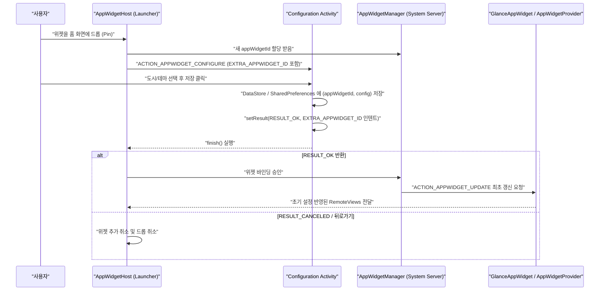

## 위젯 설정 Activity는 pin 시점에 실행되는 계약을 가진다

홈 화면에 위젯을 추가할 때 계정 설정, 도시 선택, 테마 구성 등 사용자 입력이 필수적인 경우, `AppWidgetProviderInfo` 메타데이터에 **Configuration Activity**를 등록한다. 이 Activity 는 앱 화면 내의 일반 상시 설정 화면과 달리, 사용자가 홈 화면(Launcher)에 위젯을 드롭(Pin)하는 **배치 시점에 호스트에 의해 한 번만 호출되는 일회성 결과 반환 계약(Result Contract)**을 따른다.

---

### 1. 개념 및 핵심 명제 (What)

- **호스트 주도 결과 계약 (Host-driven Result Contract)**:
  위젯이 드롭되면 홈 화면 호스트(Launcher)는 `ACTION_APPWIDGET_CONFIGURE` Intent 와 함께 생성 예정인 `EXTRA_APPWIDGET_ID` 를 파라미터로 전달하여 설정 Activity 를 실행한다.
- **성공 및 취소 계약**:
  - 사용자 설정 완료 시 `setResult(RESULT_OK, resultIntent)` (Intent 에 `EXTRA_APPWIDGET_ID` 포함)를 호출하고 `finish()` 해야만 위젯이 홈 화면에 최종 배치된다.
  - 사용자가 뒤로 가기 버튼으로 취소하거나 `RESULT_CANCELED` 로 종료되면 호스트는 위젯 배치를 취소하고 렌더링하지 않는다.
- **최초 `onUpdate()` 실행 순서**:
  설정 Activity 가 등록된 위젯은 설정이 완료되기 전까지 시스템이 `onUpdate()` 를 호출하지 않으며, `RESULT_OK` 가 리턴된 직후 최초 갱신 브로드캐스트가 발송된다.

---

### 2. 왜 필요한가? (Why)

1. **초기화 미완성 상태의 위젯 노출 방지**: 계정이 선택되지 않거나 설정 정보가 없는 상태에서 위젯이 홈 화면에 빈 상태나 에러 레이아웃으로 임시 노출되는 현상을 원천 방지한다.
2. **인스턴스별 격리된 옵션 관리**: 동일한 앱의 위젯이라도 홈 화면에 여러 개 배치할 수 있다(예: 서울 날씨 위젯과 도쿄 날씨 위젯). `appWidgetId` 단위로 상이한 설정 파라미터를 초기화할 기회를 제공한다.

---

### 3. 내부 메커니즘 (How)



#### Android 버전별 변경 사항
- **Android 11 이하**: 위젯 배치 시 마다 Configuration Activity 가 반드시 강제 실행되었다.
- **Android 12 (API 31)+**: `widgetFeatures="reconfigurable|configuration_optional"` 옵션을 통해 기본값을 제공하고 설정 단계를 건너뛰거나, 배치 완료 후 나중에 사용자가 위젯을 길게 눌러 재설정(Reconfigure)할 수 있도록 확장되었다.

---

### 4. 현대 표준 코드 구현 (Jetpack Compose Config Activity & DataStore)

```kotlin
class WidgetConfigureActivity : ComponentActivity() {

    private var appWidgetId = AppWidgetManager.INVALID_APPWIDGET_ID

    override fun onCreate(savedInstanceState: Bundle?) {
        super.onCreate(savedInstanceState)
        
        // 1. 기본 반환값을 CANCELED로 세팅 (이탈 시 위젯 취소 처리)
        setResult(RESULT_CANCELED)

        // 2. 전달된 appWidgetId 검증
        appWidgetId = intent?.extras?.getInt(
            AppWidgetManager.EXTRA_APPWIDGET_ID,
            AppWidgetManager.INVALID_APPWIDGET_ID
        ) ?: AppWidgetManager.INVALID_APPWIDGET_ID

        if (appWidgetId == AppWidgetManager.INVALID_APPWIDGET_ID) {
            finish()
            return
        }

        setContent {
            WidgetConfigScreen(
                onSave = { selectedCity ->
                    lifecycleScope.launch {
                        // DataStore에 id별 설정 저장
                        WidgetPrefRepository.saveCity(applicationContext, appWidgetId, selectedCity)
                        
                        // Glance 위젯 수동 갱신
                        WeatherGlanceWidget().update(applicationContext, GlanceId(appWidgetId))

                        // 성공 결과 반환 계약 준수
                        val resultValue = Intent().putExtra(
                            AppWidgetManager.EXTRA_APPWIDGET_ID, appWidgetId
                        )
                        setResult(RESULT_OK, resultValue)
                        finish()
                    }
                }
            )
        }
    }
}
```

---

### 5. 관측 가능 증거 및 진단 (Observability)

- **설정 결과 반환 누락으로 인한 위젯 추가 실패 진단**:
  `setResult(RESULT_OK)` 에 `EXTRA_APPWIDGET_ID` 가 포함되지 않은 채 `finish()` 되면 런처에서 위젯이 즉시 삭제되며 logcat 에 다음 로그 남음:
  `AppWidgetHost: Optional configuration activity canceled or failed to return RESULT_OK`
- **현재 바인딩된 appWidgetId 와 설정 상태 확인**:
  ```bash
  adb shell dumpsys appwidget
  ```

---

### 6. 관련 문서 및 참조

- 상위 문서: [Android 앱 아키텍처는 UI 패턴보다 수명과 OS 진입점을 나누는 문제다](../../architecture/android-app-architecture.md)
- 관련 계약 문서:
  - [App Widget 계약](./app-widget-contracts.md)
  - [AppWidgetProvider lifecycle은 지속 프로세스가 아니라 broadcast로 갱신된다](./appwidgetprovider-lifecycle-runs-through-broadcasts-not-a-persistent-process.md)
- 공식 문서: [Enable users to configure app widgets](https://developer.android.com/develop/ui/views/appwidgets/configuration)

검증일: 2026-08-05. Configuration Activity 의 RESULT_OK 계약 및 Android 12+ 재설정 옵션 원문 대조 확인 완료.
