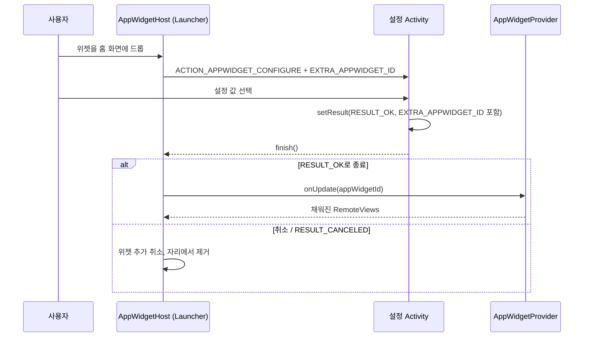

## 위젯 설정 Activity 는 pin 시점에 실행되는 계약을 가진다

위젯이 시간대를 고르는 시계나 폴더를 고르는 메일 위젯처럼 사용자 입력이 필요하면, `AppWidgetProviderInfo` 에 configuration `Activity` 를 선언한다. 공식 문서는 이 시점을 다음과 같이 설명한다. "Android widgets display their configuration choices right after the user drops the widget onto a home screen." 즉 이 Activity 는 화면에 상시 존재하는 설정 화면이 아니라, host 가 위젯을 pin 하는 순간 한 번 끼워 넣는 결과값 契約(result contract)이다.

### 내부 동작 메커니즘

- `<appwidget-provider>` XML 의 `android:configure` 속성에 설정 Activity 의 정규화된 클래스명을 적는다. 사용자가 위젯을 드롭하면 host 는 `ACTION_APPWIDGET_CONFIGURE` intent 로 이 Activity 를 실행하며 `EXTRA_APPWIDGET_ID` 를 함께 전달한다.
- 설정 Activity 는 사용자가 선택을 끝내면 반드시 `setResult(RESULT_OK, resultValue)` 를 호출하고 `resultValue` 에 동일한 `EXTRA_APPWIDGET_ID` 를 담아 `finish()` 해야 한다. `RESULT_OK` 없이 종료되거나 사용자가 뒤로 가기로 취소하면 host 는 위젯을 home 화면에 추가하지 않는다.
- Android 11(API 30) 이하에서는 이 Activity 가 "사용자가 위젯을 홈 화면에 추가할 때마다" 매번 실행된다. Android 12(API 31)부터는 기본 설정(default configuration)을 제공해 이 단계를 건너뛸 수 있고, 이미 배치된 위젯도 나중에 다시 열어 재설정(reconfigure)할 수 있는 옵션이 추가됐다.
- 설정이 끝나면 host 는 그제서야 `AppWidgetProvider.onUpdate()` 를 호출해 처음 `RemoteViews` 를 채운다. 즉 `onUpdate()` 는 설정이 필요한 위젯이라면 설정 완료 이후에 최초로 실행된다.



### 코드 예시

```xml
<!-- res/xml/benefit_widget_info.xml -->
<appwidget-provider xmlns:android="http://schemas.android.com/apk/res/android"
    android:minWidth="180dp"
    android:minHeight="110dp"
    android:updatePeriodMillis="1800000"
    android:configure="com.example.benefit.BenefitWidgetConfigureActivity"
    android:initialLayout="@layout/widget_benefit" />
```

```kotlin
class BenefitWidgetConfigureActivity : ComponentActivity() {

    private var appWidgetId = AppWidgetManager.INVALID_APPWIDGET_ID

    override fun onCreate(savedInstanceState: Bundle?) {
        super.onCreate(savedInstanceState)
        // 취소로 끝나는 기본값을 먼저 세팅해, 중간에 프로세스가 죽어도
        // host가 위젯을 추가하지 않는 안전한 상태를 유지한다.
        setResult(RESULT_CANCELED)

        appWidgetId = intent.getIntExtra(
            AppWidgetManager.EXTRA_APPWIDGET_ID,
            AppWidgetManager.INVALID_APPWIDGET_ID
        )
        if (appWidgetId == AppWidgetManager.INVALID_APPWIDGET_ID) {
            finish()
            return
        }

        setContent {
            ConfigScreen(onConfirm = { selectedFolder ->
                saveWidgetPref(appWidgetId, selectedFolder)

                val resultValue = Intent().putExtra(
                    AppWidgetManager.EXTRA_APPWIDGET_ID, appWidgetId
                )
                setResult(RESULT_OK, resultValue)
                finish()
            })
        }
    }
}
```

### 관측 가능한 증거

- 설정 Activity 를 뒤로 가기로 취소하면 홈 화면에 위젯이 배치되지 않고 사라지는 것을 직접 관찰할 수 있다. `EXTRA_APPWIDGET_ID` 를 실수로 담지 않고 `RESULT_OK` 를 반환하면 위젯 배치 자체가 실패하며 `AppWidgetManager` 관련 예외가 logcat 에 남는다.
- `adb shell dumpsys appwidget` 으로 특정 `appWidgetId` 가 "bound" 상태인지, 아직 설정 대기 중인지 확인할 수 있다.

상위 문서: [Android 앱 아키텍처는 UI 패턴보다 수명과 OS 진입점을 나누는 문제다](../../architecture/android-app-architecture.md)

관련 노트: [AppWidgetProvider lifecycle은 지속 프로세스가 아니라 broadcast로 갱신된다](./appwidgetprovider-lifecycle-runs-through-broadcasts-not-a-persistent-process.md)

공식 문서: [App widgets overview](https://developer.android.com/develop/ui/views/appwidgets/overview), [Enable users to configure app widgets](https://developer.android.com/guide/topics/appwidgets/configuration)

검증일: 2026-08-04. "드롭 직후 설정 화면 노출"과 Android 11 이하에서 매번 실행되는 동작, Android 12+ 기본 설정/재설정 옵션 추가는 공식 가이드 원문으로 확인했다. `setResult`/`EXTRA_APPWIDGET_ID` 계약은 오래 유지된 표준 App Widget 패턴으로, 이번 세션에서 별도 원문 인용을 재확인하지 못해 API 문서 재검토 시 다시 대조한다.
