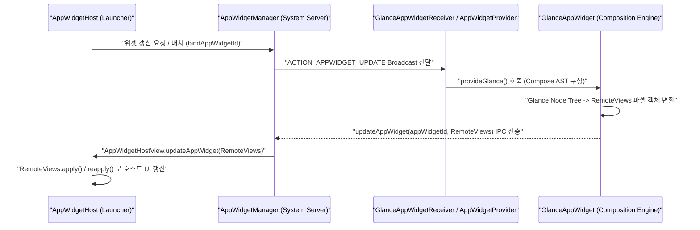

## App Widget 계약

App Widget 은 Activity 나 Service 와 같이 앱 내부에서 독자적인 UI Window 나 지속적인 실행 프로세스를 소유하는 일반적인 앱 컴포넌트와 근본적으로 다른 실행 계약(Execution Contract)을 갖는다. 위젯의 렌더링 주체는 앱 자신이 아니라 OS 의 홈 화면 관리자(Launcher / `AppWidgetHost`)이며, 위젯 UI 전달 및 업데이트는 프로세스 간 통신(IPC) 바운더리를 넘어 `RemoteViews` 또는 현대적 추상화인 **Jetpack Glance**를 통해 이루어진다.

---

### 1. 개념과 핵심 명제 (What)

App Widget 시스템의 본질은 **"앱의 실행 프로세스를 지속시키지 않고, 홈 화면 호스트 프로세스에 선언적 UI 뷰 트리를 원격 주입 및 갱신하는 브로드캐스트 기반 원격 UI 프로토콜"**이다.

- **원격 UI 호스팅 (Remote Hosting)**: 위젯의 실제 View 인스턴스는 홈 화면(Launcher)의 `AppWidgetHostView` 내부에서 생성되고 렌더링된다. 앱 프로세스는 `RemoteViews` 파셀(Parcelable) 객체에 레이아웃 구조와 바인딩 명령만 담아 `AppWidgetManager` 시스템 서비스로 전달한다.
- **현대 표준 Jetpack Glance**: 과거 XML 레이아웃 기반 `RemoteViews` 작성의 번거로움과 제약을 개선하기 위해, 현대 안드로이드 개발에서는 **Jetpack Glance**를 주력 표준으로 사용한다. Glance 는 Kotlin Compose DSL 로 작성된 코드를 빌드 타임 및 런타임에 호환 가능한 `RemoteViews` 트어로 변환해 호스트 프로세스로 송신한다.
- **비상주 프로세스 모델 (Non-persistent Process)**: 위젯을 유지하기 위해 앱 프로세스가 상주하지 않는다. `AppWidgetProvider`(BroadcastReceiver)가 시스템으로부터 `ACTION_APPWIDGET_UPDATE` 이벤트 신호를 수신할 때만 앱 프로세스가 임시로 스케줄링되어 갱신 작업을 수행한다.

---

### 2. 왜 필요한가? (Why)

1. **전력 및 시스템 메모리 보호 (System Efficiency)**: 홈 화면에 십수 개의 위젯이 등록되어 있더라도 해당 앱들이 백그라운드 프로세스로 24시간 상주한다면 기기 메모리와 배터리는 급격히 소모된다. 이벤트 기반 원격 렌더링 구조는 앱 프로세스가 죽어 있어도 호스트 화면에 이전 UI 뷰 트리가 유지되도록 보장한다.
2. **프로세스 격리 및 보안 (Security Isolation)**: 홈 화면 호스트(Launcher)에 제3자 앱의 임의 사용자 지정 View 나 실행 코드가 직접 로딩되면 시스템 보안 샌드박스가 무너진다. `RemoteViews` 및 Glance 가 허용하는 시스템 View 부분집합으로 레이아웃 구성을 제한함으로써 호스트의 안정성과 보안을 원천 보호한다.

---

### 3. 내부 메커니즘 및 시스템 동작 (How)



1. **IPC 레이아웃 전송 및 디시리얼라이제이션**:
   - `GlanceAppWidget` 은 Compose 노드 트리를 탐색하여 파셀화 가능한 `RemoteViews` 명령 모음으로 인코딩한다.
   - `AppWidgetManager` 는 [binder ipc](../../01_system_internals/ipc-and-process/binder-ipc.md) 를 통해 해당 `RemoteViews` 를 `AppWidgetHost` 프로세스로 전달한다.
   - 호스트 프로세스는 자신의 Context 상에서 `RemoteViews.apply()` 를 실행하여 기존 뷰 구조에 새로운 데이터를 반영한다.
2. **상태 관리와 스케줄링 제약**:
   - 위젯은 앱의 메모리 객체([stateflow](../async-flow/flow-state/stateflow-and-sharedflow.md), LiveData 등)를 직접 구독(Subscribe)할 수 없다. 데이터 갱신 시 `GlanceAppWidget.update(context, glanceId)` 또는 `AppWidgetManager.updateAppWidget()` 을 명시적으로 호출해야 한다.
   - 주기적 갱신 속성(`updatePeriodMillis`)은 최소 30분 단위의 배터리 최적화 스케줄만 제공하며, 즉시 갱신이 필요한 경우 `WorkManager` 또는 Push Notification 을 연동해야 한다.

---

### 4. 레거시(XML RemoteViews) vs 현대 표준(Jetpack Glance) 비교

| 구분 | 레거시 표준 (XML RemoteViews) | 현대 안드로이드 표준 (Jetpack Glance) |
| :--- | :--- | :--- |
| **UI 정의 방식** | `res/layout/*.xml` 고정 레이아웃 소스 | Kotlin Compose DSL (`GlanceAppWidget`) |
| **상태 관리** | SharedPreferences / 수동 RemoteViews 갱신 | `GlanceStateDefinition` (DataStore 기반 코루틴 상태) |
| **사용자 상호작용** | `PendingIntent` 수동 조립 및 등록 | `actionRunCallback`, `actionStartActivity` 컴포저블 람다 |
| **동적 레이아웃** | View.GONE / VISIBLE 조작 명령 대량 전달 | Compose 조건문 (`if/else`, `LazyColumn`) 자동 변환 |

---

### 5. 관측 가능 증거 및 진단 명령 (Observability)

- **등록된 위젯 인스턴스 및 바인딩 상태 확인**:
  ```bash
  adb shell dumpsys appwidget
  ```
  *(출력에서 등록된 Provider 목록, Allocated AppWidget ID, 호스트 패키지 이름, 갱신 스케줄 확인 가능)*
- **위젯 갱신 브로드캐스트 로그 추적**:
  ```bash
  adb logcat -s AppWidgetHost AppWidgetManager GlanceAppWidget
  ```

---

### 6. 관련 문서 및 표준 가이드

- 상위 문서: [Android 앱 아키텍처는 UI 패턴보다 수명과 OS 진입점을 나누는 문제다](../architecture/android-app-architecture.md)
- 관련 계약 문서:
  - [RemoteViews vs Jetpack Glance 비교](glance-remoteviews-rendering.md)
  - [AppWidgetProvider lifecycle은 지속 프로세스가 아니라 broadcast로 갱신된다](appwidgetprovider-lifecycle.md)
  - [Glance는 Compose UI가 아니라 RemoteViews를 통해 위젯을 렌더링한다](glance-remoteviews-rendering.md)
  - [RemoteViews는 위젯 layout을 고정된 View 부분집합으로 제한한다](remoteviews-layout-restrictions.md)
  - [updatePeriodMillis는 최소 간격만 보장하는 best-effort 스케줄이다](widget-update-intervals.md)
  - [위젯 설정 Activity는 pin 시점에 실행되는 계약을 가진다](widget-configuration-activity.md)
- 공식 문서: [Android App Widgets Overview](https://developer.android.com/develop/ui/views/appwidgets/overview), [Jetpack Glance Overview](https://developer.android.com/develop/ui/compose/glance)

검증일: 2026-08-05. Glance 최신 표준 및 AppWidgetManager IPC 구조 원문 대조 확인 완료.
