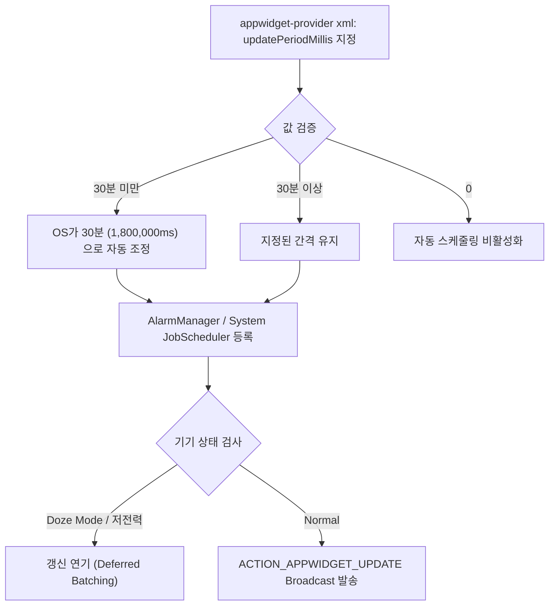

## updatePeriodMillis는 최소 간격만 보장하는 best-effort 스케줄이다

App Widget 메타데이터 XML 에 정의하는 `android:updatePeriodMillis` 속성은 OS 시스템 서비스(`AppWidgetManager`)가 위젯 브로드캐스트(`ACTION_APPWIDGET_UPDATE`)를 발송하는 간격을 지정한다. 그러나 이 값은 **정확한 주기성을 보장하는 실시간 타이머가 아니며, 안드로이드 전력 관리 하한선(최소 30분) 및 Doze 모드 제약을 받는 Best-effort 최소 간격 힌트**에 불과하다.

---

### 1. 개념 및 핵심 명제 (What)

- **30분 하한선 제약 (30-Minute Minimum Limit)**: 안드로이드 2.0 (API LEVEL 5) 이후 배터리 최적화를 위해 `updatePeriodMillis` 에 30분(1,800,000ms) 미만의 값을 입력하더라도 **OS 시스템은 이를 자동으로 30분으로 올림 절삭**하여 처리한다.
- **Best-Effort 스케줄링**: exact 알람이 아니므로, 기기의 전원 절약 상태(Doze Mode, App Standby Buckets) 및 시스템 부하에 따라 30분 이상 지연된 후 묶어서(Batching) 실행될 수 있다.
- **값 `0` 의 의미**: `android:updatePeriodMillis="0"` 으로 설정하면 시스템 타이머 갱신을 완전히 비활성화하고, 이벤트 발생 시 앱이 직접 명시적으로 위젯을 갱신하겠다는 계약을 의미한다.

---

### 2. 왜 실시간 타이머를 지원하지 않는가? (Why)

1. **배터리 수명 보호 (Battery Preservation)**: 수십 개의 위젯이 매 1분, 5분마다 개별적으로 웨이크락(WakeLock)을 일으켜 AP(Processor)를 깨운다면 스마트폰 배터리가 급격히 소모된다.
2. **App Standby 및 Doze 정책 준수**: 안드로이드 OS 는 사용하지 않는 앱의 백그라운드 실행을 제한한다. 위젯 타이머 역시 OS 의 글로벌 알람 배치(Alarm Batching) 메커니즘을 통과해야 한다.

---

### 3. 내부 메커니즘 및 대안 아키텍처 (How)



#### 고주기 및 이벤트 기반 위젯 갱신 대안 패턴

실시간에 가까운 위젯 갱신(예: 15분 주기의 정기 데이터 갱신, 푸시 수신 시 즉시 갱신)이 필요한 경우 다음 대안을 조합한다.

1. **WorkManager 연동 (정기 갱신)**:
   `PeriodicWorkRequestBuilder` (최소 간격 15분)를 연동하여 네트워크 데이터를 가져온 후 `GlanceAppWidget.update(context, glanceId)` 호출.
2. **Push Notification (FCM 연동)**:
   서버 변경 사항 발생 시 FCM Silent Push 를 수신하고 `GlanceAppWidget.update()` 실행.

---

### 4. 현대 표준 구현 예시 (WorkManager 연동 대안)

```kotlin
// 1. WorkManager를 이용한 정기 갱신 Worker
class WidgetRefreshWorker(
    context: Context,
    params: WorkerParameters
) : CoroutineWorker(context, params) {

    override async fun doWork(): Result {
        // 비동기 데이터 로딩
        WeatherRepository.fetchLatestData()
        
        // Glance 위젯 재렌더링 트리거
        val glanceManager = GlanceAppWidgetManager(applicationContext)
        val glanceIds = glanceManager.getGlanceIds(WeatherGlanceWidget::class.java)
        glanceIds.forEach { glanceId ->
            WeatherGlanceWidget().update(applicationContext, glanceId)
        }
        return Result.success()
    }
}

// 2. 위젯 활성화 시 WorkManager 주기적 스케줄링 등록 (onEnabled)
class WeatherGlanceWidgetReceiver : GlanceAppWidgetReceiver() {
    override val glanceAppWidget: GlanceAppWidget = WeatherGlanceWidget()

    override fun onEnabled(context: Context) {
        super.onEnabled(context)
        val refreshRequest = PeriodicWorkRequestBuilder<WidgetRefreshWorker>(
            repeatInterval = 15,
            repeatIntervalTimeUnit = TimeUnit.MINUTES
        ).setConstraints(
            Constraints.Builder().setRequiresBatteryNotLow(true).build()
        ).build()

        WorkManager.getInstance(context).enqueueUniquePeriodicWork(
            "weather_widget_periodic_update",
            ExistingPeriodicWorkPolicy.KEEP,
            refreshRequest
        )
    }

    override fun onDisabled(context: Context) {
        super.onDisabled(context)
        WorkManager.getInstance(context).cancelUniqueWork("weather_widget_periodic_update")
    }
}
```

---

### 5. 관측 가능 증거 및 진단 (Observability)

- **등록된 위젯의 updatePeriodMillis 및 다음 알람 시각 확인**:
  ```bash
  adb shell dumpsys appwidget
  ```
  *(출력 항목 중 `updatePeriodMillis` 설정값과 `updateDeadline` 시각 대조)*
- **Doze 모드 강제 진입 시 갱신 지연 확인**:
  ```bash
  adb shell dumpsys deviceidle force-idle
  ```
  *(Doze 진입 후 `ACTION_APPWIDGET_UPDATE` 발송이 차단 및 연기되는 현상 관찰 가능)*

---

### 6. 관련 문서 및 참조

- 상위 문서: [Android 앱 아키텍처는 UI 패턴보다 수명과 OS 진입점을 나누는 문제다](../../architecture/android-app-architecture.md)
- 관련 계약 문서:
  - [App Widget 계약](./app-widget.md)
  - [AppWidgetProvider lifecycle은 지속 프로세스가 아니라 broadcast로 갱신된다](./appwidgetprovider-lifecycle-runs-through-broadcasts-not-a-persistent-process.md)
  - [WorkManager는 지연 가능한 보장 작업의 기본 선택이다](../../../04_system_services/background-and-notifications/background-work/work-manager.md)
- 공식 문서: [Optimize app widget updates](https://developer.android.com/develop/ui/views/appwidgets/advanced#update-provider)

검증일: 2026-08-05. 30분 하한선 및 Doze 모드 제약 공식 문서 원문 확인 완료.
