## RemoteViews vs Jetpack Glance 위젯 프레임워크 비교

### 1. 개념 및 비유로 이해하는 개념 (What & Analogy)

- **RemoteViews vs Jetpack Glance 정의**:
  - **`RemoteViews`**: 타 프로세스(홈 화면 런처)에서 뷰를 그리도록 레이아웃 XML과 뷰 설정 명령(`setTextViewText`, `setOnClickPendingIntent` 등)을 IPC 객체로 묶어 전송하는 레거시 안드로이드 원격 UI 청사진이다.
  - **`Jetpack Glance`**: Kotlin Compose의 선언형 DSL 문법으로 위젯 UI를 작성할 수 있게 제공되는 현대적 프레임워크다. 단, 런처 프로세스와의 보안 경계를 유지하기 위해 내부 컴포지션 결과를 `RemoteViews`로 자동 번역하여 전송한다.

- **쉬운 비유로 이해하기**:
  - **RemoteViews (원격 IPC 청사진 / Remote IPC Blueprint)**: 시공사(런처)에 팩스로 전송하는 **수동 종이 청사진**과 같다. 집 주인이 직접 런처에 들어가 뷰를 고칠 수 없으므로, 어떤 글자를 쓰고 어느 위치에 버튼을 놓을지 종이에 일일이 적어서 전송해야 한다.
  - **Glance (선언형 Compose 위젯 / Declarative Compose Widget)**: 최신 3D CAD 디자인 프로그램(Compose DSL)과 같다. 개발자가 화면 구조와 반응형 상태를 선언적으로 디자인하면, 시공사가 이해할 수 있는 팩스 청사진(`RemoteViews`)으로 **자동 변환하여 전송**해 준다.

---

### 2. 왜 Glance로 전환하는가? (Why)

1. **개발 생산성 향상 및 보일러플레이트 제거**:
   - 레거시 `RemoteViews`는 뷰 하나를 수정할 때마다 `RemoteViews.setTextViewText(R.id.text_view, "내용")` 과 같이 명령형 뷰 바인딩 코드를 수동 작성해야 한다.
   - `Glance`는 Compose 표준 선언형 코딩 방식을 그대로 사용하여 `Text("내용")`처럼 직관적으로 UI 구조를 작성할 수 있다.
2. **이벤트 바인딩과 상태 관리의 안전성**:
   - 레거시 방식은 버튼 클릭 이벤트를 처리하려면 매번 `PendingIntent`를 복잡하게 구성하고 `setOnClickPendingIntent()`로 수동 매핑해야 했다.
   - Glance는 `actionRunCallback<MyActionCallback>()`과 같은 타입 안전한 람다/콜백 구조를 제공하며, `GlanceStateDefinition`(DataStore 기반)을 통한 상태 관리 및 재컴포지션을 자동화한다.
3. **런처 시스템 보안과 격리성 보장**:
   - Glance는 Compose 문법을 사용하지만 런처 프로세스에 직접 커스텀 View 캔버스를 주입하지 않는다. 런처와는 여전히 검증된 `RemoteViews` IPC 규격으로 통신하므로 OS 수준의 프로세스 메모리 격리 및 안정성을 그대로 유지한다.

---

### 3. 내부 메커니즘 및 차이점 비교 (How)

#### 렌더링 흐름 구조

```mermaid
graph TD
    subgraph Legacy ["레거시 RemoteViews 방식"]
        L1["AppWidgetProvider (BroadcastReceiver)"] -->|"1. 수동 객체 생성"| L2["RemoteViews(packageName, layoutId)"]
        L2 -->|"2. 명령형 뷰 바인딩"| L3["setTextViewText / setOnClickPendingIntent"]
        L3 -->|"3. IPC 전송"| L4["AppWidgetManager.updateAppWidget()"]
        L4 -->|"4. 원격 렌더링"| L5["AppWidgetHostView (Launcher)"]
    end

    subgraph Modern ["현대 Jetpack Glance 방식"]
        M1["GlanceAppWidget.provideGlance()"] -->|"1. Compose DSL 작성"| M2["Glance AST Node Tree (GlanceNode)"]
        M2 -->|"2. 자동 번역"| M3["RemoteViewsTranslator"]
        M3 -->|"3. IPC 전송"| M4["AppWidgetManager.updateAppWidget()"]
        M4 -->|"4. 원격 렌더링"| M5["AppWidgetHostView (Launcher)"]
    end
```



#### RemoteViews vs Jetpack Glance 세부 비교표

| 항목 | RemoteViews (레거시) | Jetpack Glance (현대 표준) |
| :--- | :--- | :--- |
| **UI 작성 패러다임** | XML 레이아웃 + 명령형 View 바인딩 | Kotlin Compose 선언형 DSL (`Text`, `Column`, `Row`) |
| **클릭 이벤트 처리** | `PendingIntent` 직접 생성 후 `setOnClickPendingIntent` 바인딩 | `actionRunCallback<ActionCallback>()` 구조의 타입 안전 처리 |
| **상태 관리 (State)** | 개발자가 외부에서 상태 계산 후 전체 수동 재갱신 | `GlanceStateDefinition` (DataStore) 및 자동 재컴포지션 |
| **최종 IPC 전달 객체** | `RemoteViews` 파셀 객체 (직접 제어) | `RemoteViews` (`RemoteViewsTranslator`가 자동 생성) |
| **사용 패키지** | `android.widget.RemoteViews` | `androidx.glance.appwidget.*` |

---

### 4. 코드 비교 예시 (Code Example)

#### 1) 레거시 RemoteViews 구현 방식

```kotlin
// AppWidgetProvider onUpdate 수동 바인딩
override fun onUpdate(context: Context, appWidgetManager: AppWidgetManager, appWidgetIds: IntArray) {
    for (appWidgetId in appWidgetIds) {
        val views = RemoteViews(context.packageName, R.layout.widget_layout).apply {
            setTextViewText(R.id.widget_title, "현재 시세: $1,200")
            
            val intent = Intent(context, RefreshReceiver::class.java)
            val pendingIntent = PendingIntent.getBroadcast(
                context, 0, intent, PendingIntent.FLAG_UPDATE_CURRENT or PendingIntent.FLAG_IMMUTABLE
            )
            setOnClickPendingIntent(R.id.btn_refresh, pendingIntent)
        }
        appWidgetManager.updateAppWidget(appWidgetId, views)
    }
}
```

#### 2) 현대 Jetpack Glance 구현 방식

```kotlin
class StockGlanceWidget : GlanceAppWidget() {
    override async fun provideGlance(context: Context, id: GlanceId) {
        val price = StockRepository.getCachedPrice(context)

        provideContent {
            GlanceTheme {
                Column(modifier = GlanceModifier.fillMaxSize()) {
                    Text(text = "현재 시세: $$price")
                    Button(
                        text = "시세 갱신",
                        onClick = actionRunCallback<RefreshStockActionCallback>()
                    )
                }
            }
        }
    }
}
```

---

### 5. 관측 가능 증거 및 진단 (Observability)

- **런처로 전달된 RemoteViews 파셀 및 뷰 구조 진단**:
  ```bash
  adb shell dumpsys appwidget
  ```
  *(Glance가 런처 호스트에 생성 전송한 RemoteViews의 Layout Resource ID 및 Action 파악 가능)*

- **Glance 상태 변화 및 번역 로그 추적**:
  ```bash
  adb logcat -s GlanceAppWidget GlanceState
  ```

---

### 6. 관련 문서 및 참조

- 상위 계약 문서: [App Widget 계약](./app-widget-contracts/app-widget-contracts.md)
- 연관 atomic 계약 문서:
  - [AppWidgetProvider lifecycle은 지속 프로세스가 아니라 broadcast로 갱신된다](./app-widget-contracts/appwidgetprovider-lifecycle-runs-through-broadcasts-not-a-persistent-process.md)
  - [Glance는 Compose UI가 아니라 RemoteViews를 통해 위젯을 렌더링한다](./app-widget-contracts/glance-renders-app-widgets-through-remoteviews-not-compose-ui.md)
  - [RemoteViews는 위젯 layout을 고정된 View 부분집합으로 제한한다](./app-widget-contracts/remoteviews-restricts-widget-layouts-to-a-fixed-view-subset.md)
- 상위 구조 문서: [Android 앱 아키텍처는 UI 패턴보다 수명과 OS 진입점을 나누는 문제다](../architecture/android-app-architecture.md)

검증일: 2026-08-06. RemoteViews(원격 청사진)와 Glance(선언형 위젯) 비교 분석 검증 완료.
