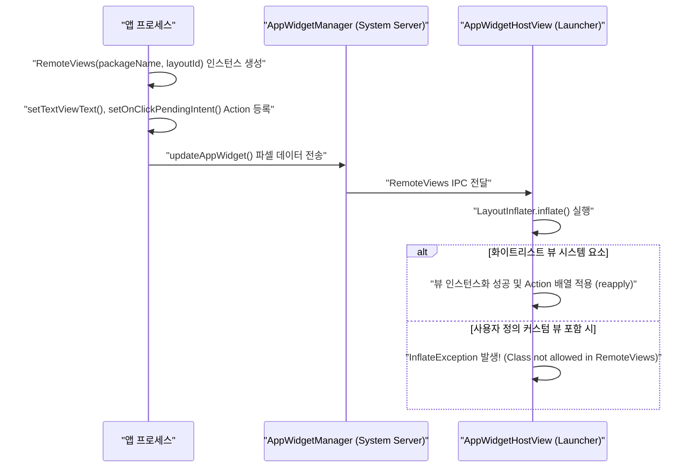

## RemoteViews는 위젯 layout을 고정된 View 부분집합으로 제한한다

`RemoteViews` 는 안드로이드 OS 보안 및 프로세스 간 렌더링 격리를 보장하기 위해 홈 화면 호스트(Launcher) 프로세스에서 인스턴스화할 수 있는 **View 및 Layout 클래스를 엄격하게 지정된 시스템 부분집합(Subset)으로 제한**한다. 제3자 앱이 커스텀 뷰(Custom View subclass)를 선언하여 `RemoteViews` 레이아웃 XML 에 포함하더라도 호스트 프로세스가 이를 디시리얼라이즈하는 과정에서 `InflateException` 이 발생한다.

---

### 1. 개념 및 핵심 명제 (What)

- **화이트리스트 View 부분집합 (Whitelisted View Subset)**:
  `RemoteViews` 가 지원하는 클래스는 오직 다음 시스템 레이아웃 및 뷰 노드뿐이다.
  - **Layouts**: `FrameLayout`, `LinearLayout`, `RelativeLayout`, `GridLayout`
  - **Widgets**: `AnalogClock`, `Button`, `Chronometer`, `ImageButton`, `ImageView`, `ProgressBar`, `TextView`, `ViewFlipper`, `ListView`, `GridView`, `StackView`, `AdapterViewFlipper`
- **커스텀 View 금지 (No Custom View Subclasses)**:
  `class MyCustomGraphView : View` 와 같이 커스텀 뷰 클래스를 만들거나, `ConstraintLayout`, `RecyclerView` 등 화이트리스트에 포함되지 않은 라이브러리 레이아웃을 직접 지원하지 않는다. (Android 12+ 에서 `RadioGroup`, `CheckBox`, `Switch` 등 일부 컴포넌트가 확대 추가됨)

---

### 2. 왜 제한하는가? (Why)

1. **클래스로더 및 보안 격리 (Classloader Isolation)**: 홈 화면 호스트(Launcher) 프로세스는 타사 앱의 APK 바이너리나 DEX 클래스를 자신의 프로세스 클래스로더(Classloader)에 직접 로딩하지 않는다. 만약 커스텀 View 인스턴스화를 허용한다면 제3자 코드가 호스트 권한으로 실행되어 보안 구멍이 발생한다.
2. **IPC 파셀 전송 안정성 (Parcelable Action Marshaling)**: `RemoteViews` 는 레이아웃 인스턴스 자체가 아니라 **"어떤 View ID에 어떤 메서드(setText, setImageViewBitmap 등)를 어떤 인자로 호출하라"**는 리플렉션/메서드 래퍼 패킷(`Action` 객체 배열)을 Parcelable 로 포장하여 전송한다. 화이트리스트 뷰에 한정되어야 호스트가 무작위 리플렉션 공격으로부터 안전하다.

---

### 3. 내부 메커니즘 (How)



#### Glance 에서의 내부 변환 처리

Jetpack Glance 도 이 제약 위에 구축되어 있다. Glance 컴포저블 코드가 작성되면 Glance 의 `RemoteViewsTranslator` 가 이를 검증하고, `GlanceModifier` 및 레이아웃을 화이트리스트에 해당하는 `LinearLayout`, `RelativeLayout`, `TextView`, `ImageView` 구조로 자동으로 맵핑하여 변환한다.

---

### 4. 코드 구현 및 제약 극복 패턴

#### 커스텀 그래픽 표현 방법: Bitmap 바인딩

차트나 커스텀 드로잉 뷰를 위젯에 표현해야 할 때는 커스텀 뷰 대신 **Bitmap 에 캔버스 드로잉을 완료한 후 ImageView 로 전송**하는 패턴을 사용한다.

```kotlin
// Glance 또는 RemoteViews 공통: 커스텀 그래픽을 Bitmap으로 그려서 ImageView에 전달
fun drawCustomChartBitmap(context: Context, widthPx: Int, heightPx: Int): Bitmap {
    val bitmap = Bitmap.createBitmap(widthPx, heightPx, Bitmap.Config.ARGB_8888)
    val canvas = Canvas(bitmap)
    val paint = Paint().apply {
        color = Color.BLUE
        strokeWidth = 5f
    }
    // 커스텀 차트 드로잉
    canvas.drawLine(0f, heightPx.toFloat(), widthPx.toFloat(), 0f, paint)
    return bitmap
}

// Glance 코드 내 적용 예시
@Composable
fun ChartWidgetContent(bitmap: Bitmap) {
    Image(
        provider = ImageProvider(bitmap),
        contentDescription = "커스텀 차트 그래픽"
    )
}
```

---

### 5. 관측 가능 증거 및 진단 (Observability)

- **지원되지 않는 View 사용 시 로그켓 오류 확인**:
  허용되지 않은 Custom View 가 레이아웃 XML 에 포함된 경우 런처 화면이나 logcat 에 다음과 같은 예외 출력:
  `android.view.InflateException: Binary XML file line #X: Class not allowed to be inflated android.widget.MyCustomView`
- **RemoteViews 액션 구성 확인**:
  ```bash
  adb shell dumpsys appwidget
  ```

---

### 6. 관련 문서 및 참조

- 상위 문서: [Android 앱 아키텍처는 UI 패턴보다 수명과 OS 진입점을 나누는 문제다](../architecture/android-app-architecture.md)
- 관련 계약 문서:
  - [App Widget 계약](app-widget.md)
  - [Glance는 Compose UI가 아니라 RemoteViews를 통해 위젯을 렌더링한다](glance-remoteviews-rendering.md)
- 공식 문서: [RemoteViews API Reference](https://developer.android.com/reference/android/widget/RemoteViews)

검증일: 2026-08-05. RemoteViews 허용 View 화이트리스트 및 IPC 파셀화 동작 원문 대조 완료.
