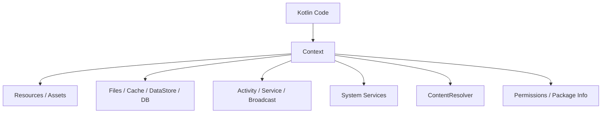

# Android Context 완전 가이드

이 문서는 Android 개발에서 거의 모든 곳에 등장하는 **`Context`**가 무엇인지, 왜 필요한지, 어떤 종류가 있고, 현대
Compose/ViewModel/Repository 구조에서는 어떻게 다뤄야 하는지를 정리합니다.

관련 공식 문서:

- [Context API reference](https://developer.android.com/reference/android/content/Context)
- [App resources overview](https://developer.android.com/guide/topics/resources/providing-resources)
- [Data and file storage overview](https://developer.android.com/training/data-storage)

---

## 1. Context란?

`Context`는 안드로이드 코드가 **현재 앱/컴포넌트가 놓인 실행 환경을 통해 OS 기능에 접근하기 위한 손잡이**입니다.

쉽게 말하면, 앱 코드가 안드로이드 OS에게 이렇게 묻거나 요청할 때 필요한 통행증입니다.

```text
내 앱의 파일 저장 위치가 어디야?
내 앱의 문자열 리소스를 가져와줘.
카메라 권한이 있나 확인해줘.
새 Activity를 실행해줘.
알림 서비스를 가져와줘.
다른 앱의 ContentProvider에 query를 보내줘.
```

이런 요청은 순수 Kotlin 객체만으로는 할 수 없습니다. 안드로이드 OS와 연결된 실행 환경이 필요하고, 그 실행 환경이 바로 `Context`입니다.



> [!IMPORTANT]
> `Context`는 앱의 "상태 저장소"가 아닙니다. 앱이 OS 리소스와 시스템 기능에 접근하기 위한 **환경 핸들(handle)**입니다.

---

## 2. Context가 할 수 있는 일

| 역할                 | 대표 API                                                 | 예시                          |
|:-------------------|:-------------------------------------------------------|:----------------------------|
| 리소스 접근             | `getString()`, `resources`, `assets`                   | 다국어 문자열, 이미지, raw asset 읽기  |
| 컴포넌트 실행            | `startActivity()`, `startService()`, `sendBroadcast()` | 화면 열기, 서비스 시작, 방송 전송        |
| 시스템 서비스 접근         | `getSystemService()`                                   | 알림, 위치, 연결 상태, 클립보드         |
| 앱 저장소 접근           | `filesDir`, `cacheDir`, `getDatabasePath()`            | 앱 내부 파일, 캐시, DB 위치          |
| ContentProvider 접근 | `contentResolver`                                      | 연락처 조회, MediaStore 조회       |
| 권한/패키지 정보          | `checkSelfPermission()`, `packageManager`              | 권한 확인, 앱 버전/패키지 조회          |
| 테마/윈도우 연동          | Activity Context                                       | Dialog, Toast, themed UI 생성 |

예시:

```kotlin
val appName = context.getString(R.string.app_name)

val notificationManager =
    context.getSystemService(NotificationManager::class.java)

val file = File(context.filesDir, "session.json")

val cursor = context.contentResolver.query(
    ContactsContract.Contacts.CONTENT_URI,
    null,
    null,
    null,
    null,
)
```

---

## 3. Context의 대표 종류

`Context`라고 다 같은 Context가 아닙니다. 수명과 역할이 다릅니다.

| 종류                             | 수명                  | 적합한 사용                                          | 피해야 할 사용                |
|:-------------------------------|:--------------------|:------------------------------------------------|:------------------------|
| `Application Context`          | 앱 프로세스가 살아있는 동안     | Repository, DataStore, Room, WorkManager, 파일 경로 | 화면 테마가 필요한 Dialog/UI    |
| `Activity Context`             | Activity 인스턴스 수명    | 화면 열기, Dialog, UI theme, Activity Result        | singleton에 저장           |
| `Service Context`              | Service 실행 수명       | foreground service 알림/작업                        | 화면 UI 소유                |
| `BroadcastReceiver`의 `context` | `onReceive()` 호출 동안 | 짧은 처리, WorkManager 예약                           | 긴 작업 직접 실행              |
| `ContentProvider`의 `context`   | provider 초기화 이후     | provider 내부 리소스/DB 접근                           | UI 작업                   |
| Compose `LocalContext.current` | 현재 Composition 위치   | Intent 실행, 리소스 접근, Android API 연결               | 장기 보관, ViewModel 필드로 저장 |

---

## 4. Application Context

`Application Context`는 앱 프로세스 전체에 묶인 Context입니다.

```kotlin
val appContext = context.applicationContext
```

수명이 길기 때문에, 오래 살아야 하는 객체가 Context를 필요로 할 때는 보통 `Application Context`가 안전합니다.

적합한 예:

```kotlin
class SessionStorage(
    private val appContext: Context,
) {
    private val dataStore = appContext.dataStore
}
```

```kotlin
val database = Room.databaseBuilder(
    appContext,
    AppDatabase::class.java,
    "app.db",
).build()
```

`Application Context`가 적합한 곳:

```text
DataStore 생성
Room database 생성
파일/cache directory 접근
Repository 내부 Android API 접근
WorkManager enqueue
NotificationManager 같은 system service 접근
```

> [!TIP]
> DI에서 `Context`를 주입해야 한다면 먼저 "이 객체가 화면보다 오래 사는가?"를 확인하세요. 오래 사는 객체라면 Activity Context가 아니라
> Application Context가 맞는 경우가 많습니다.

---

## 5. Activity Context

`Activity` 자체도 `Context`입니다.

```kotlin
class MainActivity : ComponentActivity() {
    override fun onCreate(savedInstanceState: Bundle?) {
        super.onCreate(savedInstanceState)

        val activityContext: Context = this
    }
}
```

Activity Context는 화면, 윈도우, 테마와 연결됩니다.

적합한 예:

```kotlin
AlertDialog.Builder(activityContext)
    .setTitle("삭제")
    .setMessage("정말 삭제할까요?")
    .show()
```

```kotlin
val intent = Intent(activityContext, DetailActivity::class.java)
activityContext.startActivity(intent)
```

Activity Context가 필요한 경우:

```text
Dialog / BottomSheet / Popup처럼 window token이 필요한 UI
Activity theme가 적용된 View 생성
Activity Result / permission launcher와 연결되는 흐름
새 Activity 실행
```

하지만 Activity Context는 수명이 짧습니다. 화면 회전, 다크 모드 변경, 멀티 윈도우 변화 등으로 Activity는 재생성될 수 있습니다.

```kotlin
object BadSingleton {
    // 나쁜 예: Activity가 사라져도 붙잡고 있어 memory leak 가능
    lateinit var context: Context
}
```

> [!IMPORTANT]
> Activity Context를 singleton, Repository, long-running coroutine에 저장하지 마세요. 화면이 사라졌는데 Activity를 계속
> 붙잡아 memory leak을 만들 수 있습니다.

---

## 6. Service, Receiver, Provider의 Context

### 6-1. Service Context

`Service`도 `Context`입니다. Foreground Service에서 알림 채널, 알림 매니저, 파일, 리소스에 접근할 때 사용합니다.

```kotlin
class MusicService : Service() {
    override fun onCreate() {
        super.onCreate()

        val notificationManager =
            getSystemService(NotificationManager::class.java)
    }
}
```

Service Context는 화면 UI를 소유하지 않습니다. Dialog 같은 화면 UI를 직접 띄우는 역할로 쓰면 구조가 어색해집니다.

### 6-2. BroadcastReceiver의 Context

`BroadcastReceiver.onReceive()`로 들어오는 `context`는 짧은 처리에 사용합니다.

```kotlin
class BootReceiver : BroadcastReceiver() {
    override fun onReceive(context: Context, intent: Intent) {
        if (intent.action == Intent.ACTION_BOOT_COMPLETED) {
            WorkManager.getInstance(context.applicationContext)
                .enqueue(OneTimeWorkRequestBuilder<SyncWorker>().build())
        }
    }
}
```

Receiver에서는 긴 작업을 직접 하지 말고, `WorkManager`나 foreground service로 넘기는 편이 맞습니다.

### 6-3. ContentProvider의 Context

`ContentProvider` 내부에서는 `context`로 DB, 파일, 리소스에 접근할 수 있습니다.

```kotlin
class MyProvider : ContentProvider() {
    override fun onCreate(): Boolean {
        val appContext = context?.applicationContext ?: return false
        // DB 초기화 등
        return true
    }
}
```

Provider는 앱 간 데이터 창구이므로 UI 작업보다 데이터 접근 경계로 보는 편이 맞습니다.

---

## 7. Compose에서 Context: LocalContext

Compose에는 Flutter의 `BuildContext`처럼 함수 파라미터로 `context`가 자동으로 들어오지 않습니다.

대신 필요할 때 `LocalContext.current`를 읽습니다.

```kotlin
@Composable
fun ShareButton(fileUri: Uri) {
    val context = LocalContext.current

    Button(
        onClick = {
            val intent = Intent(Intent.ACTION_SEND).apply {
                type = "application/pdf"
                putExtra(Intent.EXTRA_STREAM, fileUri)
                addFlags(Intent.FLAG_GRANT_READ_URI_PERMISSION)
            }
            context.startActivity(Intent.createChooser(intent, "공유"))
        }
    ) {
        Text("공유")
    }
}
```

`LocalContext.current`는 보통 현재 Activity Context입니다. 그래서 UI와 가까운 작업에는 편리합니다.

적합한 예:

```text
Intent 실행
Android resource 접근
Toast 표시
Activity Result launcher와 함께 플랫폼 API 호출
ClipboardManager 같은 system service 접근
```

주의할 점:

```kotlin
@Composable
fun BadScreen() {
    val context = LocalContext.current

    // 나쁜 예: Composable 안에서 Repository를 직접 만들고 Context를 오래 보관
    val repository = remember {
        SessionRepository(context)
    }
}
```

이런 객체는 DI나 ViewModel에서 만들고, 필요하면 `applicationContext`를 주입하는 편이 좋습니다.

---

## 8. Flutter BuildContext와 Android Context는 다르다

이름은 같지만 역할은 꽤 다릅니다.

| 구분    | Flutter `BuildContext`                        | Android `Context`                                   |
|:------|:----------------------------------------------|:----------------------------------------------------|
| 정체    | Widget tree 안의 위치                             | 앱/컴포넌트가 OS와 연결되는 환경 핸들                              |
| 주된 역할 | inherited widget lookup, theme, navigation 위치 | resource, storage, system service, component 실행     |
| 수명    | widget tree 위치에 묶임                            | Application/Activity/Service 등 종류별로 다름              |
| 사용 예  | `Theme.of(context)`, `Navigator.of(context)`  | `getSystemService()`, `startActivity()`, `filesDir` |

Flutter의 `BuildContext`는 "UI 트리에서 내가 어디 있나"에 가깝고, Android의 `Context`는 "내 앱/컴포넌트가 OS와 어떻게 연결되어 있나"에
가깝습니다.

Compose에서 Flutter의 `BuildContext`와 더 비슷한 개념은 `CompositionLocal`과 `Modifier` 체계에 가깝고, Android
`Context`는 그보다 더 플랫폼적인 객체입니다.

---

## 9. Context와 ViewModel/Repository

현대 Android 구조에서는 ViewModel이 Activity Context를 직접 들고 있지 않게 설계하는 편이 좋습니다.

```kotlin
class BadViewModel(
    private val activityContext: Context,
) : ViewModel()
```

이 구조는 ViewModel 수명이 Activity보다 길 수 있는 상황과 충돌합니다.

권장 구조:

```kotlin
class SessionRepository(
    private val appContext: Context,
) {
    fun sessionFile(): File {
        return File(appContext.filesDir, "session.json")
    }
}

class SessionViewModel(
    private val repository: SessionRepository,
) : ViewModel()
```

더 좋은 구조는 Repository도 가능하면 `Context` 자체를 퍼뜨리지 않고, 필요한 Android API를 더 좁은 인터페이스로 감싸는 것입니다.

```kotlin
interface SessionStorage {
    suspend fun save(sessionKey: String)
    suspend fun clear()
}

class DataStoreSessionStorage(
    private val appContext: Context,
) : SessionStorage {
    override suspend fun save(sessionKey: String) {
        // DataStore 저장
    }

    override suspend fun clear() {
        // DataStore 삭제
    }
}
```

이렇게 하면 ViewModel과 UseCase는 Android `Context`를 몰라도 됩니다.

---

## 10. 자주 하는 실수

### 10-1. Activity Context를 singleton에 저장

```kotlin
object ImageLoaderHolder {
    lateinit var context: Context
}
```

Activity Context가 들어가면 Activity가 파괴된 뒤에도 메모리에 남을 수 있습니다. singleton에는 가능하면 `applicationContext`를
사용합니다.

### 10-2. Composable에서 Context로 비즈니스 객체 생성

```kotlin
@Composable
fun BadRoute() {
    val context = LocalContext.current
    val repository = remember { BenefitRepository(context) }
}
```

Composable은 UI 선언 위치입니다. Repository는 DI/ViewModel 쪽에서 조립하는 편이 수명과 테스트가 명확합니다.

### 10-3. Application Context로 UI Dialog 띄우기

```kotlin
AlertDialog.Builder(appContext).show()
```

Dialog는 window/theme와 연결되어야 하므로 Activity Context가 필요합니다.

### 10-4. Context가 필요 없는데 함수 전체에 넘기기

```kotlin
fun formatBenefitTitle(context: Context, benefit: Benefit): String
```

단순 formatting이면 `Context` 전체를 넘기지 말고 필요한 문자열이나 formatter만 넘기는 편이 테스트하기 쉽습니다.

---

## 11. 선택 기준 요약

| 하고 싶은 일                     | 적합한 Context                                                          |
|:----------------------------|:---------------------------------------------------------------------|
| Room/DataStore/File 저장소 생성  | `applicationContext`                                                 |
| WorkManager 작업 예약           | `applicationContext`                                                 |
| Activity 시작                 | Activity Context 또는 `FLAG_ACTIVITY_NEW_TASK`가 있는 Application Context |
| Dialog/Popup/Theme UI       | Activity Context                                                     |
| Compose에서 Intent 실행         | `LocalContext.current`                                               |
| BroadcastReceiver에서 작업 예약   | `context.applicationContext`                                         |
| Repository가 Android 저장소에 접근 | 가능하면 Application Context, 더 좋게는 storage interface로 감싸기               |
| ViewModel에서 화면 상태 관리        | Context 직접 보관하지 않기                                                   |

핵심은 다음입니다.

```text
화면/테마/window와 관련 있나?
-> Activity Context

오래 살아야 하는 객체인가?
-> Application Context

앱 내부 로직 테스트가 중요한가?
-> Context를 직접 퍼뜨리지 말고 interface로 감싸기

Compose 안에서 잠깐 Android API가 필요한가?
-> LocalContext.current
```

> [!NOTE]
> 4대 컴포넌트와 OS 진입점의
> 관계는 [[android-modern-architecture-components]]
> 를 참조하세요.
> Compose 상태 관리와 `LocalContext`의
> 위치는 [[jetpack-compose-state-management-flutter-comparison]]
> 를 참조하세요.
> 저장소 API에서 Context가 필요한
> 이유는 [[android-storage-and-databases]]
> 를 참조하세요.
