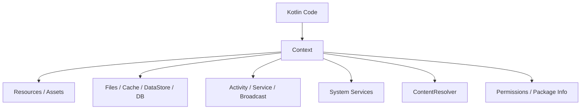

# Context란?

상위 노트: [[android-context]]

`Context`는 안드로이드 코드가 **현재 앱/컴포넌트가 놓인 실행 환경을 통해 OS 기능에 접근하기 위한 손잡이**입니다.

쉽게 말하면, 앱 코드가 안드로이드 OS에게 이렇게 묻거나 요청할 때 필요한 통행증입니다.

```text
내 앱의 파일 저장 위치가 어디야?
내 앱의 문자열 리소스를 가져와줘.
카메라 권한이 있나 확인해줘.
새 Activity를 실행해줘.
알림 서비스를 가져와줘.
다른 앱의 ContentProvider에 query를 보내줘.
```

이런 요청은 순수 Kotlin 객체만으로는 할 수 없습니다. 안드로이드 OS와 연결된 실행 환경이 필요하고, 그 실행 환경이 바로 `Context`입니다.



> [!IMPORTANT]
> `Context`는 앱의 "상태 저장소"가 아닙니다. 앱이 OS 리소스와 시스템 기능에 접근하기 위한 **환경 핸들(handle)**입니다.

---
