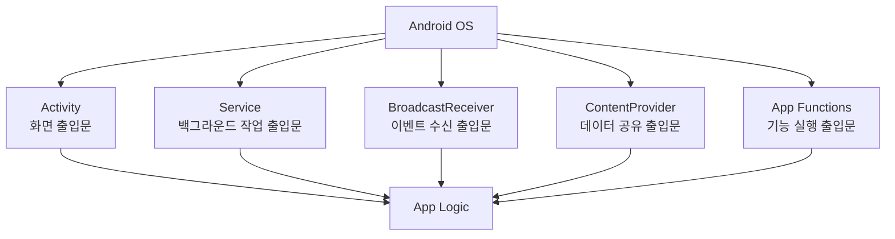
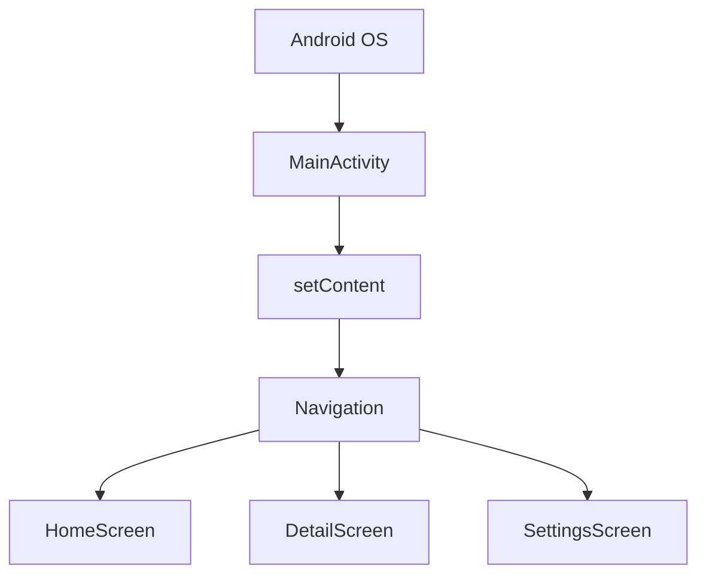
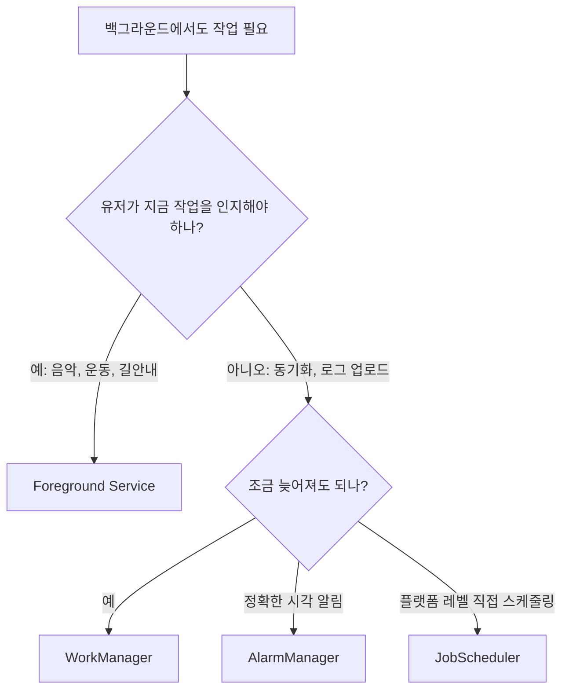
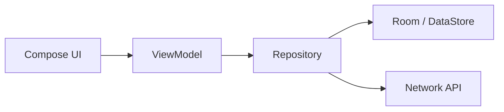
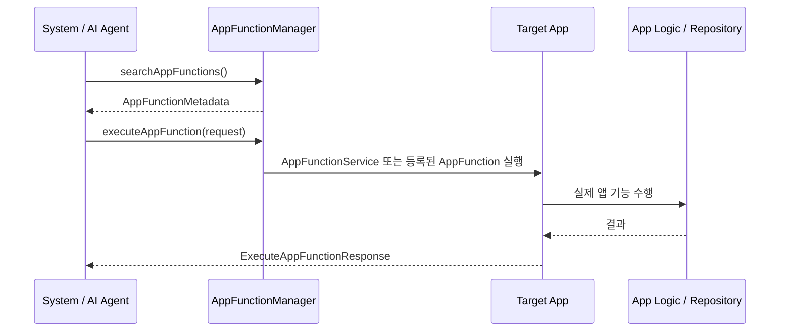
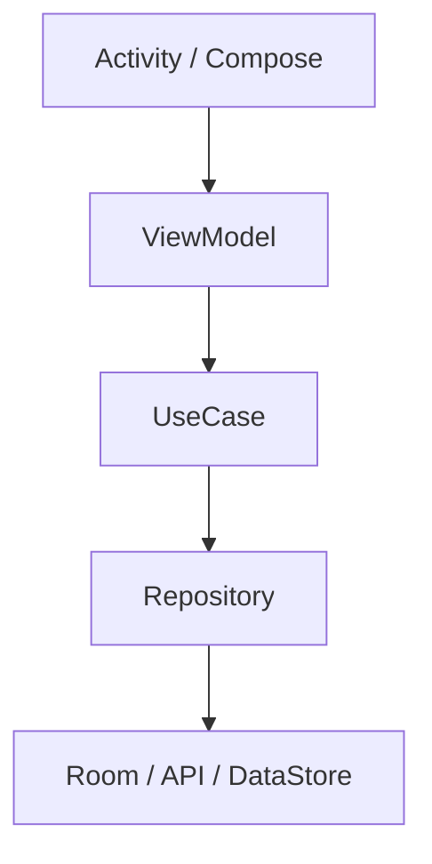
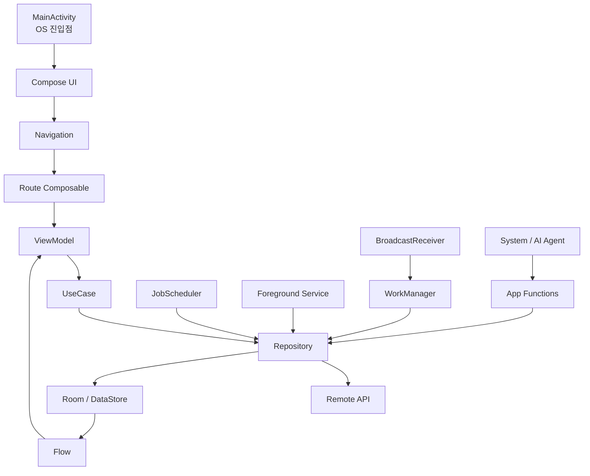
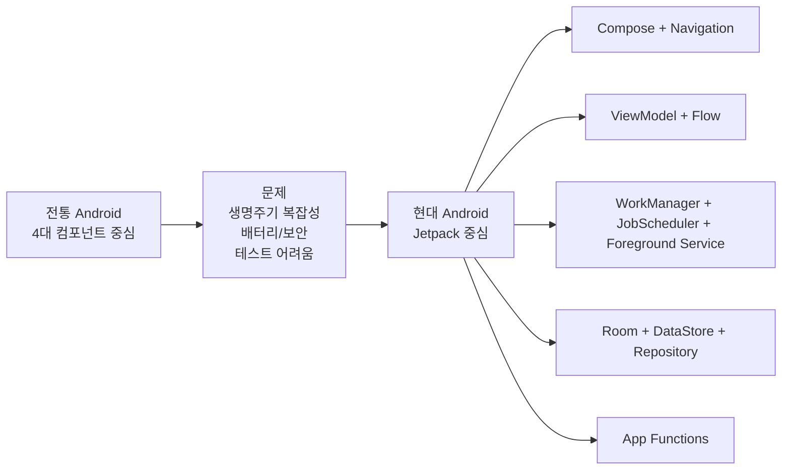

# Android 4대 컴포넌트와 현대 아키텍처 가이드

이 문서는 안드로이드 앱의 전통적인 핵심 구성 요소였던 **Activity, Service, BroadcastReceiver, ContentProvider**를 바닥부터 설명하고,
왜 현대 Android 개발에서는 **Jetpack Compose, ViewModel, Kotlin Flow, WorkManager, App Functions,
Repository,
Room/DataStore** 중심의 구조로 이동했는지를 다룹니다.

---

## 1. 안드로이드 앱은 "OS가 실행하는 컴포넌트 묶음"이다

웹 앱이나 데스크톱 앱은 보통 `main()` 함수 하나에서 프로그램이 시작됩니다. 하지만 안드로이드 앱은 다릅니다.

안드로이드 앱은 **유저가 아이콘을 눌렀을 때만 실행되는 프로그램**이 아니라, 아래처럼 여러 상황에서 OS가 필요한 컴포넌트를 직접 깨워 실행하는 구조입니다.

* 유저가 앱 아이콘을 누름 → `Activity` 실행
* 음악을 백그라운드에서 재생해야 함 → `Service` 실행
* 충전기 연결, 부팅 완료, 네트워크 변화 같은 시스템 이벤트 발생 → `BroadcastReceiver` 호출
* 다른 앱이 내 앱의 데이터를 조회하려 함 → `ContentProvider` 호출
* 시스템/AI agent가 내 앱의 특정 기능을 실행하려 함 → `App Functions` 호출

즉, 안드로이드 앱은 하나의 커다란 실행 파일이라기보다 **OS에게 등록해 둔 여러 출입문들의 묶음**에 가깝습니다.



> [!IMPORTANT]
> 전통적인 4대 컴포넌트는 모두 **안드로이드 OS가 이름을 알고 직접 실행할 수 있는 공식 진입점**입니다. 그래서 대부분 `AndroidManifest.xml`에 등록하거나,
> 코드에서 시스템 API를 통해 명시적으로 연결해야 합니다.

---

## 2. 4대 컴포넌트 한눈에 보기

| 컴포넌트                  | 전통적 역할         | 쉽게 말하면            | 현대의 주된 위치                                                  |
|:----------------------|:---------------|:------------------|:-----------------------------------------------------------|
| **Activity**          | 유저가 보는 화면 하나   | 앱의 방 / 창문         | 대부분 `MainActivity` 하나만 두고 Compose Navigation이 화면 전환 담당     |
| **Service**           | 화면 없이 오래 도는 작업 | 뒤에서 일하는 직원        | 즉시 계속 돌아야 하는 작업은 Foreground Service, 예약/보장 작업은 WorkManager |
| **BroadcastReceiver** | 시스템/앱 이벤트 수신   | 알림 방송을 듣는 귀       | 매니페스트 리시버는 제한적으로 사용, 앱 내부 이벤트는 Flow/SharedFlow로 처리         |
| **ContentProvider**   | 앱 간 데이터 공유     | 데이터 창구 / 공공 민원 창구 | 외부 공유가 필요할 때만 사용, 앱 내부 DB는 Room/Repository/Flow로 처리        |

현대 Android에서는 여기에 **App Functions**라는 새 경계도 추가로 봐야 합니다.

| 현대 경계             | 역할                                 | 쉽게 말하면                   | 위치                                                    |
|:------------------|:-----------------------------------|:-------------------------|:------------------------------------------------------|
| **App Functions** | 시스템/신뢰된 agent가 내 앱의 특정 기능을 발견하고 실행 | 앱 기능 API / AI agent용 리모컨 | `Intent`보다 구조화된 기능 호출, `ContentProvider`보다 동작 실행에 가까움 |

과거에는 이 네 컴포넌트를 잘게 나눠 앱 기능을 직접 설계하는 경우가 많았습니다. 현대에는 이 컴포넌트들이 사라진 것이 아니라, **OS와 만나는 가장 바깥 경계로 밀려나고**,
앱 내부 로직은 Jetpack 아키텍처가 담당하는 방향으로 바뀌었습니다.

---

## 3. Activity: 화면 그 자체에서 "앱의 대문"으로

### 3-1. Activity란?

`Activity`는 유저가 눈으로 보고 터치하는 화면을 담당하는 컴포넌트입니다.

전통적인 Android View System 시대에는 화면 하나마다 Activity를 만드는 방식이 흔했습니다.

```plaintext
LoginActivity
MainActivity
ProductListActivity
ProductDetailActivity
SettingsActivity
```

이 구조에서는 화면 이동도 Activity 이동이었습니다.

```kotlin
val intent = Intent(this, ProductDetailActivity::class.java).apply {
    putExtra("productId", 3)
}
startActivity(intent)
```

### 3-2. Activity가 직접 처리하던 일

과거의 Activity는 너무 많은 일을 떠안기 쉬웠습니다.

| 책임      | Activity에 몰렸던 코드                                        |
|:--------|:--------------------------------------------------------|
| 화면 렌더링  | XML layout inflate, View 찾기, TextView/Button 갱신         |
| 화면 이동   | `startActivity()`, `finish()`, intent extra 처리          |
| 상태 보관   | `onSaveInstanceState()`, 필드 변수, Bundle                  |
| 데이터 로딩  | API 호출, DB 조회, 로딩/에러 처리                                 |
| 생명주기 대응 | `onCreate()`, `onStart()`, `onResume()`, `onPause()` 분기 |

결과적으로 Activity는 **화면, 상태, 네트워크, DB, 네비게이션이 전부 섞인 거대한 클래스**가 되기 쉬웠습니다.

### 3-3. 현대 구조: Single Activity Architecture

Jetpack Compose 시대의 일반적인 구조는 **Activity를 하나만 두고**, 실제 화면 전환은 Compose Navigation이 담당하는 방식입니다.



`MainActivity`는 이제 "화면 하나"라기보다 **앱 전체 Compose UI를 올리는 대문**입니다.

```kotlin
class MainActivity : ComponentActivity() {
    override fun onCreate(savedInstanceState: Bundle?) {
        super.onCreate(savedInstanceState)

        setContent {
            MyBenefitTheme {
                AppNavigation()
            }
        }
    }
}
```

### 3-4. ViewModel + Flow와 결합한 화면 구조

현대 Activity/Compose 구조에서 화면 상태는 Activity가 아니라 `ViewModel`이 들고, UI는 `Flow`를 생명주기에 맞게 구독합니다.

```kotlin
data class ProductUiState(
    val isLoading: Boolean = false,
    val products: List<Product> = emptyList(),
    val errorMessage: String? = null,
)

class ProductViewModel(
    private val repository: ProductRepository,
) : ViewModel() {
    val uiState: StateFlow<ProductUiState> =
        repository.observeProducts()
            .map { products -> ProductUiState(products = products) }
            .stateIn(
                scope = viewModelScope,
                started = SharingStarted.WhileSubscribed(5_000),
                initialValue = ProductUiState(isLoading = true),
            )
}
```

```kotlin
@Composable
fun ProductRoute(
    viewModel: ProductViewModel = viewModel(),
) {
    val uiState by viewModel.uiState.collectAsStateWithLifecycle()

    ProductScreen(
        uiState = uiState,
        onProductClick = { productId ->
            // Navigation 호출
        },
    )
}
```

> [!NOTE]
> Activity는 OS와 Compose 세계를 연결하는 입구입니다. 화면 상태와 비즈니스 로직을 Activity에 오래 붙잡아 두면, 생명주기 변화와 테스트가 모두
> 어려워집니다.

---

## 4. Service: 백그라운드 만능 도구에서 "특수 작업용 경계"로

### 4-1. Service란?

`Service`는 화면 없이 실행되는 컴포넌트입니다.

전통적으로는 아래 같은 작업에 Service를 많이 사용했습니다.

* 음악 재생
* 파일 다운로드/업로드
* 위치 추적
* 주기적인 서버 동기화
* 블루투스/센서 연결 유지

```kotlin
class MusicService : Service() {
    override fun onBind(intent: Intent?): IBinder? = null

    override fun onStartCommand(intent: Intent?, flags: Int, startId: Int): Int {
        // 백그라운드 음악 재생 시작
        return START_STICKY
    }
}
```

```xml

<service android:name=".MusicService" android:exported="false" />
```

### 4-2. Service의 종류

| 종류                     | 역할                          | 대표 사례               |
|:-----------------------|:----------------------------|:--------------------|
| **Started Service**    | 한 번 시작하면 작업이 끝날 때까지 실행      | 예전 다운로드 서비스         |
| **Bound Service**      | 다른 컴포넌트가 연결해서 메서드를 호출       | 앱 내부 플레이어 컨트롤러      |
| **Foreground Service** | 유저가 인지해야 하는 장기 실행 작업. 알림 필수 | 음악 재생, 운동 기록, 내비게이션 |

### 4-3. 왜 Service 사용이 줄었나?

스마트폰은 배터리, 발열, 메모리 제약이 매우 강한 기기입니다. 앱들이 마음대로 Service를 오래 실행하면 폰 전체 성능이 무너집니다.

그래서 Android는 시간이 지나며 백그라운드 실행을 강하게 제한했습니다.

| 문제                | OS의 방향                             |
|:------------------|:-----------------------------------|
| 앱이 몰래 계속 실행       | 백그라운드 Service 제한 강화                |
| 배터리 과소모           | Doze, App Standby, 배터리 최적화         |
| 유저가 모르는 위치/녹음/동기화 | Foreground Service 알림과 권한 요구       |
| 주기 작업 남발          | JobScheduler/WorkManager로 스케줄링 표준화 |

결과적으로 Service는 **아무 백그라운드 작업에나 쓰는 도구**가 아니라, 정말로 OS 레벨 실행이 필요한 특수 컴포넌트가 되었습니다.

### 4-4. Background Service라는 말이 헷갈리는 이유

예전 Android 문서나 오래된 코드에서는 "background service"라는 표현을 자주 볼 수 있습니다. 보통 **화면이 없는 Service를 백그라운드에서 계속 돌린다
**는 뜻으로 쓰였습니다.

하지만 현대 Android에서는 이 표현을 조심해서 봐야 합니다.

| 표현                 | 현대적으로 해석해야 하는 의미                                                                   |
|:-------------------|:-----------------------------------------------------------------------------------|
| Background Service | 앱이 화면에 보이지 않는 동안 몰래 오래 실행되는 일반 Service. Android 8.0 이후 강하게 제한됨                     |
| Foreground Service | 유저가 인지할 수 있는 알림을 띄우고 즉시 계속 실행되는 Service                                            |
| Background work    | 앱 화면 밖에서도 끝나야 하는 작업 전체. WorkManager, JobScheduler, Foreground Service 등을 포함하는 넓은 말 |

음악 재생, 운동 기록, 내비게이션처럼 유저가 명확히 인지하고 있고 **지금 당장 계속 돌아야 하는 작업**은 일반 background service가 아니라 *
*Foreground Service**가 맞습니다.



> [!IMPORTANT]
> "앱이 백그라운드에 있어도 계속 돌아야 한다"는 말만으로 Service를 고르면 안 됩니다. **계속 실행되어야 하는 실시간 사용자 인지 작업**인지, **언젠가 완료되면 되는
보장 작업**인지 먼저 나눠야 합니다.

### 4-5. JobScheduler: OS 레벨 작업 예약기

`JobScheduler`는 Android 프레임워크가 제공하는 **OS 레벨 작업 예약 API**입니다. 네트워크 연결, 충전 중, 대기 시간, 주기 실행 같은 조건을 걸어
작업을 예약할 수 있습니다.

```kotlin
val jobInfo = JobInfo.Builder(
    1001,
    ComponentName(context, SyncJobService::class.java),
)
    .setRequiredNetworkType(JobInfo.NETWORK_TYPE_UNMETERED)
    .setRequiresCharging(true)
    .build()

context.getSystemService(JobScheduler::class.java).schedule(jobInfo)
```

```kotlin
class SyncJobService : JobService() {
    override fun onStartJob(params: JobParameters?): Boolean {
        // 별도 스레드/Coroutine에서 작업 시작
        return true
    }

    override fun onStopJob(params: JobParameters?): Boolean {
        // true를 반환하면 나중에 재시도 가능
        return true
    }
}
```

다만 일반 앱에서는 `JobScheduler`를 직접 쓰기보다 `WorkManager`를 먼저 고려하는 편이 보통 더 좋습니다.

| 구분            | JobScheduler           | WorkManager                        |
|:--------------|:-----------------------|:-----------------------------------|
| 소속            | Android Framework API  | Jetpack 라이브러리                      |
| 추상화 수준        | 낮음. `JobService` 직접 구현 | 높음. `Worker`, `CoroutineWorker` 제공 |
| OS 버전 대응      | 개발자가 세부 차이를 더 신경 써야 함  | 내부적으로 적절한 스케줄러 사용                  |
| 체이닝/재시도/상태 관찰 | 직접 설계 필요               | API로 제공                            |
| 일반 앱 권장도      | 특수한 플랫폼 제어가 필요할 때      | 대부분의 보장 백그라운드 작업                   |

> [!NOTE]
> WorkManager는 내부적으로 OS 버전과 상황에 맞는 스케줄링 메커니즘을 사용합니다. 그래서 "작업 예약"이 목적이라면 보통 WorkManager가 더 높은 수준의 표준
> API입니다.

### 4-6. 현대 대체재: WorkManager

`WorkManager`는 "언젠가는 반드시 실행되어야 하는 백그라운드 작업"을 위한 Jetpack 라이브러리입니다.

대표 사례:

* 서버에 로그 업로드
* 장바구니/주문 데이터 동기화
* 이미지 압축 후 업로드
* 네트워크가 연결되면 재시도해야 하는 작업

```kotlin
class SyncOrdersWorker(
    appContext: Context,
    params: WorkerParameters,
) : CoroutineWorker(appContext, params) {
    override suspend fun doWork(): Result {
        return try {
            // repository.syncOrders()
            Result.success()
        } catch (e: IOException) {
            Result.retry()
        } catch (e: Exception) {
            Result.failure()
        }
    }
}
```

```kotlin
val request = OneTimeWorkRequestBuilder<SyncOrdersWorker>()
    .setConstraints(
        Constraints.Builder()
            .setRequiredNetworkType(NetworkType.CONNECTED)
            .build()
    )
    .build()

WorkManager.getInstance(context).enqueueUniqueWork(
    "sync-orders",
    ExistingWorkPolicy.KEEP,
    request,
)
```

### 4-7. Foreground Service vs WorkManager vs JobScheduler 선택 기준

| 상황                                | 선택                                | 이유                               |
|:----------------------------------|:----------------------------------|:---------------------------------|
| 음악 재생처럼 앱을 내려도 바로 계속 재생되어야 함      | Foreground Service + MediaSession | 유저가 지금 듣고 있고 알림/미디어 컨트롤이 필요      |
| 운동 기록, 길안내처럼 실시간으로 계속 추적해야 함      | Foreground Service                | 중단되면 UX가 망가지고 유저가 작업을 인지해야 함     |
| 사진 업로드, 로그 전송, 서버 동기화처럼 결국 완료되면 됨 | WorkManager                       | 네트워크/충전 조건, 재시도, 앱 재시작 이후 보장에 적합 |
| OS 프레임워크 수준에서 직접 작업 스케줄을 제어해야 함   | JobScheduler                      | Jetpack 추상화보다 낮은 레벨 제어가 필요할 때    |
| 정확한 시각에 알림을 울려야 함                 | AlarmManager                      | 작업 처리보다 "정확한 시간" 자체가 핵심          |
| 화면이 보이는 동안만 API 호출/계산하면 됨         | Kotlin Coroutine                  | 앱이 화면 밖으로 나가면 취소되어도 되는 작업        |

> [!IMPORTANT]
> WorkManager는 Service의 단순 대체품이 아닙니다. "지금 즉시 계속 돌아야 하는 작업"은 Foreground Service가 맞고, **조건이 맞을 때 OS가
안전하게 실행해도 되는 보장 작업**은 WorkManager가 맞습니다.

---

## 5. BroadcastReceiver: 시스템 방송 수신기에서 "경계 이벤트 처리기"로

### 5-1. BroadcastReceiver란?

`BroadcastReceiver`는 OS나 다른 앱이 보내는 이벤트 방송을 받는 컴포넌트입니다.

예를 들어 아래 같은 상황이 방송처럼 전달될 수 있습니다.

* 기기 부팅 완료
* 충전기 연결/해제
* 시간대 변경
* 앱 설치/삭제
* 알림 액션 버튼 클릭
* SMS 수신 같은 특수 이벤트

```kotlin
class BootCompletedReceiver : BroadcastReceiver() {
    override fun onReceive(context: Context, intent: Intent) {
        if (intent.action == Intent.ACTION_BOOT_COMPLETED) {
            // 부팅 이후 필요한 작업 예약
        }
    }
}
```

```xml

<receiver android:name=".BootCompletedReceiver" android:exported="false">
    <intent-filter>
        <action android:name="android.intent.action.BOOT_COMPLETED" />
    </intent-filter>
</receiver>
```

### 5-2. BroadcastReceiver의 핵심 제약

`BroadcastReceiver.onReceive()`는 짧게 끝나야 합니다.

Receiver는 **긴 작업을 직접 수행하는 곳이 아니라, 긴 작업을 예약하거나 앱 내부로 이벤트를 넘기는 곳**입니다.

```kotlin
class BootCompletedReceiver : BroadcastReceiver() {
    override fun onReceive(context: Context, intent: Intent) {
        if (intent.action == Intent.ACTION_BOOT_COMPLETED) {
            val request = OneTimeWorkRequestBuilder<RefreshTokenWorker>().build()
            WorkManager.getInstance(context).enqueueUniqueWork(
                "refresh-token-after-boot",
                ExistingWorkPolicy.KEEP,
                request,
            )
        }
    }
}
```

### 5-3. 왜 BroadcastReceiver 사용이 줄었나?

과거에는 앱들이 시스템 방송을 광범위하게 받아서 백그라운드 작업을 시작했습니다. 예를 들어 네트워크가 바뀔 때마다 여러 앱이 동시에 깨어나 서버 동기화를 시도할 수 있었습니다.

이 방식은 배터리와 성능에 매우 나쁩니다. 그래서 Android는 암시적 브로드캐스트와 백그라운드 실행을 점점 제한했고, 앱 내부 이벤트 전달은 더 이상 Receiver에 의존하지
않는 방향으로 바뀌었습니다.

### 5-4. 현대 대체재: Kotlin Flow / StateFlow / SharedFlow

앱 내부에서 "로그인 상태가 바뀌었다", "장바구니가 갱신됐다", "네트워크 상태가 바뀌었다" 같은 이벤트를 전달하려고 BroadcastReceiver를 쓰는 것은 현대 구조에서는
과합니다.

앱 내부 상태와 이벤트는 `Flow`, `StateFlow`, `SharedFlow`, `Channel`이 더 적합합니다.

| 도구             | 용도                        | 대표 예시                     | 비유      |
|:---------------|:--------------------------|:--------------------------|:--------|
| **Flow**       | 시간에 따라 여러 값을 내보내는 비동기 스트림 | Room DB 변경 관찰, 네트워크 상태 관찰 | 물길      |
| **StateFlow**  | 현재 상태를 항상 1개 보관하고 최신값 제공  | 화면 UI 상태, 로그인 세션 상태       | 전광판     |
| **SharedFlow** | 여러 구독자에게 이벤트 발행           | Snackbar, Toast, 네비게이션 신호 | 사내 방송   |
| **Channel**    | 한 소비자에게 큐 형태로 이벤트 전달      | 순서가 중요한 단일 소비 이벤트         | 번호표 대기열 |

> [!IMPORTANT]
> 이 도구들은 **앱 내부 프로세스 안에서** 상태와 이벤트를 전달하는 Kotlin 도구입니다. 다른 앱으로 데이터를 공개하거나 전달하는 수단이 아닙니다. 앱 밖으로 데이터를
> 열어야 하면 `ContentProvider`, 파일 공유는 `FileProvider`, 한 번의 요청 전달은 `Intent`를 사용합니다.

```kotlin
sealed interface LoginEvent {
    data object Success : LoginEvent
}

class AuthRepository {
    private val _loginEvents = MutableSharedFlow<LoginEvent>()
    val loginEvents: SharedFlow<LoginEvent> = _loginEvents.asSharedFlow()

    suspend fun login(email: String, password: String) {
        // API 호출
        _loginEvents.emit(LoginEvent.Success)
    }
}
```

```kotlin
class HomeViewModel(
    authRepository: AuthRepository,
) : ViewModel() {
    init {
        viewModelScope.launch {
            authRepository.loginEvents.collect { event ->
                when (event) {
                    LoginEvent.Success -> {
                        // 홈 데이터 새로고침
                    }
                }
            }
        }
    }
}
```

### 5-5. BroadcastReceiver vs Flow 선택 기준

| 상황                             | 선택                                         |
|:-------------------------------|:-------------------------------------------|
| OS가 보내는 부팅 완료 이벤트를 받아야 함       | BroadcastReceiver                          |
| 알림의 "답장", "삭제", "확인" 액션을 받아야 함 | BroadcastReceiver 또는 PendingIntent 대상 컴포넌트 |
| 앱 내부 로그인 상태 변경을 여러 화면이 알아야 함   | StateFlow/SharedFlow                       |
| DB 변경을 화면이 자동 반영해야 함           | Room + Flow                                |
| 네트워크 연결 상태를 UI가 구독해야 함         | callbackFlow + StateFlow                   |
| 다른 앱이 내 데이터를 조회해야 함            | ContentProvider                            |

> [!TIP]
> Receiver는 "앱 밖에서 들어온 방송을 받는 문"입니다. 앱 안에서 컴포넌트끼리 대화하려고 Receiver를 쓰면 구조가 불필요하게 무거워집니다.

---

## 6. ContentProvider: 앱 간 데이터 공유 창구에서 "특수한 공개 API"로

### 6-1. ContentProvider란?

`ContentProvider`는 앱의 데이터를 다른 앱이나 시스템이 정해진 URI로 조회/삽입/수정/삭제할 수 있게 열어주는 컴포넌트입니다.

대표적인 예시는 연락처 앱입니다.

```text
content://contacts/people/3
```

이 URI는 웹의 URL처럼 보이지만, 실제로는 안드로이드 기기 내부에서 특정 앱의 데이터 창구를 가리키는 주소입니다.

```kotlin
val cursor = context.contentResolver.query(
    ContactsContract.Contacts.CONTENT_URI,
    null,
    null,
    null,
    null,
)
```

### 6-2. ContentProvider가 필요한 이유

안드로이드 앱은 기본적으로 각자의 샌드박스 안에 갇혀 있습니다. A 앱은 B 앱의 DB 파일을 직접 열 수 없습니다.

ContentProvider는 이 문제를 해결하기 위해 **권한, URI, 표준 CRUD 인터페이스를 갖춘 공식 데이터 공유 창구**를 제공합니다.

| 역할       | 설명                                    |
|:---------|:--------------------------------------|
| 데이터 주소화  | `content://...` URI로 데이터 위치 표현        |
| 권한 통제    | 읽기/쓰기 권한, URI 임시 권한 부여                |
| 표준 인터페이스 | `query`, `insert`, `update`, `delete` |
| 앱 간 공유   | 다른 앱이나 시스템 UI가 안전하게 접근                |

### 6-3. 현대 앱에서 사용 빈도가 낮아진 이유

일반적인 앱은 더 이상 자기 내부 데이터를 다른 앱에 직접 공개하지 않습니다.

현대 앱 데이터 흐름은 보통 아래처럼 닫힌 구조입니다.



내 앱 안에서만 쓰는 데이터라면 ContentProvider를 만들 필요가 없습니다. `Flow`는 이 내부 데이터를 화면과 ViewModel에 흘려보내는 도구이고,
ContentProvider는 앱 밖으로 공개 API를 여는 도구입니다.

대신:

* 관계형 로컬 DB → `Room`
* 키-값 설정값 → `DataStore`
* 화면 자동 갱신 → `Flow`
* 서버 데이터 동기화 → `Repository + WorkManager`
* 파일 공유 → `FileProvider`

### 6-4. 그래도 ContentProvider가 필요한 경우

ContentProvider는 사라진 기술이 아니라 **앱 간 데이터 공유가 제품 요구사항일 때 필요한 공식 창구**입니다.

| 상황                             | 예시                             |
|:-------------------------------|:-------------------------------|
| 다른 앱이 내 데이터를 검색해야 함            | 연락처, 캘린더, 사전 앱                 |
| 시스템 검색/추천에 데이터를 노출해야 함         | 검색 가능한 콘텐츠                     |
| 파일을 안전하게 공유해야 함                | `FileProvider`로 이미지/PDF URI 공유 |
| 기업/플랫폼 앱이 여러 앱에 공통 데이터를 제공해야 함 | 사내 계정, 공통 인증, 공통 설정            |

### 6-5. FileProvider 예시

일반 앱에서 가장 자주 만나는 ContentProvider 계열은 직접 Provider를 구현하는 것이 아니라 `FileProvider`를 사용하는 경우입니다.

```xml

<provider android:name="androidx.core.content.FileProvider"
    android:authorities="${applicationId}.fileprovider" android:exported="false"
    android:grantUriPermissions="true">
    <meta-data android:name="android.support.FILE_PROVIDER_PATHS"
        android:resource="@xml/file_paths" />
</provider>
```

```kotlin
val uri = FileProvider.getUriForFile(
    context,
    "${context.packageName}.fileprovider",
    pdfFile,
)

val intent = Intent(Intent.ACTION_SEND).apply {
    type = "application/pdf"
    putExtra(Intent.EXTRA_STREAM, uri)
    addFlags(Intent.FLAG_GRANT_READ_URI_PERMISSION)
}
context.startActivity(Intent.createChooser(intent, "공유"))
```

> [!IMPORTANT]
> 파일 경로(`/storage/.../invoice.pdf`)를 다른 앱에 직접 넘기는 방식은 안전하지 않습니다. `content://` URI와 임시 권한을 주는
`FileProvider`가 현대 Android의 표준 방식입니다.

---

## 7. App Functions: 시스템/AI agent에게 앱 기능을 공개하는 현대 경계

### 7-1. App Functions란?

`App Functions`는 앱 안의 특정 기능을 **시스템이나 신뢰된 agent가 발견하고 실행할 수 있도록 공개하는 API**입니다.

예를 들어 agent가 다음과 같은 기능을 앱을 열지 않고도 호출할 수 있게 만드는 방향입니다.

* 노트 앱의 `createNote`
* 음악 앱의 `playSong`
* 캘린더 앱의 `createEvent`
* 음식 주문 앱의 `orderAgain`



> [!IMPORTANT]
> App Functions는 전통적인 4대 컴포넌트 중 하나는 아닙니다. 하지만 현대 Android에서는 `Intent`, `ContentProvider`,
`FileProvider`와 함께 **앱 밖에서 내 앱 기능에 접근하는 공식 경계**로 봐야 합니다.

### 7-2. 왜 현대 구조에 포함해야 하나?

전통적인 앱 간 연동은 보통 아래 중 하나였습니다.

| 방식                     | 잘하는 일                        | 한계                            |
|:-----------------------|:-----------------------------|:------------------------------|
| `Intent`               | 화면 열기, 공유하기, 한 번의 액션 요청      | 파라미터/결과 구조가 느슨함               |
| `ContentProvider`      | 다른 앱이 내 데이터를 조회/수정           | "동작 실행"보다 "데이터 창구"에 가까움       |
| `FileProvider`         | 파일을 안전하게 공유                  | 파일 URI 공유에 특화                 |
| Bound Service / Binder | 강한 IPC 계약                    | 구현/권한/버전 관리가 무거움              |
| **App Functions**      | 기능을 메타데이터로 선언하고 agent가 검색/실행 | 최신/실험적 기능이므로 적용 범위와 호환성 확인 필요 |

AI assistant와 agentic workflow가 중요해지면 "앱을 여는 것"보다 **앱의 기능을 구조화해서 실행하는 것**이 중요해집니다. App Functions는 이
지점에 들어갑니다.

### 7-3. 제공 방식: AppFunctionService와 런타임 등록

공식 API 기준으로 앱은 기능을 두 방식으로 제공할 수 있습니다.

| 제공 방식                | 언제 적합한가                                   | 핵심 API                                      |
|:---------------------|:------------------------------------------|:--------------------------------------------|
| `AppFunctionService` | 앱 전체에서 항상 제공 가능한 기능                       | `AppFunctionService`, `onExecuteFunction()` |
| 런타임 등록               | 특정 Activity나 foreground service 상태에 묶인 기능 | `AppFunctionManager.registerAppFunction()`  |

`AppFunctionService` 방식은 시스템이 필요할 때 앱을 깨워 기능을 실행할 수 있습니다.

```xml

<service android:name=".NoteAppFunctionService"
    android:permission="android.permission.BIND_APP_FUNCTION_SERVICE" android:exported="true">
    <property android:name="android.app.appfunctions" android:value="note_app_functions.xml" />
    <intent-filter>
        <action android:name="android.app.appfunctions.AppFunctionService" />
    </intent-filter>
</service>
```

```kotlin
class NoteAppFunctionService : AppFunctionService() {
    override fun onExecuteFunction(
        request: ExecuteAppFunctionRequest,
        callingPackage: String,
        callingPackageSigningInfo: SigningInfo,
        cancellationSignal: CancellationSignal,
        callback: OutcomeReceiver<ExecuteAppFunctionResponse, AppFunctionException>,
    ) {
        when (request.functionIdentifier) {
            "createNote" -> {
                // repository.createNote(...)
                callback.onResult(ExecuteAppFunctionResponse(...))
            }
            else -> {
                callback.onError(
                    AppFunctionException(
                        AppFunctionException.FUNCTION_NOT_FOUND,
                        "Unknown function: ${request.functionIdentifier}",
                    )
                )
            }
        }
    }
}
```

> [!NOTE]
> App Functions는 함수 메타데이터를 XML asset으로 선언하고, 이를 `android.app.appfunctions` property로 연결합니다. Android
> SDK 문서 기준으로 앱 하나에는 활성 `AppFunctionService` 구현이 하나만 있을 수 있습니다.

### 7-4. Intent, ContentProvider, Flow와의 차이

| 비교 대상                | App Functions와의 차이                                                            |
|:---------------------|:------------------------------------------------------------------------------|
| `Intent`             | Intent는 "이 화면/액션을 처리해줘"에 가깝고, App Functions는 agent가 검색 가능한 구조화된 기능 계약에 가깝습니다. |
| `ContentProvider`    | ContentProvider는 데이터를 조회/수정하는 창구이고, App Functions는 앱의 동작을 실행하는 창구입니다.         |
| `Flow` / `StateFlow` | Flow는 앱 내부 프로세스의 상태 흐름이고, App Functions는 앱 밖의 시스템/agent가 호출하는 경계입니다.          |
| `WorkManager`        | WorkManager는 내 앱의 백그라운드 작업 예약이고, App Functions는 외부 agent가 내 앱 기능을 실행하는 통로입니다. |

### 7-5. 현재 문서에서 빠졌던 이유

이 문서가 처음에는 전통적인 4대 컴포넌트와 Jetpack 아키텍처 이동에 초점을 맞췄기 때문에, `App Functions` 같은 최신 agent-facing API를 다루지
않았습니다.

하지만 현대 Android 구조를 설명하려면 이제 다음처럼 분리해서 봐야 합니다.

```text
앱 내부 상태/이벤트 흐름
-> ViewModel, Flow, StateFlow, SharedFlow, Repository

앱 내부 백그라운드 작업
-> WorkManager, JobScheduler, Foreground Service

앱 밖에서 들어오는 화면/데이터/기능 경계
-> Activity, Intent, ContentProvider, FileProvider, App Functions
```

> [!WARNING]
> App Functions는 현재 Android API reference에서 beta/experimental preview로 표시됩니다. 일반 앱의 기본 구조에 무조건 넣는
> 기능이라기보다는, assistant/agent가 앱 기능을 호출해야 하는 제품 요구사항이 있을 때 검토하는 현대적 확장 경계로 보는 편이 정확합니다.

---

## 8. 왜 현대 아키텍처로 바뀌었나?

### 8-1. 이유 1: 생명주기가 너무 복잡하다

Activity와 Service는 OS 생명주기에 직접 묶여 있습니다.

* 화면 회전
* 다크 모드 변경
* 멀티 윈도우 크기 변경
* 프로세스 종료 후 복원
* 앱이 백그라운드로 이동
* 배터리 최적화로 작업 지연

이 모든 상황을 Activity나 Service 안에서 직접 처리하면 코드가 빠르게 복잡해집니다.

현대 구조는 생명주기 대응을 Jetpack 라이브러리에 나눠 맡깁니다.

| 문제                | 현대 해법                           |
|:------------------|:--------------------------------|
| 화면 회전 시 데이터 유지    | ViewModel                       |
| 화면이 보일 때만 Flow 구독 | `collectAsStateWithLifecycle()` |
| 앱이 꺼져도 작업 재시도     | WorkManager                     |
| DB 변경 자동 반영       | Room + Flow                     |
| 설정값 비동기 저장        | DataStore                       |

### 8-2. 이유 2: 테스트가 어려웠다

Activity/Service/Receiver/Provider에 비즈니스 로직이 들어가면 테스트가 무거워집니다. OS 컴포넌트를 띄워야 하고, Context와 생명주기까지 준비해야
하기 때문입니다.

현대 구조에서는 핵심 로직을 순수 Kotlin 클래스에 둡니다.



이렇게 하면 `UseCase`, `Repository`, `ViewModel` 대부분은 로컬 JVM 테스트로 검증할 수 있습니다.

### 8-3. 이유 3: 배터리와 개인정보 보호가 중요해졌다

초기 Android는 앱이 백그라운드에서 비교적 자유롭게 움직일 수 있었습니다. 하지만 앱 수가 많아지고, 위치/센서/네트워크 사용이 늘어나면서 OS는 점점 엄격해졌습니다.

현대 Android는 개발자에게 이렇게 요구합니다.

* 오래 실행되는 작업은 유저가 알아야 한다.
* 백그라운드 작업은 OS가 배터리 상태에 맞춰 조절할 수 있어야 한다.
* 민감한 데이터는 명시적 권한과 최소 공개 원칙을 따라야 한다.
* 앱 내부 상태 전달과 앱 간 공개 API를 구분해야 한다.

그래서 `Service`와 `BroadcastReceiver`를 남발하던 구조는 줄고, `WorkManager`, 권한 모델, Foreground Service, Flow 기반
상태 전달이 표준이 되었습니다.

### 8-4. 이유 4: 선언형 UI와 상태 중심 설계가 자리 잡았다

Compose에서는 화면을 직접 명령형으로 바꾸지 않습니다.

```kotlin
// 예전 View 방식의 느낌
progressBar.visibility = View.VISIBLE
titleTextView.text = product.name
```

대신 상태를 만들고, UI는 그 상태를 그립니다.

```kotlin
@Composable
fun ProductScreen(uiState: ProductUiState) {
    if (uiState.isLoading) {
        CircularProgressIndicator()
    } else {
        ProductList(products = uiState.products)
    }
}
```

이 구조에서는 `Flow`가 매우 자연스럽습니다. 데이터가 시간에 따라 흘러오고, Compose는 최신 상태를 다시 그리면 됩니다.

---

## 9. 전통 컴포넌트와 현대 도구 매핑

| 예전 접근                       | 현대 접근                                | 핵심 변화                        |
|:----------------------------|:-------------------------------------|:-----------------------------|
| 화면마다 Activity 생성            | Single Activity + Compose Navigation | OS 화면 단위에서 앱 내부 라우트 단위로 이동   |
| Activity가 API 호출과 상태 관리     | ViewModel + Repository + Flow        | UI와 비즈니스 로직 분리               |
| Service로 동기화                | WorkManager / JobScheduler           | OS 친화적 예약/재시도                |
| Service로 음악/운동/길안내 유지       | Foreground Service                   | 유저가 인지하는 실시간 장기 실행           |
| Receiver로 앱 내부 이벤트 전달       | StateFlow/SharedFlow/Channel         | 앱 내부 상태/이벤트를 Kotlin 스트림으로 처리 |
| SQLiteOpenHelper 직접 사용      | Room                                 | 타입 안정성, Flow 연동, 마이그레이션 관리   |
| SharedPreferences 직접 사용     | DataStore                            | 코루틴/Flow 기반 비동기 저장           |
| 파일 경로 직접 공유                 | FileProvider                         | `content://` URI와 임시 권한      |
| Provider로 앱 내부 DB 접근        | Repository                           | 외부 공개 API와 내부 저장소 분리         |
| Intent/Provider만으로 agent 연동 | App Functions                        | 앱 기능을 구조화된 함수 계약으로 공개        |

---

## 10. 실무 아키텍처 예시

아래는 현대 Android 앱에서 흔히 사용하는 책임 분리 구조입니다.



### 10-1. 화면 데이터 로딩

```kotlin
class BenefitRepository(
    private val api: BenefitApi,
    private val dao: BenefitDao,
) {
    fun observeBenefits(): Flow<List<Benefit>> {
        return dao.observeBenefits()
    }

    suspend fun refreshBenefits() {
        val benefits = api.fetchBenefits()
        dao.replaceAll(benefits)
    }
}
```

```kotlin
class BenefitViewModel(
    private val repository: BenefitRepository,
) : ViewModel() {
    val benefits: StateFlow<List<Benefit>> =
        repository.observeBenefits()
            .stateIn(
                scope = viewModelScope,
                started = SharingStarted.WhileSubscribed(5_000),
                initialValue = emptyList(),
            )

    fun refresh() {
        viewModelScope.launch {
            repository.refreshBenefits()
        }
    }
}
```

### 10-2. 백그라운드 동기화

```kotlin
class BenefitSyncWorker(
    appContext: Context,
    params: WorkerParameters,
) : CoroutineWorker(appContext, params) {
    private val repository =
        (appContext.applicationContext as MyBenefitApplication)
            .appContainer
            .benefitRepository

    override suspend fun doWork(): Result {
        return try {
            repository.refreshBenefits()
            Result.success()
        } catch (e: IOException) {
            Result.retry()
        }
    }
}
```

> [!NOTE]
> Hilt나 별도 `WorkerFactory`를 쓰는 프로젝트라면 `BenefitRepository`를 Worker 생성자에 직접 주입할 수 있습니다. 위 예시는 의존성 주입
> 프레임워크를 전제하지 않는 가장 단순한 구조입니다.

이 구조에서 `Activity`는 화면을 올리고, `ViewModel`은 UI 상태를 만들고, `Repository`는 데이터 출처를 숨깁니다. `Flow`는 앱 내부의 상태
변화를 UI까지 전달하고, `WorkManager`/`JobScheduler`는 앱이 화면 밖으로 나간 뒤에도 필요한 예약 작업을 OS에게 맡기며,
`Foreground Service`는 음악 재생처럼 즉시 계속 돌아야 하는 사용자 인지 작업을 담당합니다. `App Functions`는 시스템/AI agent가 내 앱의 기능을
구조적으로 실행해야 할 때 Repository/UseCase 경계로 들어오는 새 외부 진입점입니다.

---

## 11. 언제 전통 컴포넌트를 직접 써야 하나?

전통 컴포넌트는 구식이라서 버리는 것이 아닙니다. **OS와 직접 계약해야 하는 경계**에서는 여전히 필요합니다.

| 요구사항                         | 필요한 컴포넌트                                        |
|:-----------------------------|:------------------------------------------------|
| 앱 아이콘, 딥 링크, 공유 인텐트로 진입      | Activity                                        |
| 음악/운동/위치 안내처럼 유저가 인지하는 장기 실행 | Foreground Service                              |
| 부팅 완료 후 작업 예약                | BroadcastReceiver + WorkManager 또는 JobScheduler |
| 알림 액션 버튼 처리                  | BroadcastReceiver 또는 Activity/PendingIntent     |
| 다른 앱에 파일 공유                  | FileProvider                                    |
| 다른 앱이 내 구조화 데이터를 조회해야 함      | ContentProvider                                 |
| 시스템/AI agent가 내 앱 기능을 실행해야 함 | App Functions                                   |
| 접근성/입력기/VPN 같은 OS 확장 기능      | 특수 Service                                      |

> [!TIP]
> 판단 기준은 간단합니다. **OS나 다른 앱이 내 코드를 직접 깨워야 하면 4대 컴포넌트 또는 App Functions**, 앱 내부의 상태와 작업 흐름이면 *
*ViewModel/Flow/Repository/WorkManager**를 먼저 생각하면 됩니다.

---

## 12. 전체 흐름 요약



핵심은 다음과 같습니다.

* 4대 컴포넌트는 안드로이드 OS가 앱을 깨우는 공식 진입점이다.
* 과거에는 이 컴포넌트 안에 화면, 상태, 데이터, 백그라운드 작업이 많이 섞였다.
* 현대에는 4대 컴포넌트를 OS 경계로 얇게 유지하고, 앱 내부 로직은 Jetpack 아키텍처로 분리한다.
* `Flow`는 앱 내부 상태와 이벤트를 시간의 흐름으로 표현한다. 앱 간 데이터 전달 API가 아니다.
* `WorkManager`는 OS가 안전하게 실행할 수 있는 백그라운드 보장 작업을 맡는다.
* `JobScheduler`는 Android 프레임워크의 낮은 수준 작업 예약 API이며, 일반 앱에서는 WorkManager가 더 편한 진입점인 경우가 많다.
* `Foreground Service`는 음악 재생처럼 유저가 인지하는 즉시 실행/장기 실행 작업에 쓴다.
* `App Functions`는 시스템/AI agent가 앱 기능을 검색하고 실행해야 하는 현대적 외부 기능 경계다.
* `Service`, `BroadcastReceiver`, `ContentProvider`는 여전히 필요하지만, 사용 범위가 더 명확하고 좁아졌다.

> [!NOTE]
> 매니페스트에 4대 컴포넌트를 등록하는 방식은 [[android-manifest|android_manifest.md]]를 참조하세요.
> Context의 종류와 수명 차이는 [[android-context|android_context.md]]를 참조하세요.
> Coroutine, Flow, StateFlow의 기본 개념과 실전 패턴은 [[kotlin-coroutines-flow-stateflow|kotlin_coroutines_flow_stateflow.md]]를 참조하세요.
> ViewModel의 화면 상태 소유, user action 처리, Reducer 분리 기준은 [[viewmodel-ui-state-reducer|viewmodel_ui_state_reducer_guide.md]]를 참조하세요.
> 인텐트와 외부 진입 흐름은 [[intent-and-deep-link|intent_and_deep_link.md]]를 참조하세요.
> Compose Navigation의 화면 전환 구조는 [[jetpack-navigation-3-guide|navigation_guide.md]]를 참조하세요.
> 백그라운드 작업 선택 기준은 Android Developers의 [Background tasks overview](https://developer.android.com/develop/background-work/background-tasks), [Task scheduling](https://developer.android.com/develop/background-work/background-tasks/persistent), [Foreground services overview](https://developer.android.com/develop/background-work/services/foreground-services)를 함께 보면 좋습니다.
> App Functions API는 [android.app.appfunctions](https://developer.android.com/reference/android/app/appfunctions/package-summary)와 [androidx.appfunctions](https://developer.android.com/reference/androidx/appfunctions/package-summary)를 참조하세요.
