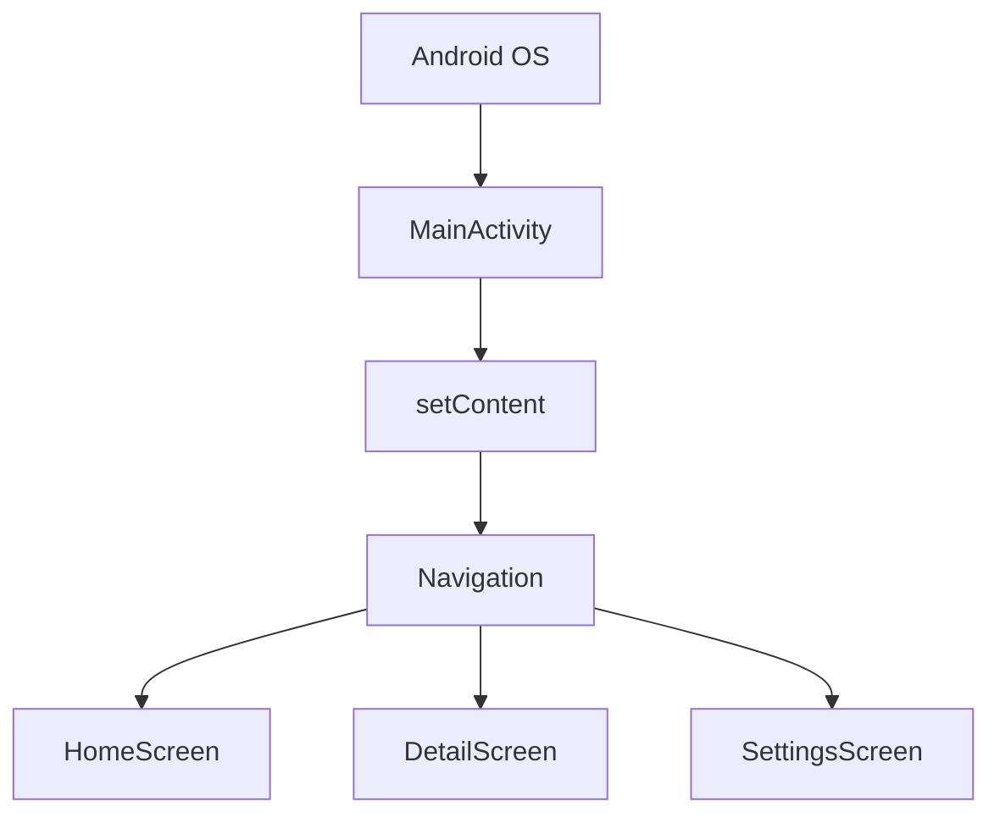

# Activity: 화면 그 자체에서 "앱의 대문"으로

상위 노트: [[android-modern-architecture-components]]

### 3-1. Activity란?

`Activity`는 유저가 눈으로 보고 터치하는 화면을 담당하는 컴포넌트입니다.

전통적인 Android View System 시대에는 화면 하나마다 Activity를 만드는 방식이 흔했습니다.

```plaintext
LoginActivity
MainActivity
ProductListActivity
ProductDetailActivity
SettingsActivity
```

이 구조에서는 화면 이동도 Activity 이동이었습니다.

```kotlin
val intent = Intent(this, ProductDetailActivity::class.java).apply {
    putExtra("productId", 3)
}
startActivity(intent)
```

### 3-2. Activity가 직접 처리하던 일

과거의 Activity는 너무 많은 일을 떠안기 쉬웠습니다.

| 책임      | Activity에 몰렸던 코드                                        |
|:--------|:--------------------------------------------------------|
| 화면 렌더링  | XML layout inflate, View 찾기, TextView/Button 갱신         |
| 화면 이동   | `startActivity()`, `finish()`, intent extra 처리          |
| 상태 보관   | `onSaveInstanceState()`, 필드 변수, Bundle                  |
| 데이터 로딩  | API 호출, DB 조회, 로딩/에러 처리                                 |
| 생명주기 대응 | `onCreate()`, `onStart()`, `onResume()`, `onPause()` 분기 |

결과적으로 Activity는 **화면, 상태, 네트워크, DB, 네비게이션이 전부 섞인 거대한 클래스**가 되기 쉬웠습니다.

### 3-3. 현대 구조: Single Activity Architecture

Jetpack Compose 시대의 일반적인 구조는 **Activity를 하나만 두고**, 실제 화면 전환은 Compose Navigation이 담당하는 방식입니다.



`MainActivity`는 이제 "화면 하나"라기보다 **앱 전체 Compose UI를 올리는 대문**입니다.

```kotlin
class MainActivity : ComponentActivity() {
    override fun onCreate(savedInstanceState: Bundle?) {
        super.onCreate(savedInstanceState)

        setContent {
            MyBenefitTheme {
                AppNavigation()
            }
        }
    }
}
```

### 3-4. ViewModel + Flow와 결합한 화면 구조

현대 Activity/Compose 구조에서 화면 상태는 Activity가 아니라 `ViewModel`이 들고, UI는 `Flow`를 생명주기에 맞게 구독합니다.

```kotlin
data class ProductUiState(
    val isLoading: Boolean = false,
    val products: List<Product> = emptyList(),
    val errorMessage: String? = null,
)

class ProductViewModel(
    private val repository: ProductRepository,
) : ViewModel() {
    val uiState: StateFlow<ProductUiState> =
        repository.observeProducts()
            .map { products -> ProductUiState(products = products) }
            .stateIn(
                scope = viewModelScope,
                started = SharingStarted.WhileSubscribed(5_000),
                initialValue = ProductUiState(isLoading = true),
            )
}
```

```kotlin
@Composable
fun ProductRoute(
    viewModel: ProductViewModel = viewModel(),
) {
    val uiState by viewModel.uiState.collectAsStateWithLifecycle()

    ProductScreen(
        uiState = uiState,
        onProductClick = { productId ->
            // Navigation 호출
        },
    )
}
```

> [!NOTE]
> Activity는 OS와 Compose 세계를 연결하는 입구입니다. 화면 상태와 비즈니스 로직을 Activity에 오래 붙잡아 두면, 생명주기 변화와 테스트가 모두
> 어려워집니다.

---
